# Fondations du SaaS BTP — dossier complet 1.0

# Cadrage — version 1.0, 1 octobre 2026

## Périmètre reformulé
Le produit transforme un cahier des charges en une **proposition de devis explicable et modifiable**, à partir des prix et paramètres propres à l'entreprise. Il aide à détecter les omissions et demande les données manquantes. Un professionnel contrôle le résultat ; le logiciel calcule les montants et n'envoie rien sans action explicite. La vision inclut chantiers, portail client, ressources et avenants.

## État des connaissances
| Nature | Éléments |
|---|---|
| Besoins confirmés | Cahier → devis ; Excel privé ; questions ; calcul exact ; correction ; versions ; validation ; PDF ; envoi explicite ; décision client ; extensions chantier/avenant/planning ; journal et coûts IA. |
| Hypothèses révisables | France, EUR, langue française ; pilote peinture intérieure ; documents PDF texte, TXT et DOCX ; un fournisseur IA ; client identifié avant validation ; décisions saisies par l'entreprise dans le MVP. |
| Recommandations | Monolithe modulaire TypeScript, React, PostgreSQL, worker ; stockage objet privé ; règles métier versionnées ; aucune formation automatique du modèle. |
| Décisions ouvertes | Métier pilote, validation des barèmes par un professionnel, TVA applicable, valeur juridique de la décision client, hébergement/fournisseur, conservation et budget. |

## Sources inspectées
- Texte fourni : `Texte collé.txt`, lu intégralement ; il constitue l'expression de besoin.
- Dépôt annoncé : https://github.com/Tomsonne/BTP ; lecture de l'API Contents le 01/10/2026 : réponse « This repository is empty ». Aucun fichier ni architecture existante n'a été supposé.
- Ce dossier propose des fondations ; il ne décrit pas une application déjà implémentée et n'est pas publié sur GitHub.

## MVP et étapes suivantes
| Lot | Inclus | Limites |
|---|---|---|
| MVP | Entreprises, comptes multi-entreprises, droits ; clients ; Excel matériaux/prix ; saisie unités et ressources complémentaires ; bibliothèque d'ouvrages peinture validés ; import du besoin ; génération asynchrone ; questions ; contrôles ; devis manuel ; versions ; validation interne ; PDF ; envoi email explicite ; saisie de la décision avec preuve ; audit, quotas et sauvegardes. | Pas de mesure automatique sur plans ; pas de reconnaissance fiable de scans ; pas de signature électronique intégrée ; pas de paie, facture ou comptabilité. |
| E1 | Chantier depuis version acceptée ; tâches/étapes, photos modérées, avancement, portail client, messages ; avenant manuel assisté et décision client. | Portail accessible uniquement aux contacts autorisés ; les suggestions ne valent pas engagement. |
| E2 | Affectations, indisponibilités, prévention des conflits, horaires et congés selon politique validée ; suivi budgétaire chantier ; davantage de métiers. | Pas de calcul réglementaire automatique des heures supplémentaires ni de paie. |
| E3 | OCR assisté, comparaison de documents, détection de changements, amélioration contrôlée des règles, éventuel ajustement de modèle après preuve de besoin. | Réutilisation collective soumise à autorisation et évaluation distinctes. |
| Extensions hors périmètre | Facturation, paiements, comptabilité, paie, achats et stocks réels. | Une décision produit et un dossier spécifique sont nécessaires. |

La bibliothèque commune peut traiter plusieurs métiers dès le modèle, mais seuls les ouvrages du pilote sont commercialement testés. Un métier inconnu déclenche une alerte et une saisie professionnelle, pas une garantie de couverture.

## Glossaire commun
| Terme | Sens |
|---|---|
| Entreprise / tenant | Espace de données isolé d'un client SaaS. |
| Appartenance | Relation entre un compte et une entreprise, avec rôles et état ; un compte peut en avoir plusieurs. |
| Client | Personne ou organisation bénéficiaire ; ses contacts et futurs comptes portail sont séparés des employés. |
| Cahier des charges | Besoin source ; chaque modification crée une révision de besoin. |
| Snapshot d'entrée | Copie cohérente du besoin, catalogue, règles et paramètres utilisée par une génération. |
| Matériau | Ressource consommable, prix d'achat et unité explicites. |
| Ressource | Matériau, main-d'œuvre, équipement ou frais ; les frais forfaitaires sont traçables. |
| Ouvrage | Recette de ressources pour une unité de travail ; rendements et pertes explicites. |
| Ligne de devis | Poste vendu ; il peut être lié à un ouvrage, mais garde ses propres valeurs figées. |
| Version de devis | Ensemble des lignes, hypothèses, totaux, sources et conditions à un instant donné. |
| Révision d'édition | Compteur technique d'un brouillon ; ne remplace pas le numéro de version commerciale. |
| Proposition IA | Résultat candidat, questions et alertes ; jamais un devis accepté. |
| Blocage | Manque ou erreur qui interdit la validation, même si une génération technique a réussi. |
| Devis de référence | Version acceptée ; base immuable du chantier. |
| Changement de périmètre | Écart documenté au périmètre contractuel courant. |
| Avenant | Document versionné qui chiffre un changement et ne produit d'effet qu'après acceptation. |
| Outbox | Événement enregistré dans la même transaction que la décision à transmettre. |
| Idempotence | Plusieurs appels avec la même clé et le même contenu produisent le même effet métier. |

## Expérience d'utilisation
Navigation courte : Projets, Devis, Catalogue, Paramètres ; extensions ajoutées après activation. Écran devis : besoin → questions → lignes → validation. Prix et quantités inconnus sont affichés « À renseigner », jamais zéro par défaut. Les valeurs estimées portent source, hypothèse et confirmation. Les totaux se recalculent ; le résumé indique précisément les blocages. Un brouillon peut être enregistré même incomplet. Responsive, clavier, contrastes et états de chargement/erreur font partie de l'acceptation.


---

# Règles métier et invariants

Les identifiants RM ci-dessous sont utilisés dans les diagrammes, critères et risques. **M** = MVP, **E** = extension.

| ID | Lot | Règle / invariant |
|---|---|---|
| RM01 | M | Toute entité privée porte `tenant_id`. Toute référence privée est une FK composite `(tenant_id, id)`. Le tenant actif vient d'une appartenance authentifiée, jamais d'un champ client accepté sans contrôle. |
| RM02 | M/E | Autorisation = compte actif + appartenance active + permission + portée de l'objet. Le client portail doit aussi avoir un accès explicite au chantier et à la visibilité du contenu. |
| RM03 | M | Besoin, réponses et pièces jointes constituent une révision immuable. Une modification crée une révision ; un job déjà lancé garde son snapshot. |
| RM04 | M | Aucune quantité ni prix inventé silencieusement. Chaque valeur est EXPLICITE, ESTIMEE ou MANUELLE, avec source et hypothèse. Une estimation indispensable non confirmée interdit la validation. |
| RM05 | M | Les calculs appartiennent au moteur déterministe ; le modèle propose uniquement des références, quantités candidates et explications. |
| RM06 | M | Les dimensions des unités doivent correspondre ; une conversion physique exige une règle et ses paramètres validés. m² → L nécessite rendement et nombre de couches, pas une conversion générique. |
| RM07 | M | Une ligne est facturée une fois : ouvrage agrégé OU composants facturables. Ses composants analytiques ont `facturable=false`. Les frais/équipements communs ont une clé de périmètre pour éviter leur duplication. |
| RM08 | M | Prix du catalogue historisés ; copie des prix, rendements, pertes, taxes, marges et libellés dans chaque version figée. Une mise à jour du catalogue ne modifie jamais ces snapshots. |
| RM09 | M | Une version passe EN_REVUE puis VALIDE uniquement avec tous les champs obligatoires, zéro blocage et une permission de validation. VALIDE fige le contenu ; toute correction ultérieure crée une nouvelle version. |
| RM10 | M | L'envoi exige VALIDE, PDF de cette version et destinataire vérifié. Action humaine explicite + transaction outbox ; l'IA n'a pas cette permission. |
| RM11 | M | La décision référence précisément la version envoyée et une preuve. Une seule version acceptée par devis ; acceptation possible seulement pour l'offre active, non expirée, non remplacée. |
| RM12 | M | Idempotence sur génération, confirmation d'import, création de version, envoi, décision client et création de chantier/avenant. Même clé + contenu différent → 409. |
| RM13 | M | Modification concurrente contrôlée par `edit_revision` / ETag. Un job dont la révision source n'est plus courante est OBSOLETE : visible pour comparaison, non fusionné automatiquement. |
| RM14 | M | Jobs durables, leases et token de possession ; reprise limitée ; pas de transaction DB ouverte pendant l'appel IA. Notification au moins une fois, déduplication quand le fournisseur le permet. |
| RM15 | M | Budget par tenant réservé avant appel ; coût réel ou estimé et tentatives tracés ; quota insuffisant bloque le lancement sans changer le devis. |
| RM16 | M | Fichiers non fiables : quarantaine, limites, analyse, parsing isolé, aucune exécution de macro/lien/commande. Contenu cité comme données, aucune capacité d'envoi pour le modèle. |
| RM17 | M/E | Retours privés non partagés par défaut ; publication collective uniquement après autorisation distincte, provenance, contrôle de confidentialité, évaluation et approbation. |
| RM18 | M | Invitation à usage unique, jeton haché et expiration ; révocation d'appartenance invalide immédiatement les sessions/accès de cette entreprise et les jobs non autorisés à poursuivre. |
| RM19 | M | Journal append-only des changements critiques, tenant, acteur, objet, version et corrélation ; pas de secrets, tokens ni contenu client complet dans les logs. |
| RM20 | M | Archivage distinct de suppression ; export et purge contrôlés ; exceptions de conservation motivées ; suppression des objets, index et caches ; sauvegardes expirées selon politique. |
| RM21 | E1 | Chantier créé une fois depuis la version acceptée ; référence conservée même après archivage du catalogue. |
| RM22 | E1 | Avenant lie chantier, devis de référence, changement et version de baseline. Seuls les avenants acceptés impactent le budget contractuel. |
| RM23 | E1 | Deux avenants ne couvrent pas deux fois le même changement ; acceptation atomique sur la baseline encore courante. Un conflit oblige à rebaser une nouvelle version et à la faire revalider. |
| RM24 | E1 | Photos/messages privés par défaut ; publication client explicite ; suppression/revocation retire leur accès futur. Avancement calculé par poids, jamais présenté comme mesure physique automatique. |
| RM25 | E2 | Intervalles planning demi-ouverts `[début, fin)` ; absence et affectation bloquante partagent un calendrier global par compte pour détecter les conflits entre ses entreprises sans divulguer leurs détails. |
| RM26 | M | Paramètres/règles/prompts/sources/modèle utilisés sont versionnés et conservés avec le job. Une règle commune ne contient aucun prix privé d'une entreprise. |

## Cycle commercial et versions
Les états commerciaux appartiennent à `quote_versions` (diagramme H). `quotes` conserve les pointeurs `draft_version_id`, `active_offer_version_id`, `accepted_version_id` ; son état affiché est dérivé. Le statut technique IA appartient à `generation_jobs`, sans transition commerciale implicite.

BROUILLON peut être incomplet et modifiable. EN_REVUE verrouille l'édition ; un réviseur peut renvoyer en BROUILLON avec motif. VALIDE fige le contenu. ENVOYE signifie envoi confirmé par le prestataire, pas livraison prouvée. Un outbox en attente n'avance pas cet état. ACCEPTE, REFUSE, EXPIRE et REMPLACE sont immuables comme contenus et tracés comme événements. ABANDONNE clôt un brouillon ou une revue. L'archivage est un attribut et ne réécrit pas l'état commercial.

Une correction d'une offre VALIDE ou ENVOYE crée une nouvelle version BROUILLON. L'ancienne offre envoyée reste active jusqu'à l'envoi effectif de la nouvelle ; remplacement et activation sont transactionnels. Si l'ancienne est acceptée entre-temps, l'envoi de la nouvelle est interdit : passage par avenant. Une nouvelle version validée peut remplacer une ancienne version VALIDE non envoyée. Après acceptation, le devis ne peut plus recevoir d'offre concurrente.

Décisions MVP : l'admin entreprise enregistre la décision du client et joint email/document/motif après vérification de la version. Ce n'est pas une signature électronique certifiée. E1 ajoute une décision depuis le portail avec challenge et preuve adaptés à la décision juridique retenue.

## Données requises avant validation
Identité de l'entreprise et du client, lieu/contexte utile, devise unique EUR, validité de l'offre, description claire, quantité strictement positive des postes ordinaires, unité, prix de vente ≥ 0, taux de taxe validé, sources/coûts selon politique, hypothèses critiques confirmées, moyens d'accès décidés si nécessaires. Une ligne gratuite nécessite un motif et reste visible. Un poste indispensable non chiffré bloque ; une exclusion de périmètre doit être explicite et ne peut masquer un moyen nécessaire pour exécuter un poste inclus.

## Chiffrage exact — convention proposée à valider
Types : `numeric(18,6)` pour quantités/coûts/prix unitaires, `numeric(9,6)` pour taux fractionnaires, `numeric(18,2)` pour montants EUR. Calcul intermédiaire décimal de précision au moins 28, jamais `Number` flottant pour le domaine argent. Arrondi HALF_UP, 2 décimales au montant de ligne ; total HT = somme des lignes arrondies. TVA = arrondi par groupe de taux du total HT du groupe × taux ; TTC = HT + TVA. Pas de remise globale dans le MVP (extension à définir avant ajout).

- **Achat** : montant versé au fournisseur, hors taxe dans la convention retenue.
- **Coût direct** : matériaux + temps × coût horaire + équipements + frais directs.
- **Coût de revient** : coût direct + frais indirects explicitement alloués.
- **Majoration** `u` : vente HT = revient × (1 + u).
- **Marge sur vente** `m` : vente HT = revient / (1 − m), avec 0 ≤ m < 1.
- **Marge en EUR** : vente − revient. La politique utilise soit `MAJORATION`, soit `MARGE_SUR_VENTE`, jamais les deux en cascade.

Exemple fictif : revient 100 €, majoration 25 % → vente 125 €, marge sur vente 20 %. Une marge sur vente de 25 % donne 133,333333 € de prix unitaire, soit 133,33 € pour une unité. Ces taux ne constituent pas des tarifs recommandés.

Ouvrage peinture fictif de 40 m², 2 couches, rendement 10 m²/L/couche, perte 10 % : besoin 8,8 L. Si seuls des pots de 5 L à 30 € sont achetables, coût matériaux = ceil(8,8 / 5) × 30 = 60 €. Le poste couvre ici cet achat complet ; aucune facturation à 8,8 L en parallèle. Si rendement de travail = 8 m²/h **pour l'ensemble des 2 couches**, durée = 5 h ; ne pas multiplier de nouveau par 2. Avec 28 €/h et frais directs 20 € : direct 220 €, frais indirects alloués 10 % = 22 €, revient 242 €, majoration 25 % = 302,50 €, TVA fictive 20 % = 60,50 €, TTC 363 €. TVA réelle et règles d'allocation à valider pour chaque cas.

Pertes appliquées aux consommables, pas automatiquement à la main-d'œuvre. Arrondir les emballages au périmètre décidé (ligne ou chantier), puis répartir le coût sans le dupliquer. Rendement, unité de rendement et portée des couches sont indispensables. Conversions m↔cm possibles si même dimension ; kg↔L seulement avec densité validée. Les recettes d'ouvrages sont sans cycle ; un ouvrage enfant est développé une seule fois avec provenance. MVP : recettes à un niveau pour limiter les ambiguïtés.

Coefficient de difficulté proposé : temps prévu = quantité / rendement × coefficient, avec coefficient strictement positif, valeur par défaut 1 et justification professionnelle pour toute autre valeur. La politique précise les postes concernés ; ne pas multiplier tous les matériaux et toutes les marges. Rendement, coefficient et justification sont copiés dans `pricing_snapshot`/`provenance`. Un coefficient proposé par l'IA demeure une estimation à confirmer. Avancement chantier : moyenne pondérée des tâches à l'intérieur de chaque étape, puis des étapes ; tâches sans poids ou étape sans tâches → avancement non calculable, pas un pourcentage inventé.

## Changement de périmètre
Le +40 m² de peinture n'est pas déduit d'un message et facturé automatiquement. Il produit un `scope_change` candidat ; le chef précise ouvrage, quantité et unité, compare aux travaux déjà inclus, choisit si le tarif contractuel est applicable, puis crée un avenant. Les frais déjà couverts (installation, accès encore utilisable) ne sont pas ajoutés une deuxième fois. Des lignes négatives sont possibles uniquement en avenant, avec motif de suppression ; le total contractuel restant doit rester cohérent.


---

# Permissions et portée

**AP** administrateur plateforme ; **AE** administrateur entreprise ; **DV** chargé de devis ; **CH** chef de chantier ; **EM** employé ; **CL** client portail. ✓ = autorisé ; P = sous permission additionnelle ; S = objets affectés/propres et champs autorisés ; — = interdit. Les droits sont configurés côté serveur, aucune confiance dans les boutons du navigateur.

| Action | AP | AE | DV | CH | EM | CL |
|---|---:|---:|---:|---:|---:|---:|
| Activer/suspendre tenant, suivre quotas techniques | ✓ | — | — | — | — | — |
| Lire contenu privé entreprise | — | ✓ | S | S | S | S |
| Inviter / révoquer employés / déléguer permissions | — | ✓ | — | — | — | — |
| Gérer contacts clients | — | ✓ | ✓ | S | — | S lecture |
| Importer catalogue / modifier prix et recettes | — | ✓ | P | — | — | — |
| Créer besoin / générer / corriger devis | — | ✓ | ✓ | P | — | — |
| Demander revue | — | ✓ | ✓ | P | — | — |
| Valider devis / avenant | — | ✓ | P | P | — | — |
| Exporter PDF brouillon marqué | — | ✓ | ✓ | P | — | — |
| Envoyer offre validée | — | ✓ | P | P | — | — |
| Enregistrer décision client (MVP) | — | ✓ | P | — | — | — |
| Accepter/refuser via portail (E1) | — | — | — | — | — | S |
| Voir coûts, marges et prix d'achat | — | ✓ | ✓ | P | — | — |
| Créer chantier depuis devis accepté | — | ✓ | P | ✓ | — | — |
| Gérer étapes / affectations / avancement | — | ✓ | — | S | S saisie | S lecture publiée |
| Déposer photos / messages | — | ✓ | S | S | S | S |
| Publier contenu au client | — | ✓ | — | S | — | — |
| Déclarer changement / proposer avenant | — | ✓ | P | S | S déclaration | S demande |
| Saisir temps / demander congé | — | ✓ | S | S | S | — |
| Approuver congé / résoudre conflit | — | ✓ | — | P | — | — |
| Lire audit d'entreprise / exporter données | — | ✓ | — | — | — | S données propres |
| Autoriser un retour pour amélioration collective | — | ✓ | — | — | — | — |
| Approuver publication de règles communes | ✓ | — | — | — | — | — |

AP gère l'exploitation sans accès automatique aux dossiers métier. Un accès de support exceptionnel exige une autorisation d'entreprise, un motif, une portée et une durée, avec audit ; il n'est pas développé dans le MVP. AE peut cumuler DV et CH. MVP : AP, AE, DV ; validation/envoi par AE, éventuellement délégués à DV. Un contrôle à quatre yeux est une option configurable, non un invariant imposé au petit artisan.

Les rôles sont attachés à une **appartenance**, pas au compte global. Les droits d'une entreprise A ne s'appliquent jamais à B. Un compte client peut avoir des `site_access` dans plusieurs entreprises ; la sélection d'espace est explicite. Le portail reçoit des DTO dédiés : lignes de vente autorisées, photos publiées, avancement, décisions ; aucune requête tenant générale et aucun champ de coût interne.

Le départ d'un employé désactive son appartenance, les affectations futures et ses invitations ; conserve l'attribution historique des actions. Les autorisations sont vérifiées à chaque requête et avant chaque effet de job. Un changement de rôles révoque les sessions tenant concernées (`auth_epoch`). Les URL de fichiers sont courtes ; révocation immédiate stricte exige un proxy de téléchargement qui revérifie l'accès à chaque lecture.


---

# Architecture cible et contrats

## Architecture proposée
Monorepo TypeScript : `apps/web` (React), `apps/api` (Node.js avec framework HTTP stable à choisir), `apps/worker`, `packages/domain`, `packages/contracts`, `packages/pricing`, `packages/knowledge`, `infra`, `tests`. API et worker exécutent le même monolithe modulaire dans deux processus. PostgreSQL contient états, snapshots, file durable de jobs et outbox. Stockage objet privé pour originaux et PDF. Aucun Redis ni bus distribué obligatoire au MVP ; extraction par lease DB et `SKIP LOCKED`, sans garder de verrou pendant les appels externes.

Modules : Identité/Accès ; Clients/Besoins ; Catalogue/Imports ; Devis/Versions ; Chiffrage pur ; Orchestration IA ; Documents/Envois ; Audit/Usage ; puis Chantiers/Avenants/Planning. Un module appelle un service public d'un autre module, jamais ses tables de manière ad hoc. Les transactions multi-modules restent locales au monolithe. Ajouter des microservices seulement si volume, contraintes d'exploitation ou responsabilité d'équipe le justifient.

## Contrats API proposés (non implémentés)
| Commande | Préconditions et résultat |
|---|---|
| `POST /tenants/{t}/catalog-imports` | Appartenance vérifiée, fichier en quarantaine ; 202 + import_id. |
| `POST /catalog-imports/{id}/confirm` | Idempotency-Key, preview_hash, revision catalogue ; 200/202 ; 409 si prévisualisation périmée. |
| `POST /requirements/{id}/revisions` | If-Match ; crée snapshot après contrôle des pièces ; 201, ou 409. |
| `POST /quotes/{id}/generations` | Idempotency-Key + input_revision ; budget réservé ; 202 + job_id et Location. |
| `GET /generation-jobs/{id}` | Portée tenant ; état technique, questions, alertes, proposition candidate. |
| `POST /quotes/{id}/versions/from-proposal` | If-Match + job_id REUSSI et non obsolète ; transaction + version_id ; 409 sinon. |
| `PATCH /quote-versions/{id}` | BROUILLON + If-Match ; validation syntaxique et recalcul déterministe ; nouvelle edit_revision. |
| `POST /quote-versions/{id}/review` | BROUILLON + permission ; EN_REVUE, blocages visibles. |
| `POST /quote-versions/{id}/validate` | EN_REVUE + If-Match + permission ; zéro blocage ; fige snapshot et crée demande PDF durable. |
| `POST /quote-versions/{id}/send` | VALIDE + PDF prêt + permission + action explicite + clé ; 202, delivery_id ; état reste VALIDE jusqu'à confirmation. |
| `POST /quote-versions/{id}/decisions` | ENVOYE active + preuve + permission ; verrou sur devis ; 201, sinon 409/422. |
| `POST /sites/from-quote` | Devis accepté + clé ; un site par devis ; 201 ou résultat déjà créé. |
| `POST /sites/{id}/scope-changes` | E1, source et quantités documentées, accès site. |
| `POST /amendment-versions/{id}/accept` | E1, état ENVOYE + baseline attendue + preuve ; verrou site puis avenant ; 409 si rebase requis. |

Erreurs : 401 non authentifié ; 403 permission insuffisante dans espace accessible ; 404 pour objet d'un autre tenant (pas de fuite d'existence) ; 409 concurrence/idempotence/baseline ; 413 limite fichier ; 415 type ; 422 données métier incomplètes ; 429 quota/rate limit ; 503 prestataire indisponible. Les erreurs DB de FK/unicité deviennent des erreurs métier neutres sans identifiant tiers.

## Génération durable et concurrence
Clé idempotente = tenant, acteur, opération, clé client ; empreinte du corps incluse. Un clic répété réutilise le job. Un job contient révision besoin, hash snapshot, version catalogue, règles, prompt, modèle et politique de prix. Il réserve un plafond de coût avant appel. Chaque tentative a son propre numéro et identifiant fournisseur lorsqu'il existe.

Worker prend une lease courte et un `lease_token` monotone ; heartbeat, puis exécute hors transaction. La finalisation exige le même token : un ancien worker ne peut pas publier après reprise par un autre. Snapshot courant changé → OBSOLETE ; résultat reste inspectable, application interdite. Résultat structuré invalide → ECHEC avec diagnostic sans prix par défaut. Résultat structurel valide avec champs manquants → REUSSI mais bloqueurs métier ; les questions sont répondues dans une nouvelle révision avant nouvelle génération. Limite proposée : 3 tentatives sur timeout, 5xx ou 429 compatible avec échéance ; délai maximum total 10 min, appel 90 s, backoff exponentiel avec jitter. 401/403 fournisseur ou erreur de schéma persistante ne sont pas réessayés automatiquement.

Un timeout ambigu peut avoir été facturé. Ne pas promettre un appel IA exactement une fois : conserver usage inconnu, plafond par tentative, et rapprochement fournisseur. Réservation plafonne les nouvelles tentatives ; ne libérer que le coût non consommé connu ou provisionné. `SUCCES` n'existe pas : état terminal canonique `REUSSI`.

## Isolation et identités
Compte global ; `(tenant_id, account_id)` unique pour appartenance. Toute table privée possède une PK `(tenant_id,id)`, y compris fichiers, prix, devis, lignes, sites et messages. Les enfants portent le tenant dans leurs FK. Index/recherche/cache/objets utilisent aussi ce scope ; aucune recherche vectorielle globale sur les documents privés. La base commune de règles est distincte et contient des sources autorisées, sans devis ni tarifs privés.

API utilise un rôle DB non propriétaire, sans BYPASSRLS ; `ENABLE` et `FORCE ROW LEVEL SECURITY` sur les tables privées. Le contexte vérifié est défini par `SET LOCAL` dans chaque transaction, jamais par un tenant de payload ; ne pas laisser de contexte sur une connexion de pool. La RLS de tenant complète les FK composites et les contrôles d'objet. **Elle ne suffit pas pour le portail** : un rôle SQL séparé n'a pas les droits de lecture générale et passe par des requêtes/DTO dédiés vérifiant `site_access`. Les accès globaux d'authentification sont encapsulés et audités.

La documentation PostgreSQL précise que les vérifications référentielles contournent la RLS ; cette conception conserve donc des clés composites et masque les erreurs d'intégrité susceptibles de révéler l'existence d'un objet. Source : https://www.postgresql.org/docs/current/ddl-rowsecurity.html (consultée le 01/10/2026).

Authentification proposée : jeton de session opaque aléatoire, seule empreinte stockée dans `sessions`, cookie Secure/HttpOnly/SameSite et protection CSRF des commandes ; hash de mot de passe robuste, limitation des tentatives et réinitialisation par jeton temporaire à usage unique. Durées de session et méthode de récupération restent configurables à valider avant T03. Chaque requête vérifie session, epoch du compte et appartenance courante ; révoquer une entreprise ne bloque pas les autres appartenances. L'authentification accède à comptes/sessions via un service restreint, sans ouvrir les tables globales au portail. Aucun stockage du secret de session dans localStorage.

## Envoi et décision
Validation fige la version et programme le PDF depuis ce snapshot. Le PDF stocke version_id, hash de contenu et hash du fichier ; un PDF d'une autre version ne peut être joint. Téléchargement brouillon marqué BROUILLON, sans effet sur l'état. Envoi crée outbox + delivery dans une transaction ; le worker ne remplace jamais le contenu de l'offre.

Un verrou sur le devis et un jeton d'offre empêchent deux offres actives. Pendant envoi, l'API bloque une acceptation concurrente jusqu'au règlement de la commande : le worker effectue contrôle, marque une intention durable, puis appelle le prestataire ; finalise ou signale une issue incertaine. En cas de crash après acceptation par le prestataire avant mise à jour DB, rapprocher par clé fournisseur/statut ; pas d'envoi aveugle. Sans API idempotente ni rapprochement, état `INCERTAIN` et résolution humaine avant reprise. Une preuve qu'une offre a été envoyée après l'acceptation concurrente doit déclencher une alerte, pas remplacer le contrat accepté.

Les emails peuvent être délivrés deux fois selon les garanties du prestataire. Le système garantit une décision commerciale et une outbox idempotentes, pas exactement une livraison. Notifications internes dédupliquées par event_id/destinataire/canal.

Implémentation du verrou logique d'offre : toutes les commandes d'envoi/décision verrouillent la ligne `quotes`, puis inspectent les livraisons rattachées à ses versions. Une livraison EN_COURS ou INCERTAIN bloque la décision concurrente et tout remplacement jusqu'à résolution ; le worker ne maintient pas de transaction ouverte pendant l'appel email. Les commandes suivent le même ordre de verrouillage et l'intention durable tient lieu de verrou entre transactions. Une confirmation active la nouvelle offre et remplace l'ancienne atomiquement ; un échec certain libère l'intention sans activer la nouvelle offre. Ne pas résoudre une issue ambiguë par une simple expiration de lease.

## Limites du schéma de référence
`schema/schema-reference.sql` matérialise les structures et FK proposées ; ce n'est pas une migration de production. Les règles qui couvrent plusieurs lignes (prix actifs, statuts, immutabilité, budgets, baseline) exigent commandes transactionnelles, contraintes supplémentaires et tests avant déploiement. Le calendrier privé global, les accès portail et les rôles SQL ne sont pas exposés à l'API générale. Les données JSON sont validées par schémas versionnés ; elles ne remplacent pas les colonnes/relations essentielles.


---

# Décisions d’architecture proposées (ADR)

Toutes sont **PROPOSEES**, révisables et non présentées comme des choix déjà actés.

| ADR | Choix | Justification | Conséquence / limite |
|---|---|---|---|
| ADR01 | Monolithe modulaire, API et worker séparés en processus | Petite équipe, transactions métier locales, exploitation simple | Contrats de modules ; découpage en services seulement après mesure. |
| ADR02 | PostgreSQL, clés composites tenant, RLS en défense complémentaire | Cohérence des versions et refus des références croisées | Discipline de rôles DB, migrations, tests négatifs ; RLS ne remplace pas les droits d'objet. |
| ADR03 | Jobs et outbox dans PostgreSQL au MVP | Évite Redis et réduit les fenêtres de perte entre état et file | Leases, fencing et nettoyage ; mesurer contention avant changement de file. |
| ADR04 | Compte global, rôles par appartenance | Plusieurs entreprises pour une personne | Sélection tenant explicite ; révocation par espace ; calendrier privé global E2. |
| ADR05 | Calcul décimal déterministe séparé du LLM | Reproductibilité, audit et prix explicables | Test de formules et snapshots ; dépendance à une bibliothèque décimale maintenue à valider. |
| ADR06 | Ouvrages composés versionnés et coûts analytiques non facturables | Rendements, pertes et moyens nécessaires sans double comptage | Pilotage métier pour écrire les recettes ; recettes à un niveau au MVP. |
| ADR07 | Pas d'entraînement maison initial ; contexte et règles versionnés | Données pilotes limitées, coût et vitesse d'itération | Un fournisseur interchangeable via adaptateur ; évaluer avant tout fine-tuning. |
| ADR08 | Versions commerciales figées dès validation | PDF, décision et catalogue ne doivent pas diverger | Nouvelle version pour correction ; l'historique coûte du stockage. |
| ADR09 | Stockage objet privé + fichiers contrôlés | Gros fichiers hors DB, révocation et analyse | Proxy ou URL très courte selon besoin ; objets et DB sauvegardés de façon cohérente. |
| ADR10 | Budget réservé et usage par tentative | Évite qu'une panne consomme le budget par reprises sans limite | Timeouts facturés possibles ; rapprochement et provisions nécessaires. |
| ADR11 | Décision client saisie avec preuve dans MVP | Lance le pilote sans complexifier signature et portail | Ne promet pas signature probante ; analyse juridique avant portail/engagement automatisé. |
| ADR12 | Catalogue Excel importé via staging et diff | Erreurs, doublons et mises à jour contrôlés | Aucune publication partielle silencieuse ; rapport et exclusions explicites. |
| ADR13 | Aucun partage collectif implicite des corrections | Confidentialité, provenance et risques de réidentification | Autorisation et comité de revue ; règles privées restent immédiatement utilisables dans le tenant. |
| ADR14 | Planning avec réserve globale privée par compte | Évite doubles réservations inter-entreprises | Service restreint, vue « indisponible » sans détail ; volume et réservations externes à préciser. |

Pour ADR14, une contrainte d'exclusion d'intervalles peut empêcher les chevauchements au niveau base. Les types range et contraintes d'exclusion sont documentés officiellement : https://www.postgresql.org/docs/current/rangetypes.html (consulté le 01/10/2026). Le schéma fournit le type d'intervalle ; la contrainte nécessite `btree_gist` et une migration validée. Les tests métier restent nécessaires pour l'approbation de congés, les disponibilités et la confidentialité.


---

# Registre des risques

P0 = empêche le lancement pilote ; P1 = requis pour un pilote exploitable ; P2 = avant l'extension concernée. Priorité qualitative, sans fréquence inventée.

| ID | Scénario | Conséquence | Prévention / détection | Priorité | Responsable proposé |
|---|---|---|---|---|---|
| R01 | Un identifiant B injecté dans une requête A | Fuite de dossier/prix | FK composites, requêtes scopées, RLS, tests API/jobs/export/cache | P0 | Backend |
| R02 | Un client reçoit un DTO salarié | Fuite de marge ou message interne | DTO portail dédiés, site_access, champs en liste blanche | P0 E1 | Backend |
| R03 | Quantité ou prix inventé | Devis erroné et perte financière | Source/hypothèse, blocage, questions et confirmation professionnelle | P0 | Métier + IA |
| R04 | Rendement ou unité incohérente | Sous-chiffrage | Dimensions, recettes validées, cas de référence | P0 | Métier |
| R05 | Ouvrage et composants vendus ensemble | Surfacturation | Mode exclusif et composant analytique non facturable | P0 | Chiffrage |
| R06 | Catalogue modifie un devis accepté | Contrat/PDF incohérents | Prix historisés, snapshots et hash PDF | P0 | Backend |
| R07 | Double clic génération/envoi | Coûts et emails doublés | Clé idempotente, empreinte, outbox unique ; rapprochement email | P0 | Backend |
| R08 | Deux utilisateurs éditent simultanément | Perte d'une correction | ETag/edit_revision, 409 et comparaison | P0 | Backend + Front |
| R09 | Besoin modifié pendant génération | Résultat appliqué au mauvais périmètre | Snapshot, contrôles à publication ET application | P0 | IA |
| R10 | Worker redémarre après appel IA | Appel facturé plusieurs fois | Leases, fencing, limite tentatives, usage incertain | P1 | Exploitation |
| R11 | Crash après envoi externe | Email perdu ou doublé | Idempotence prestataire, état INCERTAIN, rapprochement | P1 | Exploitation |
| R12 | Texte contient une injection de prompt | Action ou référence indue | Sources non fiables, aucune capacité d'action LLM, références autorisées | P0 | Sécurité + IA |
| R13 | XLSX zip bomb / macro / formule externe | Exécution, blocage ou exfiltration | Refus macros, décompression limitée, sandbox, limites CPU | P0 | Sécurité |
| R14 | Fournisseur indisponible ou cher | Arrêt du parcours ou dépassement | Devis manuel disponible, quotas, timeout, budget par tentative | P1 | Exploitation |
| R15 | Réutilisation de retour « anonymisé » | Réidentification, secret commercial | Autorisation, minimisation, revue humaine ; rejeter si risque résiduel | P0 E3 | Produit + Juridique |
| R16 | Départ employé sans révocation | Accès durable aux chantiers | Appartenance désactivée, sessions invalidées, jobs recontrôlés | P0 | Backend |
| R17 | Sauvegarde inutilisable / fichiers manquants | Perte du service/historique | Restore isolé périodique avec hashes, références et tests tenant | P1 | Exploitation |
| R18 | Deux avenants pour le même +40 m² | Double augmentation du contrat | Changement unique, baseline + verrou site | P0 E1 | Backend |
| R19 | Affectations/congés concurrents | Équipe indisponible | Réserve globale privée, exclusion d'intervalles, 409 | P0 E2 | Planning |
| R20 | Photo publiée par erreur | Vie privée ou secret client exposé | Privé par défaut, contrôle publication, révocation | P0 E1 | Front + Backend |
| R21 | Migration casse snapshots anciens | Devis ancien illisible | Schémas JSON versionnés, migration additive, lecteurs compatibles | P1 | Backend |
| R22 | TVA/mentions/acceptation inadaptées | Litige commercial | Paramètres validés, vérification juridique spécifique au pilote | P0 | Produit + Juridique |
| R23 | Hypothèse de sécurité erronée en hauteur | Moyen d'accès inapproprié | Question hauteur/environnement, validation professionnelle, aucune prescription automatique | P0 | Métier |
| R24 | Acceptation concurrente avec remplacement | Deux contrats prétendument actifs | Verrou devis, intention d'envoi durable, offre active unique, résolution d'issue incertaine | P0 | Backend |

Les cas R22 et R23 ne sont pas résolus par un modèle plus puissant. Il faut définir ce que le professionnel confirme, les limites du service et les justificatifs conservés.


---

# Critères d’acceptation et plan de vérification

Ces scénarios sont **à implémenter et tester** : leur rédaction ne signifie pas qu'une application les passe déjà. Fixtures proposées : tenants A/B ; compte AE_A, DV_A, compte multi A/B ; clients CL_A1/CL_A2 ; devis peinture ; prestataires IA/email simulés avec timeout, doublon et issue ambiguë.

| ID | Scénario concret | Résultat attendu |
|---|---|---|
| AC01 | AE_A demande le devis de B par ID, cherche son texte puis tente l'export PDF | 404/aucun résultat ; aucun contenu, métadonnée ou fichier B. |
| AC02 | Insérer une ligne A référant une version B via le rôle DB applicatif | FK composite ou RLS refuse ; erreur API neutre ; aucune ligne créée. |
| AC03 | Compte multi-entreprises choisit B avec rôle DV_B | Droits de B uniquement ; cache/query/job sans données A. |
| AC04 | Révoquer l'appartenance A pendant une session et un job | Requête suivante refusée ; finalisation/effet externe du job recontrôlé et annulé si non autorisé. |
| AC05 | Import Excel a prix sans unités et devises mélangées | Preview montre erreurs ; confirmation impossible sans unité/devise explicite ; aucun prix publié. |
| AC06 | Import 100 lignes dont 2 invalides puis exclure explicitement ces 2 | Rapport 98 publiées/2 exclues ; transaction ; même clé ne republie pas. |
| AC07 | Deux lignes ont même référence avec deux prix différents | Conflit visible ; aucune règle « dernier gagné » implicite ; résolution exigée. |
| AC08 | Cahier dit « peindre une pièce », sans surface | Question surface ou relevé ; aucun montant validable fondé sur quantité inventée. |
| AC09 | Cahier indique 6 m de hauteur sans moyen d'accès | Alerte accès/protection ; questions contexte ; validation bloquée tant que choix professionnel non documenté. |
| AC10 | Réponse IA référence un matériau du tenant B | Rejet référence ; aucune lecture de prix B ; diagnostic. |
| AC11 | Deux appels génération avec même clé et corps | Même job_id, une réservation ; corps différent avec même clé → 409. |
| AC12 | Modifier besoin pendant l'appel IA puis recevoir résultat | OBSOLETE ; aucune modification des lignes ; comparaison et relance possibles. |
| AC13 | Modifier le brouillon après job REUSSI puis appliquer | 409/OBSOLETE selon contrat ; aucune correction écrasée. |
| AC14 | Fournisseur répond 500 trois fois ou quota manque | Reprises plafonnées ; ECHEC ou lancement refusé ; coût tracé ; devis manuel utilisable. |
| AC15 | Ancien worker finalise après perte de lease | Écriture rejetée par token ; un seul résultat retenu. |
| AC16 | Calcul fictif 40 m² de RM05 avec pots de 5 L | Matériaux 60 €, revient 242 €, HT 302,50 €, TVA fictive 60,50 €, TTC 363 €. |
| AC17 | Achat 100 €, majoration 25 % vs marge sur vente 25 % | Vente 125 € vs 133,33 € pour une unité ; politiques distinctes. |
| AC18 | Recette contient m² mais quantité source en kg | Blocage sauf conversion métier explicite ; zéro conversion arbitraire. |
| AC19 | Ligne ouvrage agrégée et ses composants sont marqués vendus | Contrôle bloque ; total ne peut inclure les deux. |
| AC20 | Deux éditeurs PATCH avec même edit_revision | Un réussit ; l'autre 409 avec dernière révision ; pas de perte silencieuse. |
| AC21 | DV sans permission tente de valider/envoyer | 403, aucun PDF officiel ni outbox d'envoi créée. |
| AC22 | Valider une estimation critique non confirmée | 422 et liste des champs bloquants ; version non figée. |
| AC23 | Valider puis modifier catalogue et recette | Hash contenu et totaux de la version inchangés ; nouveau brouillon utilise nouveaux prix seulement sur recalcul explicite. |
| AC24 | Exporter version 2 alors que version 3 existe | PDF identifie version 2 ; hash et montants exacts ; pas de substitution par la dernière version. |
| AC25 | L'IA propose « envoyer ce devis » dans sa réponse | Aucune livraison ; texte traité comme donnée ; seule commande humaine habilitée envoie. |
| AC26 | Double-clic envoyer version validée | Une livraison métier/outbox ; clé fournisseur réutilisée ; issue ambiguë signalée sans reprise aveugle. |
| AC27 | Client décide sur version remplacée ou expirée | Refus contrôlé ; aucune version acceptée supplémentaire ; inviter à consulter offre active. |
| AC28 | Deux versions concurrentes tentent acceptation | Une seule accepted_version_id ; transaction concurrente rejetée. |
| AC29 | CL_A1 demande photos de CL_A2 ou coûts d'achat | 404 pour site tiers ; champs internes absents du DTO et PDF client. |
| AC30 | Créer chantier deux fois depuis devis accepté | Même site ; version référence conservée ; devis non accepté → rejet. |
| AC31 | Déclarer +40 m², déjà inclus dans un avenant accepté | Doublon refusé ou demande de justification du nouveau changement ; budget non augmenté. |
| AC32 | Accepter avenant +40 m² puis rejouer décision | Un seul delta de budget ; même réponse idempotente ; refus/expiration n'ont aucun effet. |
| AC33 | Deux avenants différents sur baseline 1 sont acceptés en parallèle | Premier baseline 2 ; second 409, rebase/revalidation nécessaires. |
| AC34 | Deux affectations se chevauchent, éventuellement dans A et B | Une seule réservation active ; autre 409 « indisponible » sans nom/client du tenant tiers. |
| AC35 | Plages [08h,10h) et [10h,12h) même personne | Pas de chevauchement ; changement DST ne modifie pas les instants UTC conservés. |
| AC36 | Correction utilisateur non autorisée collectivement | Utilisable uniquement dans tenant ; absente des règles communes et du benchmark partagé. |
| AC37 | Règle candidate oublie accès en hauteur dans jeu de référence | Publication refusée ; rapport de régression ; rollback disponible si incident après publication. |
| AC38 | Restaurer DB et objets dans environnement isolé | Versions acceptées/PDF/photos retrouvés par hash ; accès A/B toujours séparés ; RPO/RTO mesurés. |
| AC39 | Fichier macro, zip bomb, type déguisé, URL interne dans document | Rejet ou extraction sans accès réseau/exécution ; limite de ressource respectée ; aucun appel SSRF. |
| AC40 | Envoi en cours et acceptation de l'ancienne offre | Décision ordonnée par intention/verrou ; pas de remplacement d'une version déjà acceptée ; issue ambiguë escaladée. |

## Cas de référence IA
Commencer par au moins 20 cas métier rédigés et relus par un professionnel, hypothèse de travail à confirmer : pièce sans surface, peinture 2 couches avec rendement explicite, chantier occupé nécessitant protections, travail en hauteur avec accès inconnu, état du support inconnu, matériaux manquants au catalogue, métrés contradictoires, unité erronée, frais communs, prix modifié, prompt malveillant et +40 m² déjà couvert. Conserver entrées, sorties attendues, postes indispensables, questions attendues et critères de blocage. Séparer entraînement éventuel et jeu de test ; aucun dossier privé transféré dans ce jeu sans autorisation.

Mesures : exactitude des références, omissions de postes indispensables, taux de quantités non sourcées, erreurs d'unité, blocages corrects, coût/tentatives/latence et corrections humaines. Cibles pilote proposées : zéro fuite tenant, zéro calcul erroné sur cas déterministes, zéro estimation critique silencieuse, tous les cas d'omission critique du jeu bloqués ou questionnés. Le jeu limité ne prouve pas la couverture de tout le BTP.


---

# Exploitation, données et points à vérifier

## Fichiers et secrets — paramètres proposés
Documents besoin : PDF texte, TXT, DOCX, ≤ 20 MiB/fichier, ≤ 100 pages et ≤ 10 fichiers/besoin ; XLSX ≤ 10 MiB, ≤ 20 000 lignes, feuille sélectionnée ; E1 photos JPEG/PNG ≤ 10 MiB. Limiter la décompression à 100 MiB, le parsing à 30 s et mémoire 256 MiB comme point de départ, à mesurer sur fixtures. Type réel vérifié, macros refusées, liens externes non suivis, formules Excel non exécutées : valeur absente ou formule sans valeur exploitable → erreur à résoudre. Refuser fichiers chiffrés/non extractibles ; proposer saisie manuelle ; OCR plus tard.

Stockage privé, noms internes aléatoires ; aucune URL publique permanente. Analyse/quarantaine avant récupération de contenu. Retirer métadonnées de localisation des photos avant publication si politique le prévoit. Secrets injectés par environnement, jamais git ni log ; rotation, droits de sortie réseau et clés séparées dev/préprod/prod. Aucun dossier réel en dev par défaut.

## Sauvegarde, reprise et supervision
Objectifs pilotes proposés, **non garantis tant qu'un exercice ne les mesure pas** : RPO DB ≤ 1 h si PITR/archivage activé ; objets versionnés et copiés avec objectif ≤ 1 h ; RTO ≤ 4 h. Si le fournisseur ne le permet pas, réduire cette promesse avant lancement. Sauvegarde chiffrée quotidienne, journalisation continue si disponible, manifest de hashes objets/versions, copie isolée de l'accès applicatif ; ne pas confondre réplication et sauvegarde.

Chaque mois et avant lancement : restaurer sur réseau isolé ; restaurer DB puis objets à un point compatible ; vérifier hashes, cohérence FK, lecture de versions anciennes et tests tenant ; révoquer les accès restaurés, désactiver emails/IA sortants ; mesurer délai/perte réelle. Tester aussi restauration après suppression accidentelle d'un objet et reprise des jobs sans renvoyer d'email. Accès sauvegardes séparés et inventoriés.

Alertes : ancienneté file > 5 min, jobs expirés/perte heartbeat, taux d'erreur fournisseur, coût par tenant > budget, outbox INCERTAIN, rendu PDF en échec, taille stockage, sauvegarde en retard. Corrélation : request_id → job_id → version_id → delivery_id ; métriques sans texte client. Tableau tenant : appels, tentatives, coût connu/estimé, quota restant et raisons d'échec. Les montants de fournisseur sont issus de tarifs configurés/datés et rapprochés des factures, pas d'un prix public inventé.

## Conservation et sortie — décisions à valider
Quarantaine/rejets : proposition 7 jours ; staging import : 30 jours après confirmation ; résultat IA brut minimisé : 30 jours ; logs techniques : 30 jours ; audit métier, devis, preuves et photos : politique contractuelle et légale à définir. Ces durées sont des hypothèses opérationnelles et ne constituent pas une obligation légale. Les snapshots nécessaires à la compréhension des versions restent disponibles pendant la conservation décidée du devis.

Export entreprise : JSON/CSV des données, originaux autorisés, PDF et hashes, manifest et dictionnaire ; journaliser l'export. Suppression : vérifier identité et portée, blocage de conservation motivé s'il existe, purge asynchrone suivie dans DB/objets/recherche/cache ; sauvegardes expirent selon calendrier, et les tombstones de purge sont rejoués après restauration avant remise en service. Archivage permet lecture historique, pas édition ni nouvel envoi. Comptes départs : ne pas supprimer l'audit lié au compte ; pseudonymiser si approprié selon politique validée.

## Migrations
Migrations versionnées, relues ; tests sur copie synthétique de préprod. Approche expand → backfill par lots → bascule → contract après fin de compatibilité. Ne jamais réinterpréter silencieusement les anciens snapshots de chiffrage. JSON porte schema_version ; conserver lecteur ou migration explicitement historisée. Avant migration destructive : sauvegarde et exercice de retour ; un rollback SQL n'annule pas les effets externes email.

## Vérifications réglementaires et contractuelles
Le dossier n'affirme aucune conformité acquise. Faire vérifier au lancement : rôles RGPD selon finalités (service entreprise, comptes SaaS, éventuelle amélioration collective), bases légales, information et droits, sous-traitants/accords, transferts hors EEE, durées, besoin d'AIPD ; règlement IA et qualification effective du système ; droits/licences des sources métier ; mentions et taxes des devis BTP ; preuve de décision et conditions de signature ; usage de photos ; politique horaires/congés. Aucune formule de paie ou règle de TVA universelle n'est fournie.

La CNIL recommande notamment d'identifier responsabilités, finalités, base légale et minimisation pour le développement de systèmes utilisant des données personnelles. Cela justifie de traiter la réutilisation collective comme une finalité à examiner séparément ; l'autorisation produit ne remplace pas l'analyse juridique.
Source officielle consultée le 01/10/2026 : https://www.cnil.fr/fr/developpement-des-systemes-dia-les-recommandations-de-la-cnil-pour-respecter-le-rgpd .

Supprimer noms et emails ne suffit pas : adresse, photo, combinaison de chantier ou texte rare peuvent réidentifier une personne ou révéler un secret d'entreprise. La procédure collective doit pouvoir rejeter un retour, conserver sa provenance et retirer une règle/version si les droits ne sont plus établis. Un corpus public n'est pas automatiquement libre de réutilisation ; documenter licence, origine, date, version et périmètre.


---

# Décisions ouvertes et ordre de développement

## Priorités à valider
| Priorité | Question / décision | Hypothèse de travail | Moment bloquant |
|---|---|---|---|
| 1 | Quel métier et quels pilotes ? | Peinture intérieure, 3 à 5 entreprises pilotes | Avant recettes et promesse commerciale. |
| 1 | Qui valide rendements, omissions et moyens nécessaires ? | Un professionnel partenaire, recettes relues | Avant devis envoyé sur chantier réel. |
| 1 | Quel contenu minimum du catalogue ? | Référence, nom, unité, prix HT EUR ; compléter MO/équipements/ouvrages hors Excel initial | Avant import final et calcul. |
| 1 | Majoration ou marge, frais et TVA ? | Une politique par entreprise, figée par version | Avant moteur accepté et lancement. |
| 1 | Qui valide/envoie et quelle preuve client ? | AE ; délégation explicite ; preuve saisie au MVP | Avant envoi réel. |
| 1 | Hébergement et fournisseur IA/email ? | Services privés, contrats/usage/rétention vérifiés | Avant traitement de dossiers réels. |
| 2 | Budget IA tenant et plafond opération ? | Budget réservé par tentative, limite configurable | Avant pilote payant. |
| 2 | Durées et suppression/export ? | Valeurs opérationnelles du document 08, contrat à préciser | Avant collecte de données réelles. |
| 2 | Contrôle à quatre yeux ? | Facultatif pour artisan, activable | Avant délégation fine. |
| 2 | Ordre chantier vs avenant vs portail ? | E1 minimal, avenant manuel assisté | Après stabilité du devis. |
| 3 | Horaires/congés et personnes multi-entreprises ? | Calendrier privé global, pas de paie | Avant E2. |
| 3 | Quel partage collectif des corrections ? | Aucun par défaut | Avant E3. |
| 3 | Prix des autres métiers et mesure sur plans ? | Extensions, pas de promesse de couverture automatique | Avant extension commerciale. |

Aucune de ces décisions n'empêche d'écrire les fondations techniques proposées. Les paramètres fiscaux, le fournisseur pour données réelles et la validation professionnelle empêchent en revanche un lancement réel s'ils restent ouverts.

## Développement par dépendances
| Tâche | Livrable concret | Dépend de | Critère de sortie |
|---|---|---|---|
| T01 | Valider cadrage pilote, glossaire et règles de prix | — | Décisions priorité 1 attribuées, hypothèses approuvées ou corrigées. |
| T02 | Monorepo, CI, env fictifs et migrations initiales | T01 | Build/review ; aucun secret ; tests DB disponibles. |
| T03 | Comptes, entreprises, appartenance, invitations, autorisation | T02 | AC01–04 ; tests négatifs tenant et compte multi. |
| T04 | Moteur décimal, unités, recettes et fixtures métier | T01, T02 | AC16–19 ; exemple 40 m² exact ; postes indispensables relus. |
| T05 | Fichiers privés, quarantaine, limites et audit | T03 | AC39 ; accès aux objets contrôlé. |
| T06 | Catalogue et Excel preview/mapping/diff/publication | T04, T05 | AC05–07 et conservation historique des prix. |
| T07 | Clients, besoin/révisions, devis manuel et versions | T03–T06 | AC20–24 ; parcours utilisable sans IA. |
| T08 | Jobs durables, leases, budgets et adaptateur IA simulé | T03, T07 | AC11–15 avec panne/lease périmée. |
| T09 | Extraction/propositions/questions et contrôles métier | T04, T06–T08 | AC08–10, AC12–13 ; jeu de référence relu. |
| T10 | Revue/validation/PDF et envoi explicite outbox | T07, T08 | AC21–28, AC40 ; timeout email testé. |
| T11 | Supervision, export/purge et restore préprod | T05–T10 | AC38 ; RPO/RTO mesurés, données/export cohérents. |
| T12 | Pilote restreint et correction des recettes | T09–T11 | Aucun P0 ouvert ; coûts et corrections suivis. |
| T13 | E1 chantier, publications client et portail | T12 | AC29–30 ; accès portail testés. |
| T14 | E1 changements et avenants avec baseline | T10, T13 | AC31–33 ; aucune double augmentation. |
| T15 | E2 planning, congés et horaires selon politique | T13 | AC34–35 ; conflit inter-entreprises masqué. |
| T16 | E3 amélioration commune et nouveaux métiers | T12, décision droits | AC36–37 ; provenance/approbation et rollback. |

Les premières tâches exécutables sont T01–T03 et la création des cas de chiffrage T04. Développer d'abord le devis manuel donne une référence vérifiable à l'IA. Aucune estimation de durée n'est annoncée sans effectif, disponibilité, barèmes et niveau de maturité du pilote.


---

# Dictionnaire des données

50 tables proposées ; les tables E1/E2 ne sont pas à déployer avant leur lot.

Toutes les tables ont `id uuid NOT NULL` et `created_at timestamptz NOT NULL`. Tables privées : `tenant_id uuid NOT NULL`, PK `(tenant_id,id)`. Tables globales : PK `id`. `calendar_reservations` est globale mais privée à un service interne, avec tenant d’origine et unique `(tenant_id,id)`.

Chaque FK privée reprend tenant_id. Les UUID des exemples sont symboliques, à remplacer par fixtures. Les montants sont en EUR HT sauf mention ; les quantités utilisent l’unité explicitement liée. Les JSON sont des contrats versionnés à valider côté serveur.

Les contraintes inter-objets (états, correspondance client/besoin/devis, appartenance du contact, PDF/version exacte, facture jamais impliquée) sont vérifiées par commandes transactionnelles ; le SQL ne prétend pas toutes les implémenter. Aucune suppression cascade sur l’historique accepté.

## accounts — global

Compte authentifié indépendant des entreprises

| Champ | Type | Null ? | Sens / unité | Contraintes / lien | Exemple |
|---|---|---|---|---|---|
| email | text | non | Email normalisé unique | Unique email | pilote@example.test |
| password_hash | text | non | Hash robuste ; jamais retourné | Validation métier | hash Argon2id |
| state | text | non | Valeur contrôlée : ACTIF, DESACTIVE | state IN ('ACTIF','DESACTIVE') | ACTIF |
| auth_epoch | integer | non | Révocation globale des sessions | Validation métier | 1 |

## sessions — global

Session authentifiée ; sélection tenant recontrôlée à chaque requête

| Champ | Type | Null ? | Sens / unité | Contraintes / lien | Exemple |
|---|---|---|---|---|---|
| account_id | uuid | non | Compte connecté | FK accounts globale | UUID de accounts |
| token_hash | text | non | Empreinte jeton opaque ; secret uniquement en cookie | Unique token_hash | 64 caractères |
| account_auth_epoch | integer | non | Epoch compte lors de création | Validation métier | 1 |
| expires_at | timestamptz | non | Expiration absolue | Validation métier | 2026-10-01T20:00:00Z |
| revoked_at | timestamptz | oui | Révocation | Validation métier | 2026-10-01T20:00:00Z |

## tenants — global

Entreprise SaaS

| Champ | Type | Null ? | Sens / unité | Contraintes / lien | Exemple |
|---|---|---|---|---|---|
| name | text | non | Nom entreprise | Validation métier | Peinture Exemple |
| currency | text | non | Devise MVP unique | Validation métier | EUR |
| pricing_policy | jsonb | non | Politique de prix versionnée à copier dans les devis | Validation métier | {"schema_version":1,"mode":"MAJORATION","rate":"0.25"} |
| ai_monthly_budget | numeric(18,2) | non | Plafond dépenses IA en EUR | Validation métier | 20.00 |
| state | text | non | Valeur contrôlée : ACTIF, SUSPENDU, ARCHIVE | state IN ('ACTIF','SUSPENDU','ARCHIVE') | ACTIF |

## units — global

Unités autorisées et dimensions

| Champ | Type | Null ? | Sens / unité | Contraintes / lien | Exemple |
|---|---|---|---|---|---|
| code | text | non | Code normalisé | Unique code | m2 |
| dimension | text | non | Dimension physique | Validation métier | SURFACE |
| factor_to_base | numeric(18,6) | non | Facteur pour même dimension | factor_to_base > 0 | 1 |

## knowledge_releases — global

Corpus/règles communes autorisés ; aucun tarif privé

| Champ | Type | Null ? | Sens / unité | Contraintes / lien | Exemple |
|---|---|---|---|---|---|
| version | text | non | Identifiant publication | Unique version | peinture-1.0 |
| state | text | non | Valeur contrôlée : CANDIDATE, APPROUVEE, PUBLIEE, RETIREE | state IN ('CANDIDATE','APPROUVEE','PUBLIEE','RETIREE') | CANDIDATE |
| manifest | jsonb | non | Sources/licences/hashes/approbateurs et critères | Validation métier | {"schema_version":1,"sources":[]} |
| hash | text | non | SHA256 du contenu | Validation métier | 64 caractères hex |

## memberships — M

Lien compte entreprise

| Champ | Type | Null ? | Sens / unité | Contraintes / lien | Exemple |
|---|---|---|---|---|---|
| account_id | uuid | non | Compte membre | FK accounts globale ; Unique account_id | UUID de accounts |
| state | text | non | Valeur contrôlée : ACTIF, REVOQUE | state IN ('ACTIF','REVOQUE') | ACTIF |
| auth_epoch | integer | non | Révocation dans tenant | Validation métier | 1 |

## membership_roles — M

Attribution de rôle par appartenance

| Champ | Type | Null ? | Sens / unité | Contraintes / lien | Exemple |
|---|---|---|---|---|---|
| membership_id | uuid | non | Appartenance | FK memberships avec tenant ; Unique membership_id,role | UUID de memberships |
| role | text | non | Valeur contrôlée : AE, DV, CH, EM | role IN ('AE','DV','CH','EM') ; Unique membership_id,role | AE |
| permissions | jsonb | non | Permissions déléguées explicites | Validation métier | ["quote.validate"] |

## invitations — M

Invitation employé à durée limitée

| Champ | Type | Null ? | Sens / unité | Contraintes / lien | Exemple |
|---|---|---|---|---|---|
| email | text | non | Destinataire vérifié | Validation métier | employe@example.test |
| token_hash | text | non | SHA256 jeton, pas le secret | Unique token_hash | 64 caractères |
| expires_at | timestamptz | non | Expiration | Validation métier | 2026-10-01T20:00:00Z |
| used_at | timestamptz | oui | Consommation unique | Validation métier | 2026-10-01T20:00:00Z |
| roles | jsonb | non | Rôles approuvés par AE | Validation métier | ["DV"] |

## clients — M

Bénéficiaire du devis ou chantier

| Champ | Type | Null ? | Sens / unité | Contraintes / lien | Exemple |
|---|---|---|---|---|---|
| name | text | non | Nom bénéficiaire | Validation métier | Client Exemple |
| details | jsonb | non | Coordonnées minimisées | Validation métier | {"schema_version":1,"address":"adresse fictive"} |
| archived_at | timestamptz | oui | Archivage | Validation métier | 2026-10-01T20:00:00Z |

## client_contacts — M

Contact destinataire et futur accès portail

| Champ | Type | Null ? | Sens / unité | Contraintes / lien | Exemple |
|---|---|---|---|---|---|
| client_id | uuid | non | Client lié | FK clients avec tenant | UUID de clients |
| email | text | non | Email vérifié pour envoi | Validation métier | client@example.test |
| name | text | non | Nom affiché | Validation métier | Contact Exemple |

## files — M

Fichier privé scanné ; son chemin seul ne donne aucun droit

| Champ | Type | Null ? | Sens / unité | Contraintes / lien | Exemple |
|---|---|---|---|---|---|
| object_key | text | non | Clé objet inclut tenant | Unique object_key | tenant-uuid/files/random |
| mime_type | text | non | Type réel validé | Validation métier | application/pdf |
| bytes | bigint | non | Taille en octets | bytes >= 0 | 1024 |
| sha256 | text | non | Hash fichier | Validation métier | 64 caractères |
| state | text | non | Valeur contrôlée : QUARANTAINE, DISPONIBLE, REJETE, PURGE | state IN ('QUARANTAINE','DISPONIBLE','REJETE','PURGE') | QUARANTAINE |
| uploaded_by | uuid | non | Auteur | FK accounts globale | UUID de accounts |
| purge_after | timestamptz | oui | Date purge définie par politique | Validation métier | 2026-10-01T20:00:00Z |

## catalog_imports — M

Staging et confirmation de catalogue

| Champ | Type | Null ? | Sens / unité | Contraintes / lien | Exemple |
|---|---|---|---|---|---|
| file_id | uuid | non | XLSX source | FK files avec tenant | UUID de files |
| state | text | non | Valeur contrôlée : EN_ATTENTE, A_CORRIGER, PRET, CONFIRME, ECHEC | state IN ('EN_ATTENTE','A_CORRIGER','PRET','CONFIRME','ECHEC') | EN_ATTENTE |
| mapping | jsonb | non | Colonnes, formats et unités | Validation métier | {"reference":"A","price":"C"} |
| report | jsonb | non | Erreurs et exclusions explicites | Validation métier | {"rows_valid":98,"rows_excluded":2} |
| preview_hash | text | non | Empreinte preview et mapping | Validation métier | 64 caractères |
| base_revision | integer | non | Révision catalogue avant import | Validation métier | 1 |

## catalog_revisions — M

Publication atomique catalogue

| Champ | Type | Null ? | Sens / unité | Contraintes / lien | Exemple |
|---|---|---|---|---|---|
| number | integer | non | Numéro monotone par tenant | number > 0 ; Unique number | 2 |
| import_id | uuid | oui | Source import ou manuel | FK catalog_imports avec tenant | UUID de catalog_imports |
| hash | text | non | Hash manifeste catalogue | Validation métier | 64 caractères |

## resources — M

Matériau, main-d’œuvre, équipement ou frais

| Champ | Type | Null ? | Sens / unité | Contraintes / lien | Exemple |
|---|---|---|---|---|---|
| reference | text | non | Référence entreprise stable | Unique reference | MAT-PEINT-01 |
| name | text | non | Libellé | Validation métier | Peinture blanche |
| kind | text | non | Valeur contrôlée : MATERIAU, MAIN_OEUVRE, EQUIPEMENT, FRAIS | kind IN ('MATERIAU','MAIN_OEUVRE','EQUIPEMENT','FRAIS') | MATERIAU |
| unit_id | uuid | non | Unité de coût/consommation | FK units globale | UUID de units |
| pack_size | numeric(18,6) | oui | Quantité par emballage dans unité de ressource | pack_size > 0 | 5 |
| archived_at | timestamptz | oui | Archivage | Validation métier | 2026-10-01T20:00:00Z |

## resource_prices — M

Historique des prix par publication

| Champ | Type | Null ? | Sens / unité | Contraintes / lien | Exemple |
|---|---|---|---|---|---|
| resource_id | uuid | non | Ressource | FK resources avec tenant ; Unique resource_id,catalog_revision_id | UUID de resources |
| catalog_revision_id | uuid | non | Publication | FK catalog_revisions avec tenant ; Unique resource_id,catalog_revision_id | UUID de catalog_revisions |
| purchase_unit_price | numeric(18,6) | non | Prix HT EUR par unité de coût | purchase_unit_price >= 0 | 6 |
| currency | text | non | Devise prix | Validation métier | EUR |
| source | jsonb | non | Cellule Excel ou saisie sourcée | Validation métier | {"sheet":"Matériaux","cell":"C2"} |

## works — M

Ouvrage stable, par métier

| Champ | Type | Null ? | Sens / unité | Contraintes / lien | Exemple |
|---|---|---|---|---|---|
| reference | text | non | Référence ouvrage | Unique reference | PEINT-2C |
| trade | text | non | Corps de métier | Validation métier | PEINTURE |
| name | text | non | Nom ouvrage | Validation métier | Peinture intérieure deux couches |

## work_revisions — M

Recette immuable publiée

| Champ | Type | Null ? | Sens / unité | Contraintes / lien | Exemple |
|---|---|---|---|---|---|
| work_id | uuid | non | Ouvrage | FK works avec tenant ; Unique work_id,number | UUID de works |
| number | integer | non | Révision recette | number > 0 ; Unique work_id,number | 1 |
| unit_id | uuid | non | Unité de travail | FK units globale | UUID de units |
| conditions | jsonb | non | Conditions/rendements applicables | Validation métier | {"schema_version":1,"coats":2} |
| hash | text | non | Hash recette | Validation métier | 64 caractères |

## work_components — M

Ressource composant un ouvrage, un niveau au MVP

| Champ | Type | Null ? | Sens / unité | Contraintes / lien | Exemple |
|---|---|---|---|---|---|
| work_revision_id | uuid | non | Recette | FK work_revisions avec tenant | UUID de work_revisions |
| resource_id | uuid | non | Ressource | FK resources avec tenant | UUID de resources |
| quantity_per_unit | numeric(18,6) | non | Unité ressource par unité ouvrage | quantity_per_unit > 0 | 0.2 |
| loss_rate | numeric(9,6) | non | Perte appliquée au consommable ; fraction, pas pourcentage entier | loss_rate >= 0 AND loss_rate < 1 | 0.1 |
| basis | jsonb | non | Portée couche/rendement et conditionnement | Validation métier | {"covers_all_coats":true} |

## requirements — M

Besoin agrégé pour un client

| Champ | Type | Null ? | Sens / unité | Contraintes / lien | Exemple |
|---|---|---|---|---|---|
| client_id | uuid | non | Bénéficiaire | FK clients avec tenant | UUID de clients |
| title | text | non | Nom projet | Validation métier | Peinture salon |
| current_revision | integer | non | Révision courante | Validation métier | 1 |

## requirement_revisions — M

Snapshot immuable du besoin et des réponses

| Champ | Type | Null ? | Sens / unité | Contraintes / lien | Exemple |
|---|---|---|---|---|---|
| requirement_id | uuid | non | Besoin | FK requirements avec tenant ; Unique requirement_id,number | UUID de requirements |
| number | integer | non | Numéro révision | number > 0 ; Unique requirement_id,number | 1 |
| payload | jsonb | non | Faits, contraintes, réponses sourcées | Validation métier | {"schema_version":1,"surface_m2":"40"} |
| hash | text | non | Hash entrée | Validation métier | 64 caractères |
| created_by | uuid | non | Auteur | FK accounts globale | UUID de accounts |

## requirement_files — M

Pièces d’une révision de besoin

| Champ | Type | Null ? | Sens / unité | Contraintes / lien | Exemple |
|---|---|---|---|---|---|
| requirement_revision_id | uuid | non | Révision | FK requirement_revisions avec tenant ; Unique requirement_revision_id,file_id | UUID de requirement_revisions |
| file_id | uuid | non | Pièce autorisée | FK files avec tenant ; Unique requirement_revision_id,file_id | UUID de files |

## quotes — M

Agrégat devis et pointeurs métier

| Champ | Type | Null ? | Sens / unité | Contraintes / lien | Exemple |
|---|---|---|---|---|---|
| requirement_id | uuid | non | Besoin associé | FK requirements avec tenant | UUID de requirements |
| reference | text | non | Référence commerciale unique dans tenant | Unique reference | DEV-2026-001 |
| draft_version_id | uuid | oui | Brouillon courant | FK quote_versions avec tenant | UUID de quote_versions |
| active_offer_version_id | uuid | oui | Offre envoyée encore active | FK quote_versions avec tenant | UUID de quote_versions |
| accepted_version_id | uuid | oui | Version acceptée une seule fois | FK quote_versions avec tenant | UUID de quote_versions |
| archived_at | timestamptz | oui | Archivage | Validation métier | 2026-10-01T20:00:00Z |

## quote_versions — M

Version commerciale ; contenu figé dès VALIDE

| Champ | Type | Null ? | Sens / unité | Contraintes / lien | Exemple |
|---|---|---|---|---|---|
| quote_id | uuid | non | Devis parent | FK quotes avec tenant ; Unique quote_id,number ; Unique quote_id,id | UUID de quotes |
| requirement_revision_id | uuid | non | Besoin source | FK requirement_revisions avec tenant | UUID de requirement_revisions |
| number | integer | non | Numéro commercial | number > 0 ; Unique quote_id,number | 1 |
| edit_revision | integer | non | Révision optimiste du brouillon | edit_revision > 0 | 1 |
| state | text | non | Valeur contrôlée : BROUILLON, EN_REVUE, VALIDE, ENVOYE, ACCEPTE, REFUSE, EXPIRE, REMPLACE, ABANDONNE | state IN ('BROUILLON','EN_REVUE','VALIDE','ENVOYE','ACCEPTE','REFUSE','EXPIRE','REMPLACE','ABANDONNE') | BROUILLON |
| currency | text | non | Devise | Validation métier | EUR |
| pricing_snapshot | jsonb | non | Paramètres/recettes/taxes/sources versionnés | Validation métier | {"schema_version":1,"mode":"MAJORATION"} |
| total_ht | numeric(18,2) | non | Vente hors taxes EUR | Validation métier | 302.50 |
| total_tax | numeric(18,2) | non | Taxe par groupe EUR | Validation métier | 60.50 |
| total_ttc | numeric(18,2) | non | TTC EUR | Validation métier | 363.00 |
| content_hash | text | non | Hash contenu figé ou brouillon | Validation métier | 64 caractères |
| valid_until | timestamptz | non | Échéance offre | Validation métier | 2026-10-01T20:00:00Z |
| frozen_at | timestamptz | oui | Gel après validation | Validation métier | 2026-10-01T20:00:00Z |
| validated_by | uuid | oui | Validateur | FK accounts globale | UUID de accounts |

## quote_lines — M

Poste de vente avec snapshots et provenance

| Champ | Type | Null ? | Sens / unité | Contraintes / lien | Exemple |
|---|---|---|---|---|---|
| quote_version_id | uuid | non | Version | FK quote_versions avec tenant ; Unique quote_version_id,position | UUID de quote_versions |
| position | integer | non | Ordre dans document | position > 0 ; Unique quote_version_id,position | 1 |
| work_revision_id | uuid | oui | Ouvrage origine | FK work_revisions avec tenant | UUID de work_revisions |
| label | text | non | Libellé figé | Validation métier | Peinture deux couches |
| unit_id | uuid | non | Unité vendue | FK units globale | UUID de units |
| quantity | numeric(18,6) | non | Quantité vendue | quantity > 0 | 40 |
| sale_unit_price | numeric(18,6) | non | Prix unitaire vente HT EUR | sale_unit_price >= 0 | 7.5625 |
| cost_unit | numeric(18,6) | non | Coût de revient unitaire EUR | cost_unit >= 0 | 6.05 |
| tax_rate | numeric(9,6) | non | Taux taxe configuré ; fraction, pas pourcentage entier | tax_rate >= 0 AND tax_rate < 1 | 0.2 |
| amount_ht | numeric(18,2) | non | Montant arrondi ligne EUR | Validation métier | 302.50 |
| origin | text | non | Valeur contrôlée : EXPLICITE, ESTIMEE, MANUELLE | origin IN ('EXPLICITE','ESTIMEE','MANUELLE') | EXPLICITE |
| confirmed | boolean | non | Confirmation estimation critique | Validation métier | true |
| provenance | jsonb | non | Sources, hypothèses, confirmations et règle calcul | Validation métier | {"schema_version":1,"page":2,"field":"surface"} |

## line_components — M

Détail analytique non vendu en plus de la ligne

| Champ | Type | Null ? | Sens / unité | Contraintes / lien | Exemple |
|---|---|---|---|---|---|
| quote_line_id | uuid | non | Ligne vendue | FK quote_lines avec tenant | UUID de quote_lines |
| resource_price_id | uuid | oui | Prix origine | FK resource_prices avec tenant | UUID de resource_prices |
| label | text | non | Libellé snapshot | Validation métier | Peinture blanche |
| unit_id | uuid | non | Unité | FK units globale | UUID de units |
| quantity | numeric(18,6) | non | Consommation/achat alloué | quantity >= 0 | 10 |
| purchase_unit_snapshot | numeric(18,6) | non | Prix achat HT EUR | purchase_unit_snapshot >= 0 | 6 |
| facturable | boolean | non | Doit rester false en mode ouvrage agrégé | facturable = false | false |
| allocation | jsonb | non | Pertes, emballage et portée | Validation métier | {"scope":"site","packs":2} |

## quote_decisions — M

Preuve de décision sur une version envoyée

| Champ | Type | Null ? | Sens / unité | Contraintes / lien | Exemple |
|---|---|---|---|---|---|
| quote_version_id | uuid | non | Version précise | FK quote_versions avec tenant ; Unique quote_version_id | UUID de quote_versions |
| decision | text | non | Valeur contrôlée : ACCEPTE, REFUSE | decision IN ('ACCEPTE','REFUSE') | ACCEPTE |
| recorded_by | uuid | non | Compte ayant enregistré | FK accounts globale | UUID de accounts |
| proof_file_id | uuid | oui | Pièce de preuve | FK files avec tenant | UUID de files |
| proof | jsonb | non | Canal, date client, contact et justification | Validation métier | {"channel":"email","contact_id":"uuid"} |
| decided_at | timestamptz | non | Date décision | Validation métier | 2026-10-01T20:00:00Z |

## generation_jobs — M

Traitement durable et sa proposition candidate

| Champ | Type | Null ? | Sens / unité | Contraintes / lien | Exemple |
|---|---|---|---|---|---|
| quote_id | uuid | non | Devis cible | FK quotes avec tenant | UUID de quotes |
| requirement_revision_id | uuid | non | Entrée immuable | FK requirement_revisions avec tenant | UUID de requirement_revisions |
| base_version_id | uuid | oui | Brouillon à préserver | FK quote_versions avec tenant | UUID de quote_versions |
| base_edit_revision | integer | non | Révision d’édition au lancement | Validation métier | 1 |
| catalog_revision_id | uuid | non | Catalogue utilisé | FK catalog_revisions avec tenant | UUID de catalog_revisions |
| knowledge_release_id | uuid | non | Règles communes | FK knowledge_releases globale | UUID de knowledge_releases |
| input_snapshot | jsonb | non | Contenu complet minimisé / configurations / modèle | Validation métier | {"schema_version":1,"prompt_version":"1"} |
| input_hash | text | non | Empreinte entrée | Validation métier | 64 caractères |
| state | text | non | Valeur contrôlée : EN_ATTENTE, EN_COURS, A_REPRENDRE, REUSSI, OBSOLETE, ECHEC, ANNULE | state IN ('EN_ATTENTE','EN_COURS','A_REPRENDRE','REUSSI','OBSOLETE','ECHEC','ANNULE') | EN_ATTENTE |
| attempts | integer | non | Tentatives effectuées | attempts >= 0 AND attempts <= 3 | 0 |
| lease_token | bigint | non | Token croissant de possession | Validation métier | 1 |
| lease_until | timestamptz | oui | Fin lease | Validation métier | 2026-10-01T20:00:00Z |
| next_run_at | timestamptz | non | Prochaine exécution | Validation métier | 2026-10-01T20:00:00Z |
| result | jsonb | non | Proposition, questions, blocages, erreur ; pas un devis | Validation métier | {"schema_version":1,"lines":[],"blockers":[]} |
| requested_by | uuid | non | Acteur demandeur | FK accounts globale | UUID de accounts |

## idempotency_keys — M

Déduplication de commandes par tenant/acteur/opération

| Champ | Type | Null ? | Sens / unité | Contraintes / lien | Exemple |
|---|---|---|---|---|---|
| account_id | uuid | non | Acteur | FK accounts globale ; Unique account_id,operation,key | UUID de accounts |
| operation | text | non | Nom commande | Unique account_id,operation,key | quote.generate |
| key | text | non | Clé client opaque | Unique account_id,operation,key | UUID client |
| request_hash | text | non | Hash contenu commande | Validation métier | 64 caractères |
| response | jsonb | non | Réponse stable, identifiant résultat | Validation métier | {"job_id":"uuid"} |
| expires_at | timestamptz | non | Conservation clé, ≥ durée utile | Validation métier | 2026-10-01T20:00:00Z |

## ai_budget_periods — M

Plafond et réservations pour période UTC

| Champ | Type | Null ? | Sens / unité | Contraintes / lien | Exemple |
|---|---|---|---|---|---|
| period | text | non | Mois UTC | Unique period | 2026-10 |
| limit_eur | numeric(18,2) | non | Plafond | Validation métier | 20 |
| reserved_eur | numeric(18,2) | non | Provision jobs | Validation métier | 2 |
| consumed_eur | numeric(18,2) | non | Coût connu ou provisionné | Validation métier | 3 |

## ai_usage — M

Usage par tentative, y compris issue inconnue

| Champ | Type | Null ? | Sens / unité | Contraintes / lien | Exemple |
|---|---|---|---|---|---|
| job_id | uuid | non | Job | FK generation_jobs avec tenant ; Unique job_id,attempt | UUID de generation_jobs |
| attempt | integer | non | Numéro tentative | attempt > 0 ; Unique job_id,attempt | 1 |
| provider_request_id | text | oui | Identifiant fournisseur si connu | Validation métier | req-example |
| model | text | non | Identifiant exact modèle | Validation métier | modele-configure |
| input_tokens | integer | non | Jetons connus ou 0 si inconnus | input_tokens >= 0 | 1000 |
| output_tokens | integer | non | Jetons connus ou 0 si inconnus | output_tokens >= 0 | 300 |
| cost_eur | numeric(18,2) | non | Coût estimé/mesuré EUR | Validation métier | 0.02 |
| cost_state | text | non | Valeur contrôlée : MESURE, ESTIME, INCONNU | cost_state IN ('MESURE','ESTIME','INCONNU') | MESURE |
| tariff_version | text | non | Tarif daté | Validation métier | tarif-2026-10 |

## sites — E1

Chantier issu d’un devis accepté

| Champ | Type | Null ? | Sens / unité | Contraintes / lien | Exemple |
|---|---|---|---|---|---|
| quote_id | uuid | non | Devis origine | FK quotes avec tenant ; Unique quote_id | UUID de quotes |
| reference_quote_version_id | uuid | non | Version acceptée de référence | FK quote_versions avec tenant | UUID de quote_versions |
| client_id | uuid | non | Bénéficiaire | FK clients avec tenant | UUID de clients |
| state | text | non | Valeur contrôlée : PREPARATION, EN_COURS, SUSPENDU, A_RECEVOIR, RESERVES, RECEPTIONNE, CLOTURE, ANNULE | state IN ('PREPARATION','EN_COURS','SUSPENDU','A_RECEVOIR','RESERVES','RECEPTIONNE','CLOTURE','ANNULE') | PREPARATION |
| baseline_revision | integer | non | Révision contractuelle courante | baseline_revision > 0 | 1 |
| contract_total_ht | numeric(18,2) | non | Devis référence + avenants acceptés EUR | Validation métier | 302.50 |
| archived_at | timestamptz | oui | Archivage | Validation métier | 2026-10-01T20:00:00Z |

## site_access — E1

Accès portail limité à un chantier

| Champ | Type | Null ? | Sens / unité | Contraintes / lien | Exemple |
|---|---|---|---|---|---|
| site_id | uuid | non | Chantier | FK sites avec tenant ; Unique site_id,account_id | UUID de sites |
| account_id | uuid | non | Compte client | FK accounts globale ; Unique site_id,account_id | UUID de accounts |
| contact_id | uuid | oui | Contact justificatif | FK client_contacts avec tenant | UUID de client_contacts |
| state | text | non | Valeur contrôlée : ACTIF, REVOQUE | state IN ('ACTIF','REVOQUE') | ACTIF |

## site_stages — E1

Étape pondérée pour avancement

| Champ | Type | Null ? | Sens / unité | Contraintes / lien | Exemple |
|---|---|---|---|---|---|
| site_id | uuid | non | Chantier | FK sites avec tenant | UUID de sites |
| name | text | non | Nom étape | Validation métier | Préparation support |
| weight | numeric(18,6) | non | Poids positif | weight > 0 | 2 |

## site_tasks — E1

Tâche et description de progression

| Champ | Type | Null ? | Sens / unité | Contraintes / lien | Exemple |
|---|---|---|---|---|---|
| stage_id | uuid | non | Étape | FK site_stages avec tenant | UUID de site_stages |
| description | text | non | Travail à réaliser | Validation métier | Protéger les surfaces |
| progress | numeric(18,6) | non | Fraction de 0 à 1 | progress >= 0 AND progress <= 1 | 0.5 |
| weight | numeric(18,6) | non | Poids tâche | weight > 0 | 1 |
| assigned_membership_id | uuid | oui | Responsable affecté | FK memberships avec tenant | UUID de memberships |

## site_media — E1

Photo et visibilité contrôlée

| Champ | Type | Null ? | Sens / unité | Contraintes / lien | Exemple |
|---|---|---|---|---|---|
| site_id | uuid | non | Chantier | FK sites avec tenant | UUID de sites |
| file_id | uuid | non | Image analysée | FK files avec tenant | UUID de files |
| created_by | uuid | non | Auteur | FK accounts globale | UUID de accounts |
| visibility | text | non | Valeur contrôlée : INTERNE, CLIENT | visibility IN ('INTERNE','CLIENT') | INTERNE |
| taken_at | timestamptz | non | Date capture déclarée | Validation métier | 2026-10-01T20:00:00Z |

## site_messages — E1

Message privé ou publié

| Champ | Type | Null ? | Sens / unité | Contraintes / lien | Exemple |
|---|---|---|---|---|---|
| site_id | uuid | non | Chantier | FK sites avec tenant | UUID de sites |
| author_id | uuid | non | Auteur | FK accounts globale | UUID de accounts |
| body | text | non | Texte sans commande IA | Validation métier | Demande de changement |
| visibility | text | non | Valeur contrôlée : INTERNE, CLIENT | visibility IN ('INTERNE','CLIENT') | INTERNE |

## scope_changes — E1

Changement confirmé avec source et delta

| Champ | Type | Null ? | Sens / unité | Contraintes / lien | Exemple |
|---|---|---|---|---|---|
| site_id | uuid | non | Chantier | FK sites avec tenant ; Unique site_id,reference | UUID de sites |
| reference | text | non | Identifiant de changement dédupliqué | Unique site_id,reference | CHG-001 |
| state | text | non | Valeur contrôlée : SUGGERE, CONFIRME, REJETE, COUVERT | state IN ('SUGGERE','CONFIRME','REJETE','COUVERT') | SUGGERE |
| delta_quantity | numeric(18,6) | non | Écart, peut être négatif | Validation métier | 40 |
| unit_id | uuid | non | Unité | FK units globale | UUID de units |
| evidence | jsonb | non | Origine, poste de référence et justification | Validation métier | {"message_id":"uuid","reason":"40 m2 supplémentaires"} |

## amendments — E1

Avenant pour un changement de périmètre

| Champ | Type | Null ? | Sens / unité | Contraintes / lien | Exemple |
|---|---|---|---|---|---|
| site_id | uuid | non | Chantier | FK sites avec tenant ; Unique site_id,reference | UUID de sites |
| scope_change_id | uuid | non | Changement | FK scope_changes avec tenant ; Unique scope_change_id | UUID de scope_changes |
| reference_quote_version_id | uuid | non | Devis accepté de référence | FK quote_versions avec tenant | UUID de quote_versions |
| reference | text | non | Référence commerciale | Unique site_id,reference | AV-001 |

## amendment_versions — E1

Version avenant et baseline attendue

| Champ | Type | Null ? | Sens / unité | Contraintes / lien | Exemple |
|---|---|---|---|---|---|
| amendment_id | uuid | non | Avenant | FK amendments avec tenant ; Unique amendment_id,number | UUID de amendments |
| number | integer | non | Version commerciale | number > 0 ; Unique amendment_id,number | 1 |
| edit_revision | integer | non | Concurrence édition | Validation métier | 1 |
| baseline_revision | integer | non | Baseline attendue | Validation métier | 1 |
| state | text | non | Valeur contrôlée : BROUILLON, EN_REVUE, VALIDE, ENVOYE, ACCEPTE, REFUSE, EXPIRE, REMPLACE, ABANDONNE | state IN ('BROUILLON','EN_REVUE','VALIDE','ENVOYE','ACCEPTE','REFUSE','EXPIRE','REMPLACE','ABANDONNE') | BROUILLON |
| pricing_snapshot | jsonb | non | Conditions figées de calcul et sources | Validation métier | {"schema_version":1} |
| delta_ht | numeric(18,2) | non | Delta vente HT EUR | Validation métier | 302.50 |
| delta_tax | numeric(18,2) | non | Delta taxe EUR | Validation métier | 60.50 |
| delta_ttc | numeric(18,2) | non | Delta TTC EUR | Validation métier | 363.00 |
| content_hash | text | non | Hash contenu | Validation métier | 64 caractères |
| valid_until | timestamptz | non | Expiration | Validation métier | 2026-10-01T20:00:00Z |
| frozen_at | timestamptz | oui | Gel | Validation métier | 2026-10-01T20:00:00Z |

## amendment_lines — E1

Ligne de delta, suppression possible avec motif

| Champ | Type | Null ? | Sens / unité | Contraintes / lien | Exemple |
|---|---|---|---|---|---|
| amendment_version_id | uuid | non | Version | FK amendment_versions avec tenant ; Unique amendment_version_id,position | UUID de amendment_versions |
| position | integer | non | Ordre | Unique amendment_version_id,position | 1 |
| label | text | non | Libellé | Validation métier | Peinture supplémentaire |
| unit_id | uuid | non | Unité | FK units globale | UUID de units |
| delta_quantity | numeric(18,6) | non | Quantité ajoutée ou retirée | Validation métier | 40 |
| sale_unit_price | numeric(18,6) | non | Vente HT EUR unitaire | sale_unit_price >= 0 | 7.5625 |
| tax_rate | numeric(9,6) | non | Taxe ; fraction, pas pourcentage entier | tax_rate >= 0 AND tax_rate < 1 | 0.2 |
| amount_ht | numeric(18,2) | non | Delta ligne arrondi EUR | Validation métier | 302.50 |
| provenance | jsonb | non | Sources et frais déjà couverts | Validation métier | {"schema_version":1,"source_change":"uuid"} |

## amendment_decisions — E1

Décision sur version avenant

| Champ | Type | Null ? | Sens / unité | Contraintes / lien | Exemple |
|---|---|---|---|---|---|
| amendment_version_id | uuid | non | Version | FK amendment_versions avec tenant ; Unique amendment_version_id | UUID de amendment_versions |
| decision | text | non | Valeur contrôlée : ACCEPTE, REFUSE | decision IN ('ACCEPTE','REFUSE') | ACCEPTE |
| recorded_by | uuid | non | Acteur | FK accounts globale | UUID de accounts |
| proof | jsonb | non | Preuve et date, adaptée au canal | Validation métier | {"channel":"portal"} |
| decided_at | timestamptz | non | Date décision | Validation métier | 2026-10-01T20:00:00Z |

## pdf_documents — M/E1

PDF attaché à exactement une version

| Champ | Type | Null ? | Sens / unité | Contraintes / lien | Exemple |
|---|---|---|---|---|---|
| quote_version_id | uuid | oui | Version devis | FK quote_versions avec tenant | UUID de quote_versions |
| amendment_version_id | uuid | oui | Version avenant | FK amendment_versions avec tenant | UUID de amendment_versions |
| file_id | uuid | non | PDF prêt | FK files avec tenant | UUID de files |
| content_hash | text | non | Hash contenu de la version | Validation métier | 64 caractères |
| pdf_hash | text | non | Hash fichier PDF | Validation métier | 64 caractères |

## deliveries — M/E1

Commande d’envoi avec état distinct du devis

| Champ | Type | Null ? | Sens / unité | Contraintes / lien | Exemple |
|---|---|---|---|---|---|
| quote_version_id | uuid | oui | Version devis | FK quote_versions avec tenant | UUID de quote_versions |
| amendment_version_id | uuid | oui | Version avenant | FK amendment_versions avec tenant | UUID de amendment_versions |
| pdf_document_id | uuid | non | PDF exact | FK pdf_documents avec tenant | UUID de pdf_documents |
| recipient_email | text | non | Destinataire figé/vérifié | Validation métier | client@example.test |
| dedupe_key | text | non | Clé stable de livraison | Unique dedupe_key | delivery-uuid |
| state | text | non | Valeur contrôlée : EN_ATTENTE, EN_COURS, CONFIRME, ECHEC, INCERTAIN | state IN ('EN_ATTENTE','EN_COURS','CONFIRME','ECHEC','INCERTAIN') | EN_ATTENTE |
| provider_id | text | oui | Identifiant prestataire | Validation métier | mail-example |
| authorized_by | uuid | non | Personne qui a cliqué envoyer | FK accounts globale | UUID de accounts |

## outbox — M

Événements transactionnels à transmettre

| Champ | Type | Null ? | Sens / unité | Contraintes / lien | Exemple |
|---|---|---|---|---|---|
| event_key | text | non | Clé unique de l’effet | Unique event_key | quote-version-uuid-send |
| kind | text | non | Type effet | Validation métier | SEND_QUOTE |
| payload | jsonb | non | IDs, version, cible ; pas secret | Validation métier | {"delivery_id":"uuid"} |
| state | text | non | Valeur contrôlée : EN_ATTENTE, EN_COURS, CONFIRME, ECHEC, INCERTAIN | state IN ('EN_ATTENTE','EN_COURS','CONFIRME','ECHEC','INCERTAIN') | EN_ATTENTE |
| attempts | integer | non | Tentatives | Validation métier | 0 |
| lease_token | bigint | non | Token de lease | Validation métier | 1 |
| lease_until | timestamptz | oui | Fin lease | Validation métier | 2026-10-01T20:00:00Z |
| next_run_at | timestamptz | non | Prochaine reprise | Validation métier | 2026-10-01T20:00:00Z |

## audit_events — M

Événement métier append-only

| Champ | Type | Null ? | Sens / unité | Contraintes / lien | Exemple |
|---|---|---|---|---|---|
| actor_id | uuid | oui | Acteur, null si système | FK accounts globale | UUID de accounts |
| action | text | non | Nom action | Validation métier | quote.validated |
| entity_type | text | non | Type objet | Validation métier | quote_version |
| entity_id | uuid | non | ID objet dans tenant ; contrôlé par commande | Validation métier | UUID |
| correlation_id | text | non | Chaîne corrélation | Validation métier | request-uuid |
| details | jsonb | non | Version, empreinte et motif, sans contenu complet | Validation métier | {"number":1} |

## feedback — M/E3

Retour privé et autorisation éventuelle de publication

| Champ | Type | Null ? | Sens / unité | Contraintes / lien | Exemple |
|---|---|---|---|---|---|
| job_id | uuid | oui | Génération | FK generation_jobs avec tenant | UUID de generation_jobs |
| comment | text | non | Correction privée | Validation métier | Poste protection manquant |
| sharing | text | non | Valeur contrôlée : PRIVE, PROPOSE_COMMUN, AUTORISE, REJETE | sharing IN ('PRIVE','PROPOSE_COMMUN','AUTORISE','REJETE') | PRIVE |
| sharing_authorization | jsonb | non | Finalité, acteur habilité, droits et date | Validation métier | {"schema_version":1,"allowed":false} |
| release_id | uuid | oui | Publication approuvée | FK knowledge_releases globale | UUID de knowledge_releases |

## calendar_reservations — internal

Calendrier global privé : aucun accès direct via API tenant

| Champ | Type | Null ? | Sens / unité | Contraintes / lien | Exemple |
|---|---|---|---|---|---|
| tenant_id | uuid | non | Entreprise origine, jamais divulguée aux autres | FK tenants globale ; Unique tenant_id,id | UUID de tenants |
| account_id | uuid | non | Personne | FK accounts globale | UUID de accounts |
| period | tstzrange | non | Intervalle UTC [début, fin) | Validation métier | [2026-10-02T08:00Z,2026-10-02T10:00Z) |
| kind | text | non | Valeur contrôlée : AFFECTATION, ABSENCE | kind IN ('AFFECTATION','ABSENCE') | AFFECTATION |
| active | boolean | non | Réservation bloquante active | Validation métier | true |

## assignments — E2

Détail tenant d’une réservation

| Champ | Type | Null ? | Sens / unité | Contraintes / lien | Exemple |
|---|---|---|---|---|---|
| site_id | uuid | non | Chantier | FK sites avec tenant | UUID de sites |
| membership_id | uuid | non | Employé membre | FK memberships avec tenant | UUID de memberships |
| calendar_reservation_id | uuid | non | Réserve globale du même tenant | FK calendar_reservations avec tenant ; Unique calendar_reservation_id | UUID de calendar_reservations |

## leave_requests — E2

Absence proposée puis approuvée avec réserve

| Champ | Type | Null ? | Sens / unité | Contraintes / lien | Exemple |
|---|---|---|---|---|---|
| membership_id | uuid | non | Membre | FK memberships avec tenant | UUID de memberships |
| period | tstzrange | non | Dates UTC proposées | Validation métier | [2026-10-03T00:00Z,2026-10-04T00:00Z) |
| state | text | non | Valeur contrôlée : DEMANDEE, APPROUVEE, REFUSEE, ANNULEE | state IN ('DEMANDEE','APPROUVEE','REFUSEE','ANNULEE') | DEMANDEE |
| calendar_reservation_id | uuid | oui | Réservation absence | FK calendar_reservations avec tenant | UUID de calendar_reservations |
| approved_by | uuid | oui | Approbateur | FK accounts globale | UUID de accounts |

## time_entries — E2

Temps constaté ; pas de calcul de paie

| Champ | Type | Null ? | Sens / unité | Contraintes / lien | Exemple |
|---|---|---|---|---|---|
| site_id | uuid | non | Chantier | FK sites avec tenant | UUID de sites |
| membership_id | uuid | non | Membre | FK memberships avec tenant | UUID de memberships |
| started_at | timestamptz | non | Début UTC | Validation métier | 2026-10-01T20:00:00Z |
| ended_at | timestamptz | non | Fin UTC | Validation métier | 2026-10-01T20:00:00Z |
| state | text | non | Valeur contrôlée : BROUILLON, SOUMIS, APPROUVE | state IN ('BROUILLON','SOUMIS','APPROUVE') | BROUILLON |
| category | text | non | Catégorie selon politique validée | Validation métier | TRAVAIL |


---

# Matrice de traçabilité

Les groupes A–Q sont détaillés dans l’index des diagrammes. Tous les RM01–RM26 sont couverts ci-dessous ; les critères sont des engagements à tester lors du développement.

| Besoin | Description | Règles | Diagrammes | Acceptation |
|---|---|---|---|---|
| B01 | Isolation entreprises / multi-entreprises | RM01–02, RM18 | A, B, G identités, K | AC01–04 |
| B02 | Portail limité et visibilité client | RM02, RM24 | B, G chantier, K, M | AC29 |
| B03 | Excel et mise à jour prix | RM06, RM08, RM12 | E, F, G catalogue | AC05–07, AC23 |
| B04 | Extraction et questions | RM03–04, RM16 | C, D, H génération, I | AC08–10, AC39 |
| B05 | Calcul, unités, pertes, marges | RM05–07 | D, F, G devis | AC16–19 |
| B06 | Devis modifiable et versionné | RM08–09, RM13 | C, F, H devis, I | AC20–24 |
| B07 | Validation et envoi explicite | RM09–10, RM12, RM14 | B, C, H devis, I validation | AC21–22, AC25–26, AC40 |
| B08 | Décision client et conservation accepté | RM11, RM19–20 | G devis, H devis, I validation | AC23–24, AC27–28 |
| B09 | Génération asynchrone et reprises | RM03, RM12–15, RM26 | D, H génération, I, J | AC11–15 |
| B10 | Chantier accepté et suivi | RM21, RM24 | F chantier, G chantier, M, O chantier | AC29–30 |
| B11 | Avenants et delta +40 m² | RM22–23 | F chantier, G avenants, N, O avenant | AC31–33 |
| B12 | Planning, congés, horaires | RM25, RM18 | G planning, P | AC34–35 |
| B13 | Retours privés et amélioration collective | RM17, RM26 | D, G traitements, Q | AC36–37 |
| B14 | Budget, coûts, quotas | RM15, RM19 | G traitements, H génération, J | AC11, AC14 |
| B15 | Fichiers, secrets et audit | RM16, RM19 | G traitements, J, K, L | AC39, audit pour AC21–28 |
| B16 | Sauvegarde, export/purge et migrations | RM20, RM08 | G, J, L | AC38 + exercice export/purge du document 08 |


---

# Index et lecture des diagrammes

Les fichiers `.mmd` et `.puml` sont les sources complètes. Les vues Mermaid B et L sont explicitement simplifiées ; les `.puml` fournissent les véritables UML de cas d’utilisation et de déploiement.

Une frontière ou un lien ne vaut pas autorisation ; les règles métier et la matrice de permissions précisent les conditions. Les ERD techniques montrent les attributs clés ; tous les champs figurent dans le dictionnaire.

| Source | Diagramme | Lot |
|---|---|---|
| [A-contexte.mmd](../diagrammes/A-contexte.mmd) | Contexte et périmètre | MVP + E1/E2 |
| [B-cas-utilisation.puml](../diagrammes/B-cas-utilisation.puml) | Cas d’utilisation UML | MVP + E1/E2 |
| [B-vue-simplifiee.mmd](../diagrammes/B-vue-simplifiee.mmd) | Cas d’utilisation — vue Mermaid simplifiée | MVP + E1/E2 |
| [C-parcours-devis.mmd](../diagrammes/C-parcours-devis.mmd) | Création du devis | MVP |
| [D-chaine-ia.mmd](../diagrammes/D-chaine-ia.mmd) | Chaîne de traitement IA | MVP |
| [E-import-excel.mmd](../diagrammes/E-import-excel.mmd) | Import catalogue Excel | MVP |
| [F-classes-devis.mmd](../diagrammes/F-classes-devis.mmd) | Classes métier — devis | MVP |
| [F-classes-chantier.mmd](../diagrammes/F-classes-chantier.mmd) | Classes métier — chantier | E1/E2 |
| [G-mcd-identites.mmd](../diagrammes/G-mcd-identites.mmd) | MCD — identités et clients | MVP + E1 |
| [G-mcd-chiffrage.mmd](../diagrammes/G-mcd-chiffrage.mmd) | MCD — chiffrage | MVP |
| [G-mcd-chantier.mmd](../diagrammes/G-mcd-chantier.mmd) | MCD — chantier et avenants | E1/E2 |
| [H-etats-devis.mmd](../diagrammes/H-etats-devis.mmd) | États commerciaux du devis, portés par sa version | MVP |
| [H-etats-generation.mmd](../diagrammes/H-etats-generation.mmd) | États techniques de la génération | MVP |
| [I-generation-api.mmd](../diagrammes/I-generation-api.mmd) | Séquence — lancement et application | MVP |
| [I-generation-worker.mmd](../diagrammes/I-generation-worker.mmd) | Séquence — fournisseur et reprises | MVP |
| [I-validation-envoi.mmd](../diagrammes/I-validation-envoi.mmd) | Séquence — validation, PDF et envoi | MVP |
| [J-composants.mmd](../diagrammes/J-composants.mmd) | Composants et dépendances | MVP + extensions |
| [K-frontieres.mmd](../diagrammes/K-frontieres.mmd) | Flux de données et frontières de confiance | MVP + E1 |
| [L-deploiement-uml.puml](../diagrammes/L-deploiement-uml.puml) | Déploiement UML de référence | MVP |
| [L-dev.mmd](../diagrammes/L-dev.mmd) | Déploiement dev — Mermaid simplifié | MVP |
| [L-preprod.mmd](../diagrammes/L-preprod.mmd) | Déploiement preprod — Mermaid simplifié | MVP |
| [L-prod.mmd](../diagrammes/L-prod.mmd) | Déploiement prod — Mermaid simplifié | MVP |
| [M-parcours-chantier.mmd](../diagrammes/M-parcours-chantier.mmd) | Parcours du chantier | E1 |
| [N-activite-avenant.mmd](../diagrammes/N-activite-avenant.mmd) | Activité — création d’avenant | E1 |
| [N-sequence-avenant.mmd](../diagrammes/N-sequence-avenant.mmd) | Séquence — acceptation d’avenant | E1 |
| [O-etats-chantier.mmd](../diagrammes/O-etats-chantier.mmd) | États du chantier | E1 |
| [O-etats-avenant.mmd](../diagrammes/O-etats-avenant.mmd) | États commerciaux de l’avenant | E1 |
| [P-planning.mmd](../diagrammes/P-planning.mmd) | Planning et indisponibilités | E2 |
| [Q-amelioration.mmd](../diagrammes/Q-amelioration.mmd) | Amélioration contrôlée de l’IA | MVP privé puis E3 collectif |
| [G-erd-identites.mmd](../diagrammes/G-erd-identites.mmd) | ERD physique — identites | MVP |
| [G-erd-catalogue.mmd](../diagrammes/G-erd-catalogue.mmd) | ERD physique — catalogue | MVP |
| [G-erd-devis.mmd](../diagrammes/G-erd-devis.mmd) | ERD physique — devis | MVP |
| [G-erd-generation.mmd](../diagrammes/G-erd-generation.mmd) | ERD physique — generation | MVP |
| [G-erd-traitements.mmd](../diagrammes/G-erd-traitements.mmd) | ERD physique — traitements | MVP |
| [G-erd-connaissances.mmd](../diagrammes/G-erd-connaissances.mmd) | ERD physique — connaissances | MVP |
| [G-erd-chantier.mmd](../diagrammes/G-erd-chantier.mmd) | ERD physique — chantier | E1 |
| [G-erd-suivi.mmd](../diagrammes/G-erd-suivi.mmd) | ERD physique — suivi | E1 |
| [G-erd-avenants.mmd](../diagrammes/G-erd-avenants.mmd) | ERD physique — avenants | E1 |
| [G-erd-planning.mmd](../diagrammes/G-erd-planning.mmd) | ERD physique — planning | E2 |

## A-contexte — Contexte et périmètre

**Objectif.** Délimiter les acteurs, le SaaS et les dépendances externes.

**Hypothèses.** Email et IA externalisés ; portail et ressources arrivent après le MVP.

**Explication.** Les utilisateurs entrent leurs besoins dans le SaaS ; IA, email et stockage ont des responsabilités distinctes. Le devis accepté ouvre le suivi chantier.

**Règles.** RM01, RM02, RM10, RM15, RM16.

**Cas d’erreur couverts.** Prestataire indisponible, quota, fichier rejeté ou accès hors tenant.

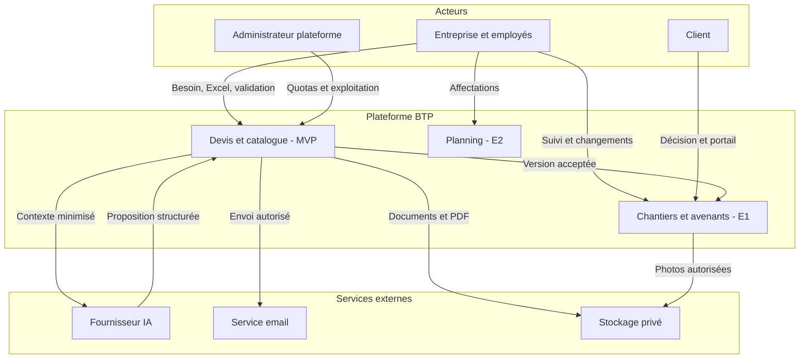
```mermaid
flowchart TB
 subgraph Acteurs[Acteurs]
  direction TB
  Ent[Entreprise et employés]
  Cli[Client]
  Adm[Administrateur plateforme]
 end
 subgraph SaaS[Plateforme BTP]
  direction TB
  Dev[Devis et catalogue - MVP]
  Cha[Chantiers et avenants - E1]
  Pla[Planning - E2]
 end
 subgraph Services[Services externes]
  direction TB
  IA[Fournisseur IA]
  Mail[Service email]
  Obj[Stockage privé]
 end
 Ent -->|Besoin, Excel, validation| Dev
 Ent -->|Suivi et changements| Cha
 Ent -->|Affectations| Pla
 Cli -->|Décision et portail| Cha
 Adm -->|Quotas et exploitation| Dev
 Dev -->|Contexte minimisé| IA
 IA -->|Proposition structurée| Dev
 Dev -->|Envoi autorisé| Mail
 Dev -->|Documents et PDF| Obj
 Cha -->|Photos autorisées| Obj
 Dev -->|Version acceptée| Cha
```

## B-cas-utilisation — Cas d’utilisation UML

**Objectif.** Attribuer les parcours aux six rôles sans confondre permission et visibilité.

**Hypothèses.** AE peut cumuler DV et CH ; les permissions de validation/envoi sont déléguables.

**Explication.** Les rôles déterminent les parcours. La délégation de validation est explicite ; le client ne consulte que le contenu autorisé.

**Règles.** RM02, RM09, RM10, RM18, RM21–RM25 ; matrice permissions.

**Cas d’erreur couverts.** Permission absente, rôle d’une autre entreprise, publication non autorisée.

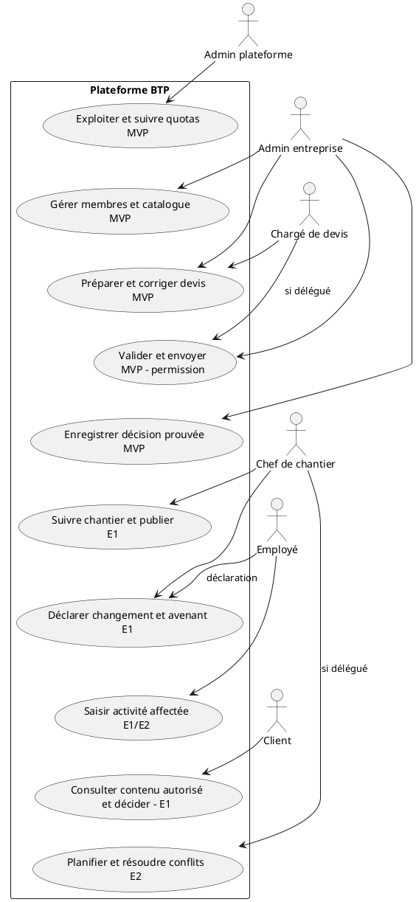
```plantuml
@startuml
!pragma layout smetana
top to bottom direction
skinparam shadowing false
actor "Admin plateforme" as AP
actor "Admin entreprise" as AE
actor "Chargé de devis" as DV
actor "Chef de chantier" as CH
actor "Employé" as EM
actor "Client" as CL
rectangle "Plateforme BTP" {
 usecase "Exploiter et suivre quotas\nMVP" as U1
 usecase "Gérer membres et catalogue\nMVP" as U2
 usecase "Préparer et corriger devis\nMVP" as U3
 usecase "Valider et envoyer\nMVP - permission" as U4
 usecase "Enregistrer décision prouvée\nMVP" as U5
 usecase "Suivre chantier et publier\nE1" as U6
 usecase "Déclarer changement et avenant\nE1" as U7
 usecase "Saisir activité affectée\nE1/E2" as U8
 usecase "Consulter contenu autorisé\net décider - E1" as U9
 usecase "Planifier et résoudre conflits\nE2" as U10
}
AP --> U1
AE --> U2
AE --> U3
DV --> U3
AE --> U4
DV --> U4 : si délégué
AE --> U5
CH --> U6
CH --> U7
EM --> U8
EM --> U7 : déclaration
CL --> U9
CH --> U10 : si délégué
AP -[hidden]down-> AE
AE -[hidden]down-> DV
DV -[hidden]down-> CH
CH -[hidden]down-> EM
EM -[hidden]down-> CL
U1 -[hidden]down-> U2
U2 -[hidden]down-> U3
U3 -[hidden]down-> U4
U4 -[hidden]down-> U5
U5 -[hidden]down-> U6
U6 -[hidden]down-> U7
U7 -[hidden]down-> U8
U8 -[hidden]down-> U9
U9 -[hidden]down-> U10
@enduml
```

## B-vue-simplifiee — Cas d’utilisation — vue Mermaid simplifiée

**Objectif.** Offrir une lecture rapide des regroupements de rôles ; cette vue n’est pas un véritable UML de cas d’utilisation.

**Hypothèses.** Le diagramme UML B-cas-utilisation et la matrice des droits restent les références.

**Explication.** Les rôles déterminent les parcours. La délégation de validation est explicite ; le client ne consulte que le contenu autorisé.

**Règles.** RM02, RM09, RM10, RM24, RM25.

**Cas d’erreur couverts.** Permission absente, rôle d’une autre entreprise, publication non autorisée.

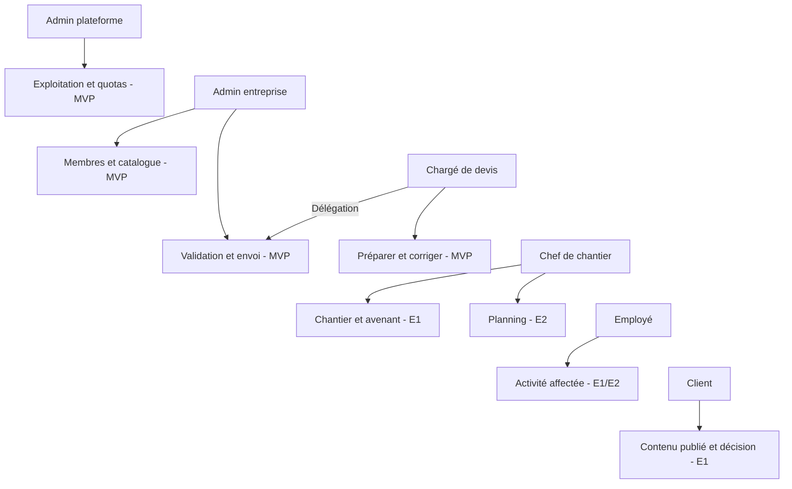
```mermaid
flowchart TB
 AP[Admin plateforme] --> Ops[Exploitation et quotas - MVP]
 AE[Admin entreprise] --> Ges[Membres et catalogue - MVP]
 AE --> Val[Validation et envoi - MVP]
 DV[Chargé de devis] --> Dev[Préparer et corriger - MVP]
 DV -->|Délégation| Val
 CH[Chef de chantier] --> Site[Chantier et avenant - E1]
 CH --> Plan[Planning - E2]
 EM[Employé] --> Act[Activité affectée - E1/E2]
 CL[Client] --> Por[Contenu publié et décision - E1]
 AP ~~~ AE
 AE ~~~ DV
 DV ~~~ CH
 CH ~~~ EM
 EM ~~~ CL
```

## C-parcours-devis — Création du devis

**Objectif.** Relier import, demandes de précision, revue et envoi à leurs voies de correction.

**Hypothèses.** Le PDF et le résultat IA peuvent échouer sans perdre le brouillon.

**Explication.** Le brouillon peut progresser malgré un échec technique. Les questions créent une nouvelle révision et la revue fige la version avant préparation du PDF et envoi.

**Règles.** RM03–RM05, RM09–RM14.

**Cas d’erreur couverts.** Document inexploitable, génération obsolète, estimation non confirmée, revue refusée, PDF/envoi en échec.

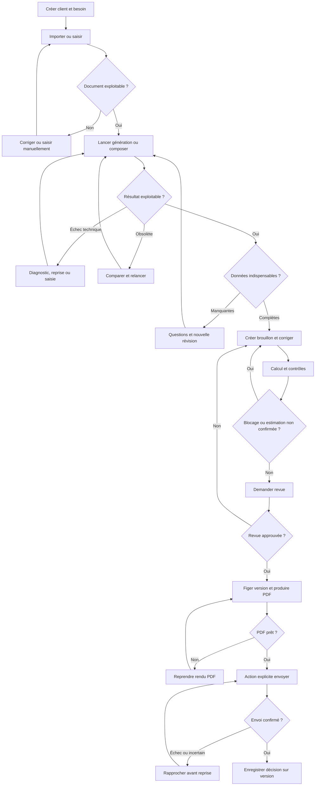
```mermaid
flowchart TB
 A[Créer client et besoin] --> B[Importer ou saisir]
 B --> C{Document exploitable ?}
 C -->|Non| D[Corriger ou saisir manuellement]
 D --> B
 C -->|Oui| E[Lancer génération ou composer]
 E --> F{Résultat exploitable ?}
 F -->|Échec technique| G[Diagnostic, reprise ou saisie]
 G --> E
 F -->|Obsolète| H[Comparer et relancer]
 H --> E
 F -->|Oui| I{Données indispensables ?}
 I -->|Manquantes| J[Questions et nouvelle révision]
 J --> E
 I -->|Complètes| K[Créer brouillon et corriger]
 K --> L[Calcul et contrôles]
 L --> M{Blocage ou estimation non confirmée ?}
 M -->|Oui| K
 M -->|Non| N[Demander revue]
 N --> O{Revue approuvée ?}
 O -->|Non| K
 O -->|Oui| P[Figer version et produire PDF]
 P --> Q{PDF prêt ?}
 Q -->|Non| R[Reprendre rendu PDF]
 R --> P
 Q -->|Oui| S[Action explicite envoyer]
 S --> T{Envoi confirmé ?}
 T -->|Échec ou incertain| U[Rapprocher avant reprise]
 U --> S
 T -->|Oui| V[Enregistrer décision sur version]
```

## D-chaine-ia — Chaîne de traitement IA

**Objectif.** Séparer texte source, connaissances métier, récupération de références et calcul fiable.

**Hypothèses.** Recherche privée limitée au tenant ; recettes du métier pilote approuvées.

**Explication.** Le texte est extrait comme données. L’analyse et les références produisent une proposition contrôlée ; seul le moteur décimal calcule les prix.

**Règles.** RM04–RM08, RM15–RM17, RM26.

**Cas d’erreur couverts.** Injection, référence non autorisée, prix absent, unité incorrecte, information critique manquante.

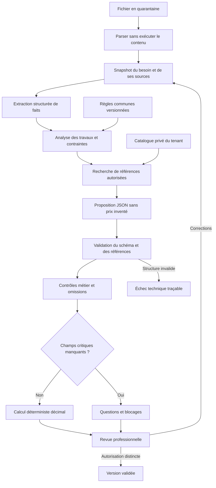
```mermaid
flowchart TB
 F[Fichier en quarantaine] --> P[Parser sans exécuter le contenu]
 P --> S[Snapshot du besoin et de ses sources]
 S --> X[Extraction structurée de faits]
 X --> B[Analyse des travaux et contraintes]
 B --> R[Recherche de références autorisées]
 Cat[Catalogue privé du tenant] --> R
 Com[Règles communes versionnées] --> B
 R --> J[Proposition JSON sans prix inventé]
 J --> V[Validation du schéma et des références]
 V --> C[Contrôles métier et omissions]
 C --> Q{Champs critiques manquants ?}
 Q -->|Oui| Dem[Questions et blocages]
 Q -->|Non| Calc[Calcul déterministe décimal]
 Calc --> H[Revue professionnelle]
 Dem --> H
 V -->|Structure invalide| E[Échec technique traçable]
 H -->|Corrections| S
 H -->|Autorisation distincte| Fin[Version validée]
```

## E-import-excel — Import catalogue Excel

**Objectif.** Valider un import avant publication d’une nouvelle version du catalogue.

**Hypothèses.** XLSX sans macros ; EUR ; une feuille sélectionnée ; noms seuls insuffisants pour déduire les unités.

**Explication.** L’utilisateur choisit le mapping, examine les erreurs et le diff de prix, puis confirme une publication atomique et historisée.

**Règles.** RM06, RM08, RM12, RM13, RM16.

**Cas d’erreur couverts.** Unité/devise absente, doublon contradictoire, formule non exploitable, catalogue modifié depuis preview.

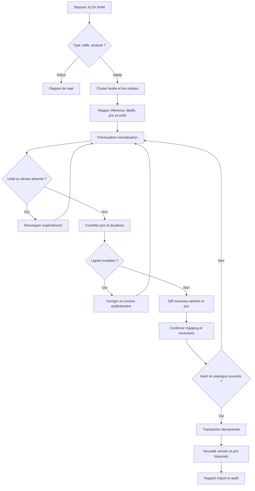
```mermaid
flowchart TB
 A[Déposer XLSX limité] --> B{Type, taille, analyse ?}
 B -->|Refus| R[Rapport de rejet]
 B -->|Valide| C[Choisir feuille et lire cellules]
 C --> D[Mapper référence, libellé, prix et unité]
 D --> E[Prévisualiser normalisation]
 E --> F{Unité ou devise absente ?}
 F -->|Oui| G[Renseigner explicitement]
 G --> E
 F -->|Non| H[Contrôler prix et doublons]
 H --> I{Lignes invalides ?}
 I -->|Oui| J[Corriger ou exclure explicitement]
 J --> E
 I -->|Non| K[Diff nouveaux articles et prix]
 K --> L[Confirmer mapping et exclusions]
 L --> M{Hash et catalogue courants ?}
 M -->|Non| E
 M -->|Oui| N[Transaction idempotente]
 N --> O[Nouvelle version et prix historisés]
 O --> P[Rapport import et audit]
```

## F-classes-devis — Classes métier — devis

**Objectif.** Différencier agrégat devis, version, ligne, ouvrage et matériau.

**Hypothèses.** Un devis peut exister sans version ; une version validable possède au moins une ligne.

**Explication.** La version porte ses lignes et leurs valeurs propres. L’ouvrage décrit la recette ; les composants de ligne donnent le détail du coût sans vente supplémentaire. Le chantier conserve son contrat de référence.

**Règles.** RM03, RM05–RM09, RM11, RM26.

**Cas d’erreur couverts.** Double comptage, recette incohérente, prix modifié après validation, changement non documenté.

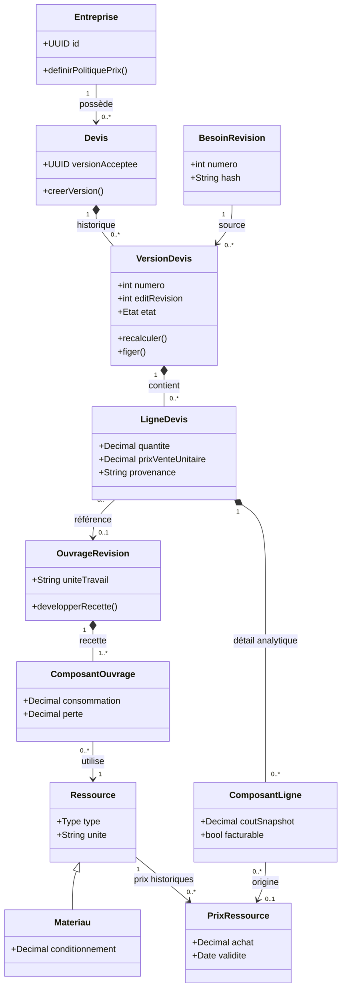
```mermaid
classDiagram
 direction TB
 class Entreprise {
  +UUID id
  +definirPolitiquePrix()
 }
 class BesoinRevision {
  +int numero
  +String hash
 }
 class Devis {
  +UUID versionAcceptee
  +creerVersion()
 }
 class VersionDevis {
  +int numero
  +int editRevision
  +Etat etat
  +recalculer()
  +figer()
 }
 class LigneDevis {
  +Decimal quantite
  +Decimal prixVenteUnitaire
  +String provenance
 }
 class OuvrageRevision {
  +String uniteTravail
  +developperRecette()
 }
 class ComposantOuvrage {
  +Decimal consommation
  +Decimal perte
 }
 class Ressource {
  +Type type
  +String unite
 }
 class Materiau {
  +Decimal conditionnement
 }
 class PrixRessource {
  +Decimal achat
  +Date validite
 }
 class ComposantLigne {
  +Decimal coutSnapshot
  +bool facturable
 }
 Entreprise "1" --> "0..*" Devis : possède
 Devis "1" *-- "0..*" VersionDevis : historique
 BesoinRevision "1" --> "0..*" VersionDevis : source
 VersionDevis "1" *-- "0..*" LigneDevis : contient
 LigneDevis "0..*" --> "0..1" OuvrageRevision : référence
 OuvrageRevision "1" *-- "1..*" ComposantOuvrage : recette
 ComposantOuvrage "0..*" --> "1" Ressource : utilise
 Ressource <|-- Materiau
 Ressource "1" --> "0..*" PrixRessource : prix historiques
 LigneDevis "1" *-- "0..*" ComposantLigne : détail analytique
 ComposantLigne "0..*" --> "0..1" PrixRessource : origine
```

## F-classes-chantier — Classes métier — chantier

**Objectif.** Relier contrat de référence, progression, changements et ressources.

**Hypothèses.** La baseline comprend le devis accepté et les avenants déjà acceptés.

**Explication.** La version porte ses lignes et leurs valeurs propres. L’ouvrage décrit la recette ; les composants de ligne donnent le détail du coût sans vente supplémentaire. Le chantier conserve son contrat de référence.

**Règles.** RM21–RM25.

**Cas d’erreur couverts.** Double comptage, recette incohérente, prix modifié après validation, changement non documenté.

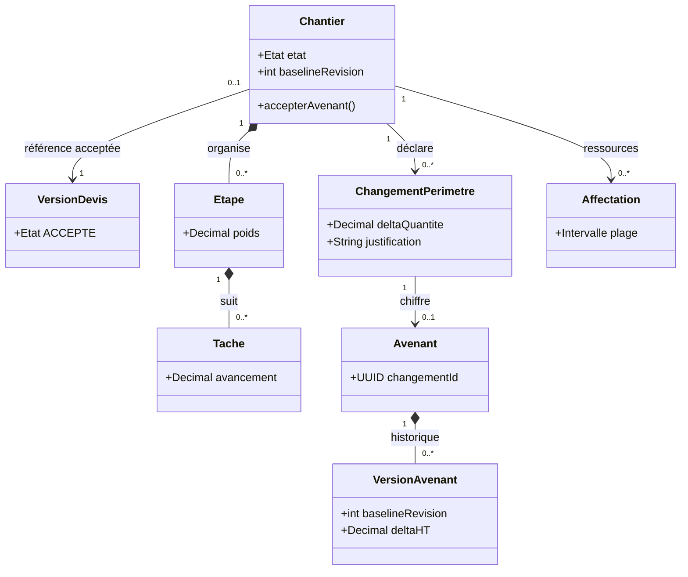
```mermaid
classDiagram
 direction TB
 class Chantier {
  +Etat etat
  +int baselineRevision
  +accepterAvenant()
 }
 class VersionDevis {
  +Etat ACCEPTE
 }
 class Etape {
  +Decimal poids
 }
 class Tache {
  +Decimal avancement
 }
 class ChangementPerimetre {
  +Decimal deltaQuantite
  +String justification
 }
 class Avenant {
  +UUID changementId
 }
 class VersionAvenant {
  +int baselineRevision
  +Decimal deltaHT
 }
 class Affectation {
  +Intervalle plage
 }
 Chantier "0..1" --> "1" VersionDevis : référence acceptée
 Chantier "1" *-- "0..*" Etape : organise
 Etape "1" *-- "0..*" Tache : suit
 Chantier "1" --> "0..*" ChangementPerimetre : déclare
 ChangementPerimetre "1" --> "0..1" Avenant : chiffre
 Avenant "1" *-- "0..*" VersionAvenant : historique
 Chantier "1" --> "0..*" Affectation : ressources
```

## G-mcd-identites — MCD — identités et clients

**Objectif.** Décrire les associations métier, avant les clés SQL ; notation ER conceptuelle.

**Hypothèses.** Compte global, contacts client distincts ; rôle lié à une appartenance.

**Explication.** Le MCD décrit les associations métier ; les ERD montrent les tables et FK. Les détails techniques sont répartis par module et les objets privés reprennent systématiquement le tenant.

**Règles.** RM01, RM02, RM18.

**Cas d’erreur couverts.** Référence croisée tenant, cardinalité invalide, offre acceptée multiple, relation entre modules incohérente.

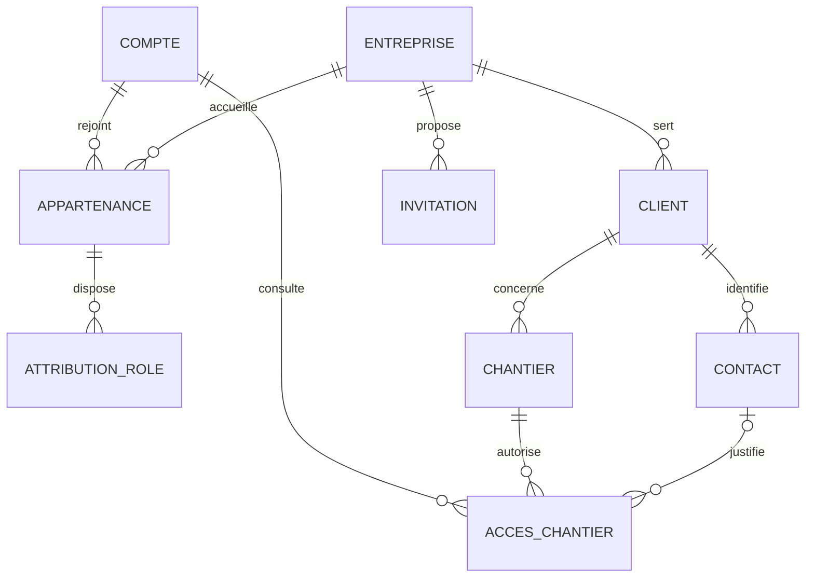
```mermaid
erDiagram
 direction TB
 COMPTE ||--o{ APPARTENANCE : rejoint
 ENTREPRISE ||--o{ APPARTENANCE : accueille
 APPARTENANCE ||--o{ ATTRIBUTION_ROLE : dispose
 ENTREPRISE ||--o{ CLIENT : sert
 CLIENT ||--o{ CONTACT : identifie
 ENTREPRISE ||--o{ INVITATION : propose
 CLIENT ||--o{ CHANTIER : concerne
 COMPTE ||--o{ ACCES_CHANTIER : consulte
 CHANTIER ||--o{ ACCES_CHANTIER : autorise
 CONTACT o|--o{ ACCES_CHANTIER : justifie
```

## G-mcd-chiffrage — MCD — chiffrage

**Objectif.** Modéliser les concepts de prix, besoin et version sans détails physiques.

**Hypothèses.** Chaque entreprise possède son catalogue ; les ouvrages sont versionnés.

**Explication.** Le MCD décrit les associations métier ; les ERD montrent les tables et FK. Les détails techniques sont répartis par module et les objets privés reprennent systématiquement le tenant.

**Règles.** RM03–RM09, RM11.

**Cas d’erreur couverts.** Référence croisée tenant, cardinalité invalide, offre acceptée multiple, relation entre modules incohérente.

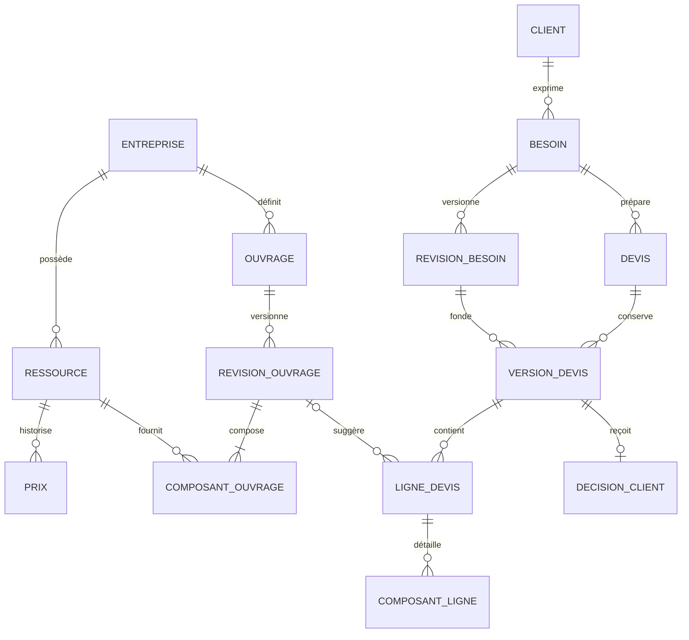
```mermaid
erDiagram
 direction TB
 ENTREPRISE ||--o{ RESSOURCE : possède
 RESSOURCE ||--o{ PRIX : historise
 ENTREPRISE ||--o{ OUVRAGE : définit
 OUVRAGE ||--o{ REVISION_OUVRAGE : versionne
 REVISION_OUVRAGE ||--|{ COMPOSANT_OUVRAGE : compose
 RESSOURCE ||--o{ COMPOSANT_OUVRAGE : fournit
 CLIENT ||--o{ BESOIN : exprime
 BESOIN ||--o{ REVISION_BESOIN : versionne
 BESOIN ||--o{ DEVIS : prépare
 DEVIS ||--o{ VERSION_DEVIS : conserve
 REVISION_BESOIN ||--o{ VERSION_DEVIS : fonde
 VERSION_DEVIS ||--o{ LIGNE_DEVIS : contient
 REVISION_OUVRAGE o|--o{ LIGNE_DEVIS : suggère
 LIGNE_DEVIS ||--o{ COMPOSANT_LIGNE : détaille
 VERSION_DEVIS ||--o| DECISION_CLIENT : reçoit
```

## G-mcd-chantier — MCD — chantier et avenants

**Objectif.** Définir la chaîne contrat accepté → chantier → changement → avenant.

**Hypothèses.** Un changement peut rester une demande sans avenant ; une version ne reçoit qu’une décision.

**Explication.** Le MCD décrit les associations métier ; les ERD montrent les tables et FK. Les détails techniques sont répartis par module et les objets privés reprennent systématiquement le tenant.

**Règles.** RM21–RM25.

**Cas d’erreur couverts.** Référence croisée tenant, cardinalité invalide, offre acceptée multiple, relation entre modules incohérente.

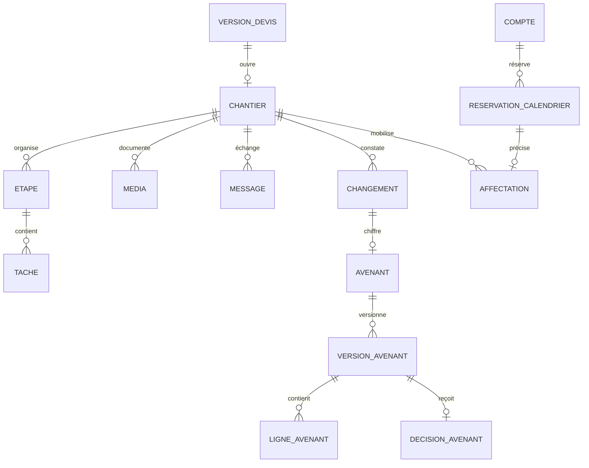
```mermaid
erDiagram
 direction TB
 VERSION_DEVIS ||--o| CHANTIER : ouvre
 CHANTIER ||--o{ ETAPE : organise
 ETAPE ||--o{ TACHE : contient
 CHANTIER ||--o{ MEDIA : documente
 CHANTIER ||--o{ MESSAGE : échange
 CHANTIER ||--o{ CHANGEMENT : constate
 CHANGEMENT ||--o| AVENANT : chiffre
 AVENANT ||--o{ VERSION_AVENANT : versionne
 VERSION_AVENANT ||--o{ LIGNE_AVENANT : contient
 VERSION_AVENANT ||--o| DECISION_AVENANT : reçoit
 COMPTE ||--o{ RESERVATION_CALENDRIER : réserve
 RESERVATION_CALENDRIER ||--o| AFFECTATION : précise
 CHANTIER ||--o{ AFFECTATION : mobilise
```

## H-etats-devis — États commerciaux du devis, portés par sa version

**Objectif.** Expliciter les transitions autorisées indépendamment des jobs IA.

**Hypothèses.** Version figée dès VALIDE ; correction par copie ; décision uniquement sur offre active.

**Explication.** Le cycle commercial appartient à chaque version. Un résultat IA n’avance aucun état commercial ; après VALIDE, une correction crée une nouvelle version.

**Règles.** RM09–RM13 ; transitions et permissions détaillées dans les règles.

**Cas d’erreur couverts.** Validation bloquée, envoi non confirmé, décision sur offre remplacée/expirée, correction sur contenu figé.

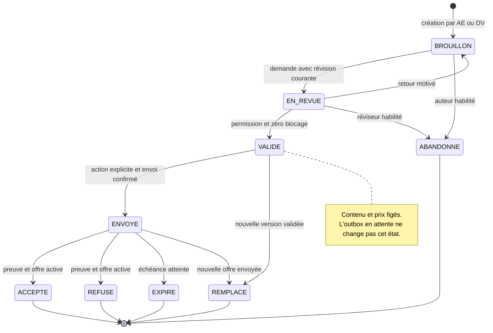
```mermaid
stateDiagram-v2
 direction TB
 [*] --> BROUILLON : création par AE ou DV
 BROUILLON --> EN_REVUE : demande avec révision courante
 EN_REVUE --> BROUILLON : retour motivé
 EN_REVUE --> VALIDE : permission et zéro blocage
 BROUILLON --> ABANDONNE : auteur habilité
 EN_REVUE --> ABANDONNE : réviseur habilité
 VALIDE --> ENVOYE : action explicite et envoi confirmé
 VALIDE --> REMPLACE : nouvelle version validée
 ENVOYE --> ACCEPTE : preuve et offre active
 ENVOYE --> REFUSE : preuve et offre active
 ENVOYE --> EXPIRE : échéance atteinte
 ENVOYE --> REMPLACE : nouvelle offre envoyée
 ACCEPTE --> [*]
 REFUSE --> [*]
 EXPIRE --> [*]
 REMPLACE --> [*]
 ABANDONNE --> [*]
 note right of VALIDE
  Contenu et prix figés.
  L'outbox en attente ne change pas cet état.
 end note
```

## H-etats-generation — États techniques de la génération

**Objectif.** Montrer reprises, résultat obsolète et interruption indépendamment du devis.

**Hypothèses.** Lease avec token ; 3 tentatives maximum ; budget réservé ; REUSSI peut contenir des questions.

**Explication.** Le worker peut reprendre une tentative transitoire ; l’état REUSSI indique une proposition structurée, pas une validation commerciale.

**Règles.** RM12–RM16, RM26.

**Cas d’erreur couverts.** Lease perdue, source modifiée, quota, timeout, tentatives épuisées, accès révoqué.

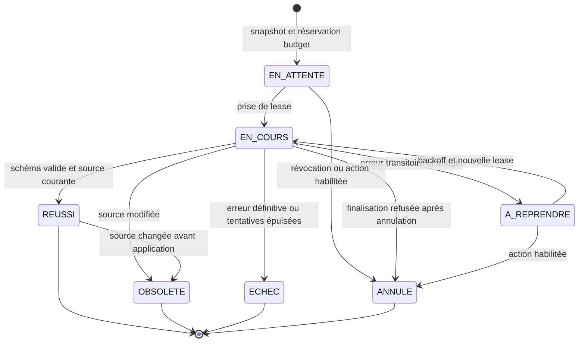
```mermaid
stateDiagram-v2
 direction TB
 [*] --> EN_ATTENTE : snapshot et réservation budget
 EN_ATTENTE --> EN_COURS : prise de lease
 EN_COURS --> A_REPRENDRE : erreur transitoire et budget
 A_REPRENDRE --> EN_COURS : backoff et nouvelle lease
 EN_COURS --> REUSSI : schéma valide et source courante
 EN_COURS --> OBSOLETE : source modifiée
 EN_COURS --> ECHEC : erreur définitive ou tentatives épuisées
 EN_ATTENTE --> ANNULE : révocation ou action habilitée
 EN_COURS --> ANNULE : finalisation refusée après annulation
 A_REPRENDRE --> ANNULE : action habilitée
 REUSSI --> OBSOLETE : source changée avant application
 REUSSI --> [*]
 OBSOLETE --> [*]
 ECHEC --> [*]
 ANNULE --> [*]
```

## I-generation-api — Séquence — lancement et application

**Objectif.** Conserver un résultat candidat et créer une version uniquement après contrôle de fraîcheur.

**Hypothèses.** Les traitements worker sont décrits séparément ; polling authentifié.

**Explication.** L’API fige l’entrée et crée le job. Le polling lit un résultat candidat ; une commande séparée applique ce résultat sous contrôle de version.

**Règles.** RM03, RM12, RM13, RM15.

**Cas d’erreur couverts.** Double clic, révision différente, devis déjà accepté, résultat obsolète.

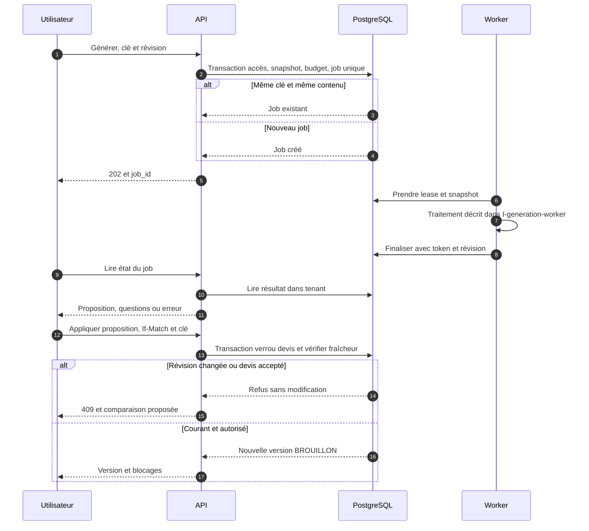
```mermaid
sequenceDiagram
 autonumber
 participant U as Utilisateur
 participant API as API
 participant DB as PostgreSQL
 participant W as Worker
 U->>API: Générer, clé et révision
 API->>DB: Transaction accès, snapshot, budget, job unique
 alt Même clé et même contenu
 DB-->>API: Job existant
 else Nouveau job
 DB-->>API: Job créé
 end
 API-->>U: 202 et job_id
 W->>DB: Prendre lease et snapshot
 W->>W: Traitement décrit dans I-generation-worker
 W->>DB: Finaliser avec token et révision
 U->>API: Lire état du job
 API->>DB: Lire résultat dans tenant
 API-->>U: Proposition, questions ou erreur
 U->>API: Appliquer proposition, If-Match et clé
 API->>DB: Transaction verrou devis et vérifier fraîcheur
 alt Révision changée ou devis accepté
 DB-->>API: Refus sans modification
 API-->>U: 409 et comparaison proposée
 else Courant et autorisé
 DB-->>API: Nouvelle version BROUILLON
 API-->>U: Version et blocages
 end
```

## I-generation-worker — Séquence — fournisseur et reprises

**Objectif.** Décrire les échecs externes et la finalisation protégée après panne.

**Hypothèses.** Chaque tentative est comptabilisée ; le coût d’un timeout peut rester inconnu.

**Explication.** Le worker trace chaque tentative puis publie seulement s’il possède encore la lease et si les données sources sont courantes.

**Règles.** RM04, RM05, RM14–RM16, RM26.

**Cas d’erreur couverts.** Appel ambigu/facturé, structure invalide, reprise limitée, token périmé.

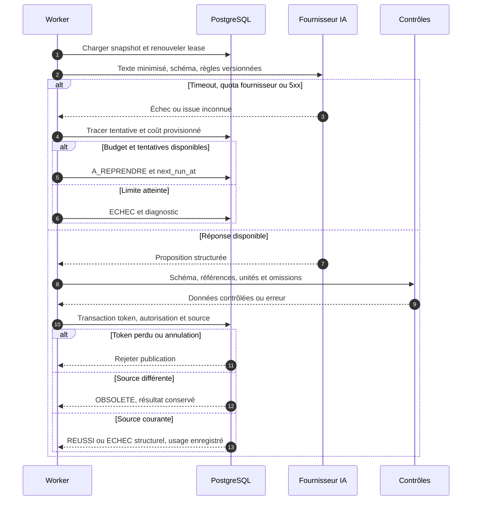
```mermaid
sequenceDiagram
 autonumber
 participant W as Worker
 participant DB as PostgreSQL
 participant IA as Fournisseur IA
 participant C as Contrôles
 W->>DB: Charger snapshot et renouveler lease
 W->>IA: Texte minimisé, schéma, règles versionnées
 alt Timeout, quota fournisseur ou 5xx
 IA-->>W: Échec ou issue inconnue
 W->>DB: Tracer tentative et coût provisionné
 alt Budget et tentatives disponibles
 W->>DB: A_REPRENDRE et next_run_at
 else Limite atteinte
 W->>DB: ECHEC et diagnostic
 end
 else Réponse disponible
 IA-->>W: Proposition structurée
 W->>C: Schéma, références, unités et omissions
 C-->>W: Données contrôlées ou erreur
 W->>DB: Transaction token, autorisation et source
 alt Token perdu ou annulation
 DB-->>W: Rejeter publication
 else Source différente
 DB-->>W: OBSOLETE, résultat conservé
 else Source courante
 DB-->>W: REUSSI ou ECHEC structurel, usage enregistré
 end
 end
```

## I-validation-envoi — Séquence — validation, PDF et envoi

**Objectif.** Séparer validation interne, création du PDF et effet externe.

**Hypothèses.** Worker regroupe rendu et livraison ; prestataire idempotent souhaité.

**Explication.** Validation, rendu PDF et envoi sont trois opérations durables. L’état ENVOYE apparaît après confirmation externe ; une issue incertaine oblige un rapprochement.

**Règles.** RM09–RM14, RM19.

**Cas d’erreur couverts.** PDF de mauvaise version, destinataire erroné, timeout ambigu, livraison potentiellement doublée.

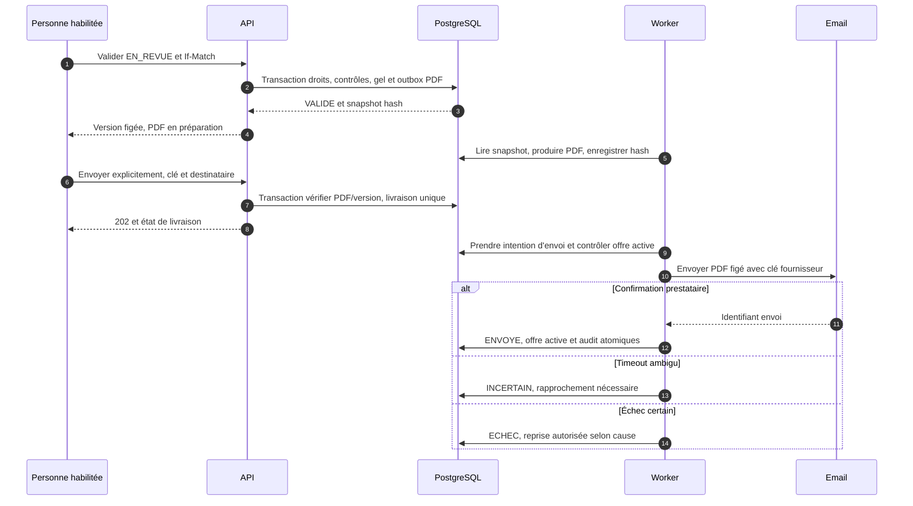
```mermaid
sequenceDiagram
 autonumber
 participant U as Personne habilitée
 participant API as API
 participant DB as PostgreSQL
 participant W as Worker
 participant M as Email
 U->>API: Valider EN_REVUE et If-Match
 API->>DB: Transaction droits, contrôles, gel et outbox PDF
 DB-->>API: VALIDE et snapshot hash
 API-->>U: Version figée, PDF en préparation
 W->>DB: Lire snapshot, produire PDF, enregistrer hash
 U->>API: Envoyer explicitement, clé et destinataire
 API->>DB: Transaction vérifier PDF/version, livraison unique
 API-->>U: 202 et état de livraison
 W->>DB: Prendre intention d'envoi et contrôler offre active
 W->>M: Envoyer PDF figé avec clé fournisseur
 alt Confirmation prestataire
 M-->>W: Identifiant envoi
 W->>DB: ENVOYE, offre active et audit atomiques
 else Timeout ambigu
 W->>DB: INCERTAIN, rapprochement nécessaire
 else Échec certain
 W->>DB: ECHEC, reprise autorisée selon cause
 end
```

## J-composants — Composants et dépendances

**Objectif.** Définir les responsabilités d’un monolithe et de son worker sans microservices prématurés.

**Hypothèses.** Moteur de prix pur, mêmes services métier utilisés par API et worker.

**Explication.** Les commandes traversent les modules du monolithe ; API et worker partagent le domaine. Le chiffrage reste indépendant du fournisseur IA.

**Règles.** RM01, RM05, RM10, RM14, RM19.

**Cas d’erreur couverts.** Effet externe perdu, accès direct à une table d’un autre module, calcul dépendant d’une réponse LLM.

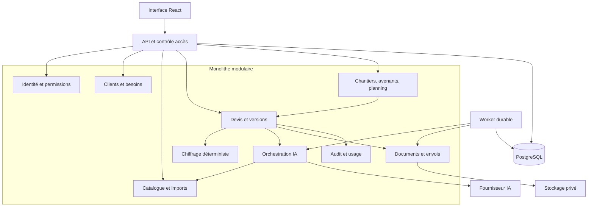
```mermaid
flowchart TB
 Web[Interface React] --> API[API et contrôle accès]
 subgraph Monolithe[Monolithe modulaire]
  direction TB
  Acc[Identité et permissions]
  Bes[Clients et besoins]
  Cat[Catalogue et imports]
  Dev[Devis et versions]
  Prix[Chiffrage déterministe]
  Orch[Orchestration IA]
  Doc[Documents et envois]
  Obs[Audit et usage]
  Ext[Chantiers, avenants, planning]
 end
 API --> Acc
 API --> Bes
 API --> Cat
 API --> Dev
 API --> Ext
 Dev --> Prix
 Dev --> Orch
 Dev --> Doc
 Orch --> Cat
 Ext --> Dev
 Dev --> Obs
 Worker[Worker durable] --> Orch
 Worker --> Doc
 API --> DB[(PostgreSQL)]
 Worker --> DB
 Doc --> Objet[Stockage privé]
 Orch --> IA[Fournisseur IA]
```

## K-frontieres — Flux de données et frontières de confiance

**Objectif.** Identifier les données non fiables et les sorties de données hors du SaaS.

**Hypothèses.** Fournisseur IA contractuellement choisi ; zéro entraînement partagé implicite.

**Explication.** Les documents entrants sont non fiables ; les données privées et connaissances communes se rejoignent uniquement dans un contexte minimisé et filtré.

**Règles.** RM01, RM02, RM16, RM17, RM20, RM26.

**Cas d’erreur couverts.** Injection de prompt, exfiltration vers IA, fuite portail, corpus privé partagé implicitement.

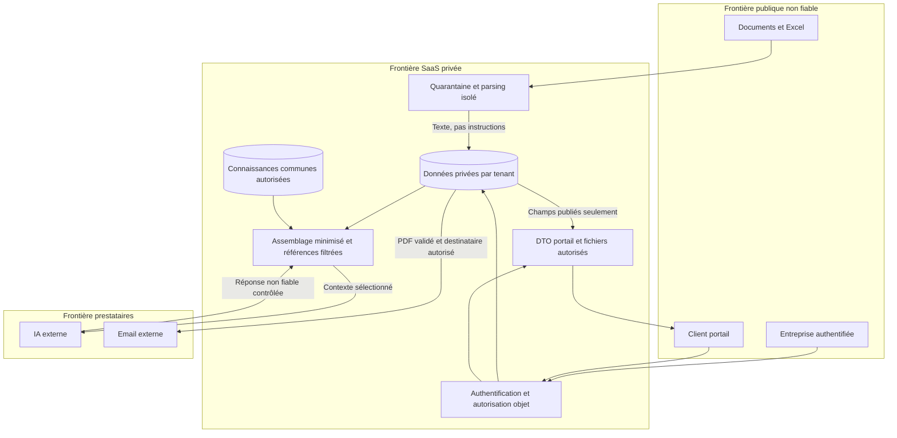
```mermaid
flowchart TB
 subgraph Public[Frontière publique non fiable]
  direction TB
  F[Documents et Excel]
  U[Entreprise authentifiée]
  C[Client portail]
 end
 subgraph Priv[Frontière SaaS privée]
  direction TB
  Gate[Authentification et autorisation objet]
  Q[Quarantaine et parsing isolé]
  T[(Données privées par tenant)]
  K[(Connaissances communes autorisées)]
  R[Assemblage minimisé et références filtrées]
  P[DTO portail et fichiers autorisés]
 end
 subgraph Tiers[Frontière prestataires]
  direction TB
  IA[IA externe]
  E[Email externe]
 end
 F --> Q
 U --> Gate
 Gate --> T
 Q -->|Texte, pas instructions| T
 T --> R
 K --> R
 R -->|Contexte sélectionné| IA
 IA -->|Réponse non fiable contrôlée| R
 C --> Gate
 Gate --> P
 T -->|Champs publiés seulement| P
 P --> C
 T -->|PDF validé et destinataire autorisé| E
```

## L-deploiement-uml — Déploiement UML de référence

**Objectif.** Représenter les nœuds, environnements et services privés réellement nécessaires.

**Hypothèses.** Conteneurs possibles ; bases et buckets séparés ; production avec TLS, secrets et sauvegardes.

**Explication.** Chaque environnement possède ses données, objets et secrets. La production expose l’entrée TLS et protège base/stockage ; les sauvegardes et la supervision sont des composants d’exploitation.

**Règles.** RM14–RM16, RM19, RM20.

**Cas d’erreur couverts.** Secret exposé, données réelles en dev, perte d’objet, restore incohérent, panne de fournisseur.

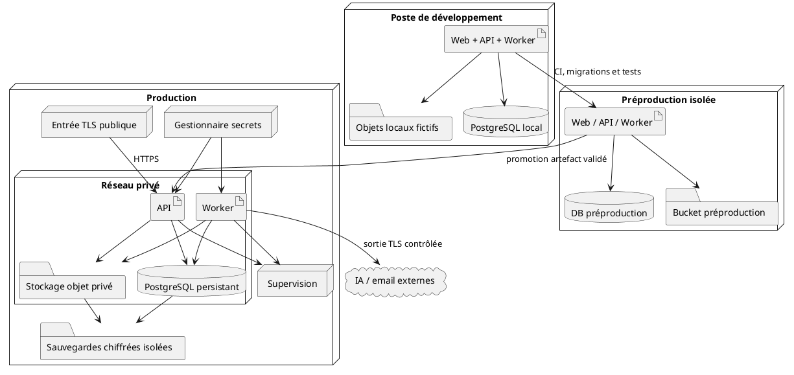
```plantuml
@startuml
!pragma layout smetana
top to bottom direction
skinparam shadowing false
node "Poste de développement" {
 artifact "Web + API + Worker" as Dev
 database "PostgreSQL local" as DDB
 folder "Objets locaux fictifs" as DObj
 Dev --> DDB
 Dev --> DObj
}
node "Préproduction isolée" {
 artifact "Web / API / Worker" as Pre
 database "DB préproduction" as PDB
 folder "Bucket préproduction" as PObj
 Pre --> PDB
 Pre --> PObj
}
node "Production" {
 node "Entrée TLS publique" as TLS
 node "Réseau privé" {
  artifact "API" as API
  artifact "Worker" as Worker
  database "PostgreSQL persistant" as DB
  folder "Stockage objet privé" as Obj
 }
 node "Gestionnaire secrets" as Secrets
 node "Supervision" as Obs
 folder "Sauvegardes chiffrées isolées" as Backup
 TLS --> API : HTTPS
 API --> DB
 Worker --> DB
 API --> Obj
 Worker --> Obj
 Secrets --> API
 Secrets --> Worker
 API --> Obs
 Worker --> Obs
 DB --> Backup
 Obj --> Backup
}
cloud "IA / email externes" as External
Worker --> External : sortie TLS contrôlée
Dev --> Pre : CI, migrations et tests
Pre --> API : promotion artefact validé
@enduml
```

## L-dev — Déploiement dev — Mermaid simplifié

**Objectif.** Visualiser réseau et persistance ; représentation simplifiée, pas UML de déploiement.

**Hypothèses.** Données fictives, services locaux, clés distinctes

**Explication.** Chaque environnement possède ses données, objets et secrets. La production expose l’entrée TLS et protège base/stockage ; les sauvegardes et la supervision sont des composants d’exploitation.

**Règles.** RM14–RM16, RM19, RM20.

**Cas d’erreur couverts.** Secret exposé, données réelles en dev, perte d’objet, restore incohérent, panne de fournisseur.

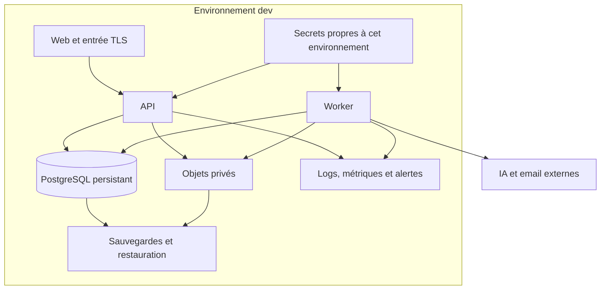
```mermaid
flowchart TB
 subgraph Env[Environnement dev]
  direction TB
  Web[Web et entrée TLS]
  API[API]
  W[Worker]
  DB[(PostgreSQL persistant)]
  Obj[Objets privés]
  Sec[Secrets propres à cet environnement]
  Mon[Logs, métriques et alertes]
  Bak[Sauvegardes et restauration]
 end
 Web --> API
 API --> DB
 W --> DB
 API --> Obj
 W --> Obj
 Sec --> API
 Sec --> W
 API --> Mon
 W --> Mon
 DB --> Bak
 Obj --> Bak
 W --> Ext[IA et email externes]
```

## L-preprod — Déploiement preprod — Mermaid simplifié

**Objectif.** Visualiser réseau et persistance ; représentation simplifiée, pas UML de déploiement.

**Hypothèses.** Jeu anonymisé ou synthétique, base et bucket isolés

**Explication.** Chaque environnement possède ses données, objets et secrets. La production expose l’entrée TLS et protège base/stockage ; les sauvegardes et la supervision sont des composants d’exploitation.

**Règles.** RM14–RM16, RM19, RM20.

**Cas d’erreur couverts.** Secret exposé, données réelles en dev, perte d’objet, restore incohérent, panne de fournisseur.

```mermaid
flowchart TB
 subgraph Env[Environnement preprod]
  direction TB
  Web[Web et entrée TLS]
  API[API]
  W[Worker]
  DB[(PostgreSQL persistant)]
  Obj[Objets privés]
  Sec[Secrets propres à cet environnement]
  Mon[Logs, métriques et alertes]
  Bak[Sauvegardes et restauration]
 end
 Web --> API
 API --> DB
 W --> DB
 API --> Obj
 W --> Obj
 Sec --> API
 Sec --> W
 API --> Mon
 W --> Mon
 DB --> Bak
 Obj --> Bak
 W --> Ext[IA et email externes]
```

## L-prod — Déploiement prod — Mermaid simplifié

**Objectif.** Visualiser réseau et persistance ; représentation simplifiée, pas UML de déploiement.

**Hypothèses.** Accès TLS public ; base et objets privés ; secrets séparés

**Explication.** Chaque environnement possède ses données, objets et secrets. La production expose l’entrée TLS et protège base/stockage ; les sauvegardes et la supervision sont des composants d’exploitation.

**Règles.** RM14–RM16, RM19, RM20.

**Cas d’erreur couverts.** Secret exposé, données réelles en dev, perte d’objet, restore incohérent, panne de fournisseur.

```mermaid
flowchart TB
 subgraph Env[Environnement prod]
  direction TB
  Web[Web et entrée TLS]
  API[API]
  W[Worker]
  DB[(PostgreSQL persistant)]
  Obj[Objets privés]
  Sec[Secrets propres à cet environnement]
  Mon[Logs, métriques et alertes]
  Bak[Sauvegardes et restauration]
 end
 Web --> API
 API --> DB
 W --> DB
 API --> Obj
 W --> Obj
 Sec --> API
 Sec --> W
 API --> Mon
 W --> Mon
 DB --> Bak
 Obj --> Bak
 W --> Ext[IA et email externes]
```

## M-parcours-chantier — Parcours du chantier

**Objectif.** Organiser la progression depuis le devis accepté jusqu’à la réception.

**Hypothèses.** Réception tracée avec réserves éventuelles ; poids de tâches explicitement définis.

**Explication.** La préparation précède l’exécution ; un changement passe par l’avenant. La réception et les réserves sont des étapes distinctes de l’avancement déclaré.

**Règles.** RM21–RM24.

**Cas d’erreur couverts.** Chantier créé depuis devis non accepté, changement refusé, réception sans preuve, réserves non levées.

```mermaid
flowchart TB
 A[Devis accepté] --> B[Créer chantier idempotent]
 B --> C[Préparer étapes, poids et accès]
 C --> D[Affecter équipe et dates]
 D --> E[Démarrer travaux]
 E --> F[Suivre tâches, photos et messages]
 F --> G{Changement de périmètre ?}
 G -->|Oui| H[Déclarer et chiffrer avenant]
 H --> I{Accepté ?}
 I -->|Oui| J[Actualiser baseline et planning]
 I -->|Non| K[Conserver périmètre accepté]
 J --> F
 K --> F
 G -->|Non| L{Travaux terminés ?}
 L -->|Non| F
 L -->|Oui| M[Préparer réception et preuves]
 M --> N{Réserves ?}
 N -->|Oui| O[Lever réserves et tracer]
 O --> M
 N -->|Non| P[Réceptionner puis clôturer]
```

## N-activite-avenant — Activité — création d’avenant

**Objectif.** Faire d’une suggestion un changement contrôlé puis un document soumis au client.

**Hypothèses.** Changement manuel ou détecté ; un avenant peut supprimer des postes avec motif.

**Explication.** La suggestion devient un changement confirmé puis un delta comparé au contrat courant. Seule l’acceptation sur la bonne baseline augmente le budget.

**Règles.** RM10, RM22, RM23.

**Cas d’erreur couverts.** Poste déjà inclus, delta sans unité, frais dupliqués, baseline périmée.

```mermaid
flowchart TB
 A[Déclaration ou suggestion IA] --> B[Chef confirme périmètre et source]
 B --> C[Comparer à baseline courante]
 C --> D{Déjà inclus ou déjà chiffré ?}
 D -->|Oui| E[Rejeter doublon ou corriger]
 D -->|Non| F[Quantifier delta et paramètres]
 F --> G{Données suffisantes ?}
 G -->|Non| H[Questions et précisions]
 H --> F
 G -->|Oui| I[Calcul delta sans frais dupliqués]
 I --> J[Créer version avenant BROUILLON]
 J --> K[Revue et validation humaine]
 K --> L[PDF figé et envoi explicite]
 L --> M{Décision sur baseline courante ?}
 M -->|Baseline changée| R[Rebaser nouvelle version et revalider]
 R --> C
 M -->|Accepté| N[Transaction baseline et budget]
 M -->|Refusé ou expiré| O[Aucun effet contractuel]
```

## N-sequence-avenant — Séquence — acceptation d’avenant

**Objectif.** Empêcher qu’une acceptation concurrente double le périmètre ou le budget.

**Hypothèses.** Verrouillage site puis avenant ; envoi identique au mécanisme de devis.

**Explication.** La décision verrouille le chantier puis l’avenant. Les événements et la baseline sont mis à jour dans la même transaction.

**Règles.** RM12, RM22, RM23.

**Cas d’erreur couverts.** Acceptation rejouée, changement déjà couvert, décisions concurrentes sur baseline ancienne.

```mermaid
sequenceDiagram
 autonumber
 participant H as Chef habilité
 participant API as API
 participant DB as PostgreSQL
 participant C as Client ou preuve
 H->>API: Confirmer changement, source et delta
 API->>DB: Changement unique, baseline et brouillon
 H->>API: Revoir, valider et envoyer explicitement
 API->>DB: Version figée et outbox comme devis
 C->>API: Décision, version et baseline attendue
 API->>DB: Transaction verrou site puis avenant
 alt Baseline différente ou changement déjà couvert
 DB-->>API: Conflit sans modification
 API-->>C: 409, nouvelle offre nécessaire
 else Refus
 DB-->>API: REFUSE, audit et baseline inchangée
 else Acceptation valide
 DB-->>API: ACCEPTE, baseline +1, delta budget, événement unique
 API-->>C: Confirmation version acceptée
 end
```

## O-etats-chantier — États du chantier

**Objectif.** Distinguer préparation, exécution, suspension et réception.

**Hypothèses.** Chef habilité pour transitions ; annulation motivée après contrôle des engagements.

**Explication.** Le chantier peut être suspendu puis repris. La réception suit la résolution des réserves ; l’annulation exige une décision motivée.

**Règles.** RM21, RM22, RM24.

**Cas d’erreur couverts.** Reprise non autorisée, réserves non levées, engagements non examinés avant annulation.

```mermaid
stateDiagram-v2
 direction TB
 [*] --> PREPARATION : devis accepté
 PREPARATION --> EN_COURS : équipe et périmètre prêts
 EN_COURS --> SUSPENDU : motif et dates
 SUSPENDU --> EN_COURS : reprise autorisée
 EN_COURS --> A_RECEVOIR : travaux déclarés terminés
 A_RECEVOIR --> RESERVES : réception avec réserves
 RESERVES --> A_RECEVOIR : réserves levées
 A_RECEVOIR --> RECEPTIONNE : preuve de réception
 RECEPTIONNE --> CLOTURE : contrôle final
 PREPARATION --> ANNULE : décision motivée
 EN_COURS --> ANNULE : engagements examinés
 SUSPENDU --> ANNULE : engagements examinés
 CLOTURE --> [*]
 ANNULE --> [*]
```

## O-etats-avenant — États commerciaux de l’avenant

**Objectif.** Conserver des états distincts du chantier et des jobs IA.

**Hypothèses.** Cycle porté par version_avenant ; valide sur baseline courante seulement.

**Explication.** Une version d’avenant suit un cycle commercial propre. Elle peut être envoyée et refusée sans changer l’état ni le budget du chantier.

**Règles.** RM09–RM12, RM22, RM23.

**Cas d’erreur couverts.** Acceptation avec baseline dépassée, PDF non prêt, tentative d’éditer une version figée.

```mermaid
stateDiagram-v2
 direction TB
 [*] --> BROUILLON : changement confirmé
 BROUILLON --> EN_REVUE : demande de revue
 EN_REVUE --> BROUILLON : correction motivée
 EN_REVUE --> VALIDE : zéro blocage et permission
 VALIDE --> ENVOYE : PDF et envoi confirmé
 VALIDE --> REMPLACE : nouvelle version validée
 ENVOYE --> ACCEPTE : preuve et baseline courante
 ENVOYE --> REFUSE : décision prouvée
 ENVOYE --> EXPIRE : échéance
 ENVOYE --> REMPLACE : nouvelle version envoyée
 BROUILLON --> ABANDONNE : auteur habilité
 EN_REVUE --> ABANDONNE : réviseur habilité
 ACCEPTE --> [*]
 REFUSE --> [*]
 EXPIRE --> [*]
 REMPLACE --> [*]
 ABANDONNE --> [*]
 note right of ENVOYE
  Baseline périmée : acceptation bloquée.
  Nouvelle version et nouvelle validation.
 end note
```

## P-planning — Planning et indisponibilités

**Objectif.** Prévenir les conflits, y compris pour une personne dans plusieurs entreprises.

**Hypothèses.** Calendrier global privé par compte ; droits tenant pour gérer l’affectation ; horaires en UTC avec fuseau local.

**Explication.** Disponibilités et absences sont vérifiées puis réservées atomiquement. Le calendrier global bloque les conflits sans divulguer les détails des autres entreprises.

**Règles.** RM02, RM18, RM25.

**Cas d’erreur couverts.** Double réservation, chevauchement de congé, fuseau mal normalisé, salarié révoqué.

```mermaid
flowchart TB
 A[Choisir personne, site et intervalle] --> B[Contrôler droits et appartenance active]
 B --> C[Normaliser UTC et intervalle demi-ouvert]
 C --> D[Contrôler disponibilités et congés]
 D --> E{Conflit privé global ?}
 E -->|Oui| F[Afficher indisponible sans détails tiers]
 F --> G[Modifier dates ou personne]
 G --> A
 E -->|Non| H[Transaction réservation et affectation]
 H --> I{Conflit concurrent en base ?}
 I -->|Oui| F
 I -->|Non| J[Confirmer et notifier]
 K[Demande de congé] --> L[Contrôler réservations existantes]
 L --> M{Réaffectation nécessaire ?}
 M -->|Oui| N[Chef résout avant approbation]
 N --> L
 M -->|Non| O[Réserver absence atomiquement]
 O --> D
```

## Q-amelioration — Amélioration contrôlée de l’IA

**Objectif.** Corriger règles et connaissances sans entraînement automatique ni partage de tarifs.

**Hypothèses.** Autorisation spécifique et examen de provenance avant utilisation collective.

**Explication.** Un retour reste privé jusqu’à autorisation. Les règles candidates passent confidentialité, benchmark et approbation avant publication avec possibilité de rollback.

**Règles.** RM17, RM19, RM26.

**Cas d’erreur couverts.** Réidentification, droits de source insuffisants, omission critique ou régression après publication.

```mermaid
flowchart TB
 F[Retour utilisateur privé] --> A[Analyser erreur et contexte]
 A --> T{Portée choisie ?}
 T -->|Entreprise| P[Règle privée versionnée]
 T -->|Collective proposée| C{Autorisation et droits de source ?}
 C -->|Non| Stop[Rester privé ou rejeter]
 C -->|Oui| D[Dépersonnaliser et examiner confidentialité]
 D --> E{Risque résiduel acceptable ?}
 E -->|Non| Stop
 E -->|Oui| R[Règle commune candidate sans prix privés]
 P --> Eval[Évaluer sur cas de référence]
 R --> Eval
 Eval --> V{Omissions et régressions ?}
 V -->|Oui| A
 V -->|Non| H[Approbation humaine documentée]
 H --> Pub[Publication versionnée et rollout limité]
 Pub --> Mon[Mesurer incidents et erreurs]
 Mon -->|Régression| Roll[Rollback version précédente]
 Mon -->|Nouveau retour| F
```

## G-erd-identites — ERD physique — identites

**Objectif.** Traduire le MCD en tables, clés et cardinalités ; tables externes montrées seulement pour les liens.

**Hypothèses.** PK/FK composites sur données privées ; attributs complets et liens non affichés dans le dictionnaire et SQL. Les tables externes sont réduites à leurs clés ; génération omet les liens compte et brouillon pour conserver au plus cinq éléments par rangée.

**Explication.** Le MCD décrit les associations métier ; les ERD montrent les tables et FK. Les détails techniques sont répartis par module et les objets privés reprennent systématiquement le tenant.

**Règles.** RM01–RM03, RM08, RM11–RM14, RM21–RM25 selon module.

**Cas d’erreur couverts.** Référence croisée tenant, cardinalité invalide, offre acceptée multiple, relation entre modules incohérente.

```mermaid
erDiagram
 direction TB
 tenants {
  uuid id PK
  text state
 }
 accounts {
  uuid id PK
  text state
 }
 sessions {
  uuid id PK
  uuid account_id FK
 }
 memberships {
  uuid tenant_id PK,FK
  uuid id PK
  uuid account_id FK
  text state
 }
 membership_roles {
  uuid tenant_id PK,FK
  uuid id PK
  uuid membership_id FK
 }
 invitations {
  uuid tenant_id PK,FK
  uuid id PK
 }
 clients {
  uuid tenant_id PK,FK
  uuid id PK
 }
 client_contacts {
  uuid tenant_id PK,FK
  uuid id PK
  uuid client_id FK
 }
 accounts ||--o{ sessions : account_id
 accounts ||--o| memberships : account_id
 memberships ||--o{ membership_roles : membership_id
 clients ||--o{ client_contacts : client_id
```

## G-erd-catalogue — ERD physique — catalogue

**Objectif.** Traduire le MCD en tables, clés et cardinalités ; tables externes montrées seulement pour les liens.

**Hypothèses.** PK/FK composites sur données privées ; attributs complets et liens non affichés dans le dictionnaire et SQL. Les tables externes sont réduites à leurs clés ; génération omet les liens compte et brouillon pour conserver au plus cinq éléments par rangée.

**Explication.** Le MCD décrit les associations métier ; les ERD montrent les tables et FK. Les détails techniques sont répartis par module et les objets privés reprennent systématiquement le tenant.

**Règles.** RM01–RM03, RM08, RM11–RM14, RM21–RM25 selon module.

**Cas d’erreur couverts.** Référence croisée tenant, cardinalité invalide, offre acceptée multiple, relation entre modules incohérente.

```mermaid
erDiagram
 direction TB
 files {
  uuid tenant_id PK,FK
  uuid id PK
  text state
  uuid uploaded_by FK
 }
 catalog_imports {
  uuid tenant_id PK,FK
  uuid id PK
  uuid file_id FK
  text state
 }
 catalog_revisions {
  uuid tenant_id PK,FK
  uuid id PK
  integer number
  uuid import_id FK
 }
 resources {
  uuid tenant_id PK,FK
  uuid id PK
  text reference
  uuid unit_id FK
 }
 resource_prices {
  uuid tenant_id PK,FK
  uuid id PK
  uuid resource_id FK
  uuid catalog_revision_id FK
 }
 works {
  uuid tenant_id PK,FK
  uuid id PK
  text reference
 }
 work_revisions {
  uuid tenant_id PK,FK
  uuid id PK
  uuid work_id FK
  integer number
  uuid unit_id FK
 }
 work_components {
  uuid tenant_id PK,FK
  uuid id PK
  uuid work_revision_id FK
  uuid resource_id FK
 }
 units {
  uuid id PK
 }
 accounts {
  uuid id PK
 }
 accounts ||--o{ files : uploaded_by
 files ||--o{ catalog_imports : file_id
 catalog_imports o|--o{ catalog_revisions : import_id
 units ||--o{ resources : unit_id
 resources ||--o{ resource_prices : resource_id
 catalog_revisions ||--o{ resource_prices : catalog_revision_id
 works ||--o{ work_revisions : work_id
 units ||--o{ work_revisions : unit_id
 work_revisions ||--o{ work_components : work_revision_id
 resources ||--o{ work_components : resource_id
```

## G-erd-devis — ERD physique — devis

**Objectif.** Traduire le MCD en tables, clés et cardinalités ; tables externes montrées seulement pour les liens.

**Hypothèses.** PK/FK composites sur données privées ; attributs complets et liens non affichés dans le dictionnaire et SQL. Les tables externes sont réduites à leurs clés ; génération omet les liens compte et brouillon pour conserver au plus cinq éléments par rangée.

**Explication.** Le MCD décrit les associations métier ; les ERD montrent les tables et FK. Les détails techniques sont répartis par module et les objets privés reprennent systématiquement le tenant.

**Règles.** RM01–RM03, RM08, RM11–RM14, RM21–RM25 selon module.

**Cas d’erreur couverts.** Référence croisée tenant, cardinalité invalide, offre acceptée multiple, relation entre modules incohérente.

```mermaid
erDiagram
 direction TB
 requirements {
  uuid tenant_id PK,FK
  uuid id PK
  uuid client_id FK
 }
 requirement_revisions {
  uuid tenant_id PK,FK
  uuid id PK
  uuid requirement_id FK
  integer number
  uuid created_by FK
 }
 requirement_files {
  uuid tenant_id PK,FK
  uuid id PK
  uuid requirement_revision_id FK
  uuid file_id FK
 }
 quotes {
  uuid tenant_id PK,FK
  uuid id PK
  uuid requirement_id FK
  text reference
  uuid draft_version_id FK
  uuid active_offer_version_id FK
  uuid accepted_version_id FK
 }
 quote_versions {
  uuid tenant_id PK,FK
  uuid id PK
  uuid quote_id FK
  uuid requirement_revision_id FK
  integer number
  integer edit_revision
  text state
  uuid validated_by FK
 }
 quote_lines {
  uuid tenant_id PK,FK
  uuid id PK
  uuid quote_version_id FK
  uuid work_revision_id FK
  uuid unit_id FK
 }
 line_components {
  uuid tenant_id PK,FK
  uuid id PK
  uuid quote_line_id FK
  uuid resource_price_id FK
  uuid unit_id FK
 }
 quote_decisions {
  uuid tenant_id PK,FK
  uuid id PK
  uuid quote_version_id FK
  uuid recorded_by FK
  uuid proof_file_id FK
 }
 clients {
  uuid tenant_id PK,FK
  uuid id PK
 }
 accounts {
  uuid id PK
 }
 files {
  uuid tenant_id PK,FK
  uuid id PK
 }
 work_revisions {
  uuid tenant_id PK,FK
  uuid id PK
 }
 units {
  uuid id PK
 }
 resource_prices {
  uuid tenant_id PK,FK
  uuid id PK
 }
 clients ||--o{ requirements : client_id
 requirements ||--o{ requirement_revisions : requirement_id
 accounts ||--o{ requirement_revisions : created_by
 requirement_revisions ||--o{ requirement_files : requirement_revision_id
 files ||--o{ requirement_files : file_id
 requirements ||--o{ quotes : requirement_id
 quote_versions o|--o{ quotes : draft_version_id
 quote_versions o|--o{ quotes : active_offer_version_id
 quote_versions o|--o{ quotes : accepted_version_id
 quotes ||--o{ quote_versions : quote_id
 requirement_revisions ||--o{ quote_versions : requirement_revision_id
 accounts o|--o{ quote_versions : validated_by
 quote_versions ||--o{ quote_lines : quote_version_id
 work_revisions o|--o{ quote_lines : work_revision_id
 units ||--o{ quote_lines : unit_id
 quote_lines ||--o{ line_components : quote_line_id
 resource_prices o|--o{ line_components : resource_price_id
 units ||--o{ line_components : unit_id
 quote_versions ||--o| quote_decisions : quote_version_id
 accounts ||--o{ quote_decisions : recorded_by
 files o|--o{ quote_decisions : proof_file_id
```

## G-erd-generation — ERD physique — generation

**Objectif.** Traduire le MCD en tables, clés et cardinalités ; tables externes montrées seulement pour les liens.

**Hypothèses.** PK/FK composites sur données privées ; attributs complets et liens non affichés dans le dictionnaire et SQL. Les tables externes sont réduites à leurs clés ; génération omet les liens compte et brouillon pour conserver au plus cinq éléments par rangée.

**Explication.** Le MCD décrit les associations métier ; les ERD montrent les tables et FK. Les détails techniques sont répartis par module et les objets privés reprennent systématiquement le tenant.

**Règles.** RM01–RM03, RM08, RM11–RM14, RM21–RM25 selon module.

**Cas d’erreur couverts.** Référence croisée tenant, cardinalité invalide, offre acceptée multiple, relation entre modules incohérente.

```mermaid
erDiagram
 direction TB
 generation_jobs {
  uuid tenant_id PK,FK
  uuid id PK
  uuid quote_id FK
  uuid requirement_revision_id FK
  uuid base_version_id FK
  uuid catalog_revision_id FK
  uuid knowledge_release_id FK
  text state
  uuid requested_by FK
 }
 ai_usage {
  uuid tenant_id PK,FK
  uuid id PK
  uuid job_id FK
 }
 quotes {
  uuid tenant_id PK,FK
  uuid id PK
 }
 requirement_revisions {
  uuid tenant_id PK,FK
  uuid id PK
 }
 catalog_revisions {
  uuid tenant_id PK,FK
  uuid id PK
 }
 knowledge_releases {
  uuid id PK
 }
 quotes ||--o{ generation_jobs : quote_id
 requirement_revisions ||--o{ generation_jobs : requirement_revision_id
 catalog_revisions ||--o{ generation_jobs : catalog_revision_id
 knowledge_releases ||--o{ generation_jobs : knowledge_release_id
 generation_jobs ||--o{ ai_usage : job_id
```

## G-erd-traitements — ERD physique — traitements

**Objectif.** Traduire le MCD en tables, clés et cardinalités ; tables externes montrées seulement pour les liens.

**Hypothèses.** PK/FK composites sur données privées ; attributs complets et liens non affichés dans le dictionnaire et SQL. Les tables externes sont réduites à leurs clés ; génération omet les liens compte et brouillon pour conserver au plus cinq éléments par rangée.

**Explication.** Le MCD décrit les associations métier ; les ERD montrent les tables et FK. Les détails techniques sont répartis par module et les objets privés reprennent systématiquement le tenant.

**Règles.** RM01–RM03, RM08, RM11–RM14, RM21–RM25 selon module.

**Cas d’erreur couverts.** Référence croisée tenant, cardinalité invalide, offre acceptée multiple, relation entre modules incohérente.

```mermaid
erDiagram
 direction TB
 idempotency_keys {
  uuid tenant_id PK,FK
  uuid id PK
  uuid account_id FK
 }
 ai_budget_periods {
  uuid tenant_id PK,FK
  uuid id PK
  text period
 }
 outbox {
  uuid tenant_id PK,FK
  uuid id PK
  text state
 }
 audit_events {
  uuid tenant_id PK,FK
  uuid id PK
  uuid actor_id FK
 }
 accounts {
  uuid id PK
 }
 accounts ||--o{ idempotency_keys : account_id
 accounts o|--o{ audit_events : actor_id
```

## G-erd-connaissances — ERD physique — connaissances

**Objectif.** Traduire le MCD en tables, clés et cardinalités ; tables externes montrées seulement pour les liens.

**Hypothèses.** PK/FK composites sur données privées ; attributs complets et liens non affichés dans le dictionnaire et SQL. Les tables externes sont réduites à leurs clés ; génération omet les liens compte et brouillon pour conserver au plus cinq éléments par rangée.

**Explication.** Le MCD décrit les associations métier ; les ERD montrent les tables et FK. Les détails techniques sont répartis par module et les objets privés reprennent systématiquement le tenant.

**Règles.** RM01–RM03, RM08, RM11–RM14, RM21–RM25 selon module.

**Cas d’erreur couverts.** Référence croisée tenant, cardinalité invalide, offre acceptée multiple, relation entre modules incohérente.

```mermaid
erDiagram
 direction TB
 knowledge_releases {
  uuid id PK
  text state
 }
 feedback {
  uuid tenant_id PK,FK
  uuid id PK
  uuid job_id FK
  uuid release_id FK
 }
 generation_jobs {
  uuid tenant_id PK,FK
  uuid id PK
 }
 generation_jobs o|--o{ feedback : job_id
 knowledge_releases o|--o{ feedback : release_id
```

## G-erd-chantier — ERD physique — chantier

**Objectif.** Traduire le MCD en tables, clés et cardinalités ; tables externes montrées seulement pour les liens.

**Hypothèses.** PK/FK composites sur données privées ; attributs complets et liens non affichés dans le dictionnaire et SQL. Les tables externes sont réduites à leurs clés ; génération omet les liens compte et brouillon pour conserver au plus cinq éléments par rangée.

**Explication.** Le MCD décrit les associations métier ; les ERD montrent les tables et FK. Les détails techniques sont répartis par module et les objets privés reprennent systématiquement le tenant.

**Règles.** RM01–RM03, RM08, RM11–RM14, RM21–RM25 selon module.

**Cas d’erreur couverts.** Référence croisée tenant, cardinalité invalide, offre acceptée multiple, relation entre modules incohérente.

```mermaid
erDiagram
 direction TB
 sites {
  uuid tenant_id PK,FK
  uuid id PK
  uuid quote_id FK
  uuid reference_quote_version_id FK
  uuid client_id FK
  text state
  integer baseline_revision
 }
 site_access {
  uuid tenant_id PK,FK
  uuid id PK
  uuid site_id FK
  uuid account_id FK
  uuid contact_id FK
  text state
 }
 site_stages {
  uuid tenant_id PK,FK
  uuid id PK
  uuid site_id FK
 }
 site_tasks {
  uuid tenant_id PK,FK
  uuid id PK
  uuid stage_id FK
  uuid assigned_membership_id FK
 }
 quotes {
  uuid tenant_id PK,FK
  uuid id PK
 }
 quote_versions {
  uuid tenant_id PK,FK
  uuid id PK
 }
 clients {
  uuid tenant_id PK,FK
  uuid id PK
 }
 accounts {
  uuid id PK
 }
 client_contacts {
  uuid tenant_id PK,FK
  uuid id PK
 }
 memberships {
  uuid tenant_id PK,FK
  uuid id PK
 }
 quotes ||--o| sites : quote_id
 quote_versions ||--o{ sites : reference_quote_version_id
 clients ||--o{ sites : client_id
 sites ||--o{ site_access : site_id
 accounts ||--o{ site_access : account_id
 client_contacts o|--o{ site_access : contact_id
 sites ||--o{ site_stages : site_id
 site_stages ||--o{ site_tasks : stage_id
 memberships o|--o{ site_tasks : assigned_membership_id
```

## G-erd-suivi — ERD physique — suivi

**Objectif.** Traduire le MCD en tables, clés et cardinalités ; tables externes montrées seulement pour les liens.

**Hypothèses.** PK/FK composites sur données privées ; attributs complets et liens non affichés dans le dictionnaire et SQL. Les tables externes sont réduites à leurs clés ; génération omet les liens compte et brouillon pour conserver au plus cinq éléments par rangée.

**Explication.** Le MCD décrit les associations métier ; les ERD montrent les tables et FK. Les détails techniques sont répartis par module et les objets privés reprennent systématiquement le tenant.

**Règles.** RM01–RM03, RM08, RM11–RM14, RM21–RM25 selon module.

**Cas d’erreur couverts.** Référence croisée tenant, cardinalité invalide, offre acceptée multiple, relation entre modules incohérente.

```mermaid
erDiagram
 direction TB
 site_media {
  uuid tenant_id PK,FK
  uuid id PK
  uuid site_id FK
  uuid file_id FK
  uuid created_by FK
 }
 site_messages {
  uuid tenant_id PK,FK
  uuid id PK
  uuid site_id FK
  uuid author_id FK
 }
 scope_changes {
  uuid tenant_id PK,FK
  uuid id PK
  uuid site_id FK
  text reference
  text state
  uuid unit_id FK
 }
 sites {
  uuid tenant_id PK,FK
  uuid id PK
 }
 files {
  uuid tenant_id PK,FK
  uuid id PK
 }
 accounts {
  uuid id PK
 }
 units {
  uuid id PK
 }
 sites ||--o{ site_media : site_id
 files ||--o{ site_media : file_id
 accounts ||--o{ site_media : created_by
 sites ||--o{ site_messages : site_id
 accounts ||--o{ site_messages : author_id
 sites ||--o{ scope_changes : site_id
 units ||--o{ scope_changes : unit_id
```

## G-erd-avenants — ERD physique — avenants

**Objectif.** Traduire le MCD en tables, clés et cardinalités ; tables externes montrées seulement pour les liens.

**Hypothèses.** PK/FK composites sur données privées ; attributs complets et liens non affichés dans le dictionnaire et SQL. Les tables externes sont réduites à leurs clés ; génération omet les liens compte et brouillon pour conserver au plus cinq éléments par rangée.

**Explication.** Le MCD décrit les associations métier ; les ERD montrent les tables et FK. Les détails techniques sont répartis par module et les objets privés reprennent systématiquement le tenant.

**Règles.** RM01–RM03, RM08, RM11–RM14, RM21–RM25 selon module.

**Cas d’erreur couverts.** Référence croisée tenant, cardinalité invalide, offre acceptée multiple, relation entre modules incohérente.

```mermaid
erDiagram
 direction TB
 amendments {
  uuid tenant_id PK,FK
  uuid id PK
  uuid site_id FK
  uuid scope_change_id FK
  uuid reference_quote_version_id FK
  text reference
 }
 amendment_versions {
  uuid tenant_id PK,FK
  uuid id PK
  uuid amendment_id FK
  integer number
  integer edit_revision
  integer baseline_revision
  text state
 }
 amendment_lines {
  uuid tenant_id PK,FK
  uuid id PK
  uuid amendment_version_id FK
  uuid unit_id FK
 }
 amendment_decisions {
  uuid tenant_id PK,FK
  uuid id PK
  uuid amendment_version_id FK
  uuid recorded_by FK
 }
 pdf_documents {
  uuid tenant_id PK,FK
  uuid id PK
  uuid quote_version_id FK
  uuid amendment_version_id FK
  uuid file_id FK
 }
 deliveries {
  uuid tenant_id PK,FK
  uuid id PK
  uuid quote_version_id FK
  uuid amendment_version_id FK
  uuid pdf_document_id FK
  text state
  uuid authorized_by FK
 }
 sites {
  uuid tenant_id PK,FK
  uuid id PK
 }
 scope_changes {
  uuid tenant_id PK,FK
  uuid id PK
 }
 quote_versions {
  uuid tenant_id PK,FK
  uuid id PK
 }
 units {
  uuid id PK
 }
 accounts {
  uuid id PK
 }
 files {
  uuid tenant_id PK,FK
  uuid id PK
 }
 sites ||--o{ amendments : site_id
 scope_changes ||--o| amendments : scope_change_id
 quote_versions ||--o{ amendments : reference_quote_version_id
 amendments ||--o{ amendment_versions : amendment_id
 amendment_versions ||--o{ amendment_lines : amendment_version_id
 units ||--o{ amendment_lines : unit_id
 amendment_versions ||--o| amendment_decisions : amendment_version_id
 accounts ||--o{ amendment_decisions : recorded_by
 quote_versions o|--o{ pdf_documents : quote_version_id
 amendment_versions o|--o{ pdf_documents : amendment_version_id
 files ||--o{ pdf_documents : file_id
 quote_versions o|--o{ deliveries : quote_version_id
 amendment_versions o|--o{ deliveries : amendment_version_id
 pdf_documents ||--o{ deliveries : pdf_document_id
 accounts ||--o{ deliveries : authorized_by
```

## G-erd-planning — ERD physique — planning

**Objectif.** Traduire le MCD en tables, clés et cardinalités ; tables externes montrées seulement pour les liens.

**Hypothèses.** PK/FK composites sur données privées ; attributs complets et liens non affichés dans le dictionnaire et SQL. Les tables externes sont réduites à leurs clés ; génération omet les liens compte et brouillon pour conserver au plus cinq éléments par rangée.

**Explication.** Le MCD décrit les associations métier ; les ERD montrent les tables et FK. Les détails techniques sont répartis par module et les objets privés reprennent systématiquement le tenant.

**Règles.** RM01–RM03, RM08, RM11–RM14, RM21–RM25 selon module.

**Cas d’erreur couverts.** Référence croisée tenant, cardinalité invalide, offre acceptée multiple, relation entre modules incohérente.

```mermaid
erDiagram
 direction TB
 calendar_reservations {
  uuid id PK
  uuid tenant_id FK
  uuid account_id FK
  tstzrange period
 }
 assignments {
  uuid tenant_id PK,FK
  uuid id PK
  uuid site_id FK
  uuid membership_id FK
  uuid calendar_reservation_id FK
 }
 leave_requests {
  uuid tenant_id PK,FK
  uuid id PK
  uuid membership_id FK
  tstzrange period
  text state
  uuid calendar_reservation_id FK
  uuid approved_by FK
 }
 time_entries {
  uuid tenant_id PK,FK
  uuid id PK
  uuid site_id FK
  uuid membership_id FK
  text state
 }
 tenants {
  uuid id PK
 }
 accounts {
  uuid id PK
 }
 sites {
  uuid tenant_id PK,FK
  uuid id PK
 }
 memberships {
  uuid tenant_id PK,FK
  uuid id PK
 }
 tenants ||--o{ calendar_reservations : tenant_id
 accounts ||--o{ calendar_reservations : account_id
 sites ||--o{ assignments : site_id
 memberships ||--o{ assignments : membership_id
 calendar_reservations ||--o| assignments : calendar_reservation_id
 memberships ||--o{ leave_requests : membership_id
 calendar_reservations o|--o{ leave_requests : calendar_reservation_id
 accounts o|--o{ leave_requests : approved_by
 sites ||--o{ time_entries : site_id
 memberships ||--o{ time_entries : membership_id
```


---

# Rapport de vérification — dossier de conception 1.0

## Contrôles effectivement réalisés
- 39 sources rendues : 37 Mermaid par Mermaid CLI 11.12.0 et 2 PlantUML par PlantUML 1.2025.10.
- Chaque SVG parsé en XML, sans message d'erreur de syntaxe et sans HTML `foreignObject` ; couleurs hsl normalisées en hex équivalents pour compatibilité d'export.
- Contrôle de correspondance source/manifest et empreintes SHA256 ; noms, rôles, cardinalités et transitions relus.
- Contrôle automatique des rangées pour les nœuds Mermaid munis de coordonnées : maximum 5 nœuds sur une même ordonnée. Vues UML et états examinés visuellement ; séquences ≤ 5 participants par construction.
- 50 tables et dictionnaire dérivés du même modèle JSON ; cibles FK et liens locaux vérifiés.
- SQL de référence exécuté intégralement dans PGlite 0.3.14 (PostgreSQL WebAssembly), avec extension btree_gist pour le planning.
- 17 contrôles SQL réussis, détaillés dans `sql-checks.json` : FK inter-tenant, RLS sur clients, contexte transactionnel, contraintes budget/devise/TTC, unicité des acceptations, pointeurs de version, conflit planning inter-entreprises et plages adjacentes.
- Exemple de chiffrage RM05 recalculé avec Decimal Python : HT 302,50 €, taxe fictive 60,50 €, TTC 363 €.
- Présence de RM01–RM26 et AC01–AC40 vérifiée ; dossiers et liens internes contrôlés.
- Lecture HTML vérifiée dans Chromium headless sur écran 1440×1000 et mobile 390×844 : 39 images chargées, aucun lien d'ancre cassé, aucun message d'erreur JavaScript, commande de zoom fonctionnelle, aucun débordement horizontal de page sur mobile. Captures examinées pour l'introduction et une vue ERD ; les sources des diagrammes restent disponibles pour modifications.

## Limites précises
Ces contrôles portent sur les **artefacts de conception**. L'application n'existe pas encore. Les 40 critères d'acceptation sont à développer/tester ; ils ne sont pas annoncés comme réussis. Les tests de RLS exécutés concernent des fixtures de clients et un rôle SQL non privilégié, pas tous les parcours futurs. Les tests SQL ne prouvent ni sécurité globale, ni exactitude des recettes métier, ni immutabilité applicative.

Le DDL n'implémente pas toutes les transitions métier, les guards de snapshot figé, les rôles portail, l'audit append-only, l'approbation des recettes ou les commandes transactionnelles d'envoi/avenant. Ils sont explicitement décrits pour l'implémentation. Une vraie instance PostgreSQL de l'hébergeur devra exécuter les migrations et les tests de concurrence multi-connexions. Aucune sauvegarde réelle ni restauration production n'a été testée ici.

Vérifications juridiques, fiscales et professionnelles encore ouvertes ; aucun statut de conformité acquis. Les fournisseurs, coûts réels, RPO/RTO et versions logicielles du futur produit restent à valider.


# Annexe SQL

```sql
-- Schéma de référence, non migration de production. Voir documents/04-architecture.md.

BEGIN;

CREATE TABLE accounts (
  id uuid NOT NULL DEFAULT gen_random_uuid(),
  email text NOT NULL,
  password_hash text NOT NULL,
  state text NOT NULL CHECK (state IN ('ACTIF','DESACTIVE')),
  auth_epoch integer NOT NULL,
  created_at timestamptz NOT NULL DEFAULT now(),
  PRIMARY KEY (id),
  UNIQUE (email)
);

CREATE TABLE sessions (
  id uuid NOT NULL DEFAULT gen_random_uuid(),
  account_id uuid NOT NULL,
  token_hash text NOT NULL,
  account_auth_epoch integer NOT NULL,
  expires_at timestamptz NOT NULL,
  revoked_at timestamptz,
  created_at timestamptz NOT NULL DEFAULT now(),
  PRIMARY KEY (id),
  UNIQUE (token_hash)
);

CREATE TABLE tenants (
  id uuid NOT NULL DEFAULT gen_random_uuid(),
  name text NOT NULL,
  currency text NOT NULL,
  pricing_policy jsonb NOT NULL,
  ai_monthly_budget numeric(18,2) NOT NULL,
  state text NOT NULL CHECK (state IN ('ACTIF','SUSPENDU','ARCHIVE')),
  created_at timestamptz NOT NULL DEFAULT now(),
  PRIMARY KEY (id),
  CHECK (currency = 'EUR'),
  CHECK (ai_monthly_budget >= 0)
);

CREATE TABLE units (
  id uuid NOT NULL DEFAULT gen_random_uuid(),
  code text NOT NULL,
  dimension text NOT NULL,
  factor_to_base numeric(18,6) NOT NULL CHECK (factor_to_base > 0),
  created_at timestamptz NOT NULL DEFAULT now(),
  PRIMARY KEY (id),
  UNIQUE (code)
);

CREATE TABLE knowledge_releases (
  id uuid NOT NULL DEFAULT gen_random_uuid(),
  version text NOT NULL,
  state text NOT NULL CHECK (state IN ('CANDIDATE','APPROUVEE','PUBLIEE','RETIREE')),
  manifest jsonb NOT NULL,
  hash text NOT NULL,
  created_at timestamptz NOT NULL DEFAULT now(),
  PRIMARY KEY (id),
  UNIQUE (version)
);

CREATE TABLE memberships (
  tenant_id uuid NOT NULL REFERENCES tenants(id),
  id uuid NOT NULL DEFAULT gen_random_uuid(),
  account_id uuid NOT NULL,
  state text NOT NULL CHECK (state IN ('ACTIF','REVOQUE')),
  auth_epoch integer NOT NULL,
  created_at timestamptz NOT NULL DEFAULT now(),
  PRIMARY KEY (tenant_id, id),
  UNIQUE (tenant_id, account_id)
);

CREATE TABLE membership_roles (
  tenant_id uuid NOT NULL REFERENCES tenants(id),
  id uuid NOT NULL DEFAULT gen_random_uuid(),
  membership_id uuid NOT NULL,
  role text NOT NULL CHECK (role IN ('AE','DV','CH','EM')),
  permissions jsonb NOT NULL,
  created_at timestamptz NOT NULL DEFAULT now(),
  PRIMARY KEY (tenant_id, id),
  UNIQUE (tenant_id, membership_id, role)
);

CREATE TABLE invitations (
  tenant_id uuid NOT NULL REFERENCES tenants(id),
  id uuid NOT NULL DEFAULT gen_random_uuid(),
  email text NOT NULL,
  token_hash text NOT NULL,
  expires_at timestamptz NOT NULL,
  used_at timestamptz,
  roles jsonb NOT NULL,
  created_at timestamptz NOT NULL DEFAULT now(),
  PRIMARY KEY (tenant_id, id),
  UNIQUE (tenant_id, token_hash)
);

CREATE TABLE clients (
  tenant_id uuid NOT NULL REFERENCES tenants(id),
  id uuid NOT NULL DEFAULT gen_random_uuid(),
  name text NOT NULL,
  details jsonb NOT NULL,
  archived_at timestamptz,
  created_at timestamptz NOT NULL DEFAULT now(),
  PRIMARY KEY (tenant_id, id)
);

CREATE TABLE client_contacts (
  tenant_id uuid NOT NULL REFERENCES tenants(id),
  id uuid NOT NULL DEFAULT gen_random_uuid(),
  client_id uuid NOT NULL,
  email text NOT NULL,
  name text NOT NULL,
  created_at timestamptz NOT NULL DEFAULT now(),
  PRIMARY KEY (tenant_id, id)
);

CREATE TABLE files (
  tenant_id uuid NOT NULL REFERENCES tenants(id),
  id uuid NOT NULL DEFAULT gen_random_uuid(),
  object_key text NOT NULL,
  mime_type text NOT NULL,
  bytes bigint NOT NULL CHECK (bytes >= 0),
  sha256 text NOT NULL,
  state text NOT NULL CHECK (state IN ('QUARANTAINE','DISPONIBLE','REJETE','PURGE')),
  uploaded_by uuid NOT NULL,
  purge_after timestamptz,
  created_at timestamptz NOT NULL DEFAULT now(),
  PRIMARY KEY (tenant_id, id),
  UNIQUE (tenant_id, object_key)
);

CREATE TABLE catalog_imports (
  tenant_id uuid NOT NULL REFERENCES tenants(id),
  id uuid NOT NULL DEFAULT gen_random_uuid(),
  file_id uuid NOT NULL,
  state text NOT NULL CHECK (state IN ('EN_ATTENTE','A_CORRIGER','PRET','CONFIRME','ECHEC')),
  mapping jsonb NOT NULL,
  report jsonb NOT NULL,
  preview_hash text NOT NULL,
  base_revision integer NOT NULL,
  created_at timestamptz NOT NULL DEFAULT now(),
  PRIMARY KEY (tenant_id, id)
);

CREATE TABLE catalog_revisions (
  tenant_id uuid NOT NULL REFERENCES tenants(id),
  id uuid NOT NULL DEFAULT gen_random_uuid(),
  number integer NOT NULL CHECK (number > 0),
  import_id uuid,
  hash text NOT NULL,
  created_at timestamptz NOT NULL DEFAULT now(),
  PRIMARY KEY (tenant_id, id),
  UNIQUE (tenant_id, number)
);

CREATE TABLE resources (
  tenant_id uuid NOT NULL REFERENCES tenants(id),
  id uuid NOT NULL DEFAULT gen_random_uuid(),
  reference text NOT NULL,
  name text NOT NULL,
  kind text NOT NULL CHECK (kind IN ('MATERIAU','MAIN_OEUVRE','EQUIPEMENT','FRAIS')),
  unit_id uuid NOT NULL,
  pack_size numeric(18,6) CHECK (pack_size > 0),
  archived_at timestamptz,
  created_at timestamptz NOT NULL DEFAULT now(),
  PRIMARY KEY (tenant_id, id),
  UNIQUE (tenant_id, reference)
);

CREATE TABLE resource_prices (
  tenant_id uuid NOT NULL REFERENCES tenants(id),
  id uuid NOT NULL DEFAULT gen_random_uuid(),
  resource_id uuid NOT NULL,
  catalog_revision_id uuid NOT NULL,
  purchase_unit_price numeric(18,6) NOT NULL CHECK (purchase_unit_price >= 0),
  currency text NOT NULL,
  source jsonb NOT NULL,
  created_at timestamptz NOT NULL DEFAULT now(),
  PRIMARY KEY (tenant_id, id),
  UNIQUE (tenant_id, resource_id, catalog_revision_id),
  CHECK (currency = 'EUR')
);

CREATE TABLE works (
  tenant_id uuid NOT NULL REFERENCES tenants(id),
  id uuid NOT NULL DEFAULT gen_random_uuid(),
  reference text NOT NULL,
  trade text NOT NULL,
  name text NOT NULL,
  created_at timestamptz NOT NULL DEFAULT now(),
  PRIMARY KEY (tenant_id, id),
  UNIQUE (tenant_id, reference)
);

CREATE TABLE work_revisions (
  tenant_id uuid NOT NULL REFERENCES tenants(id),
  id uuid NOT NULL DEFAULT gen_random_uuid(),
  work_id uuid NOT NULL,
  number integer NOT NULL CHECK (number > 0),
  unit_id uuid NOT NULL,
  conditions jsonb NOT NULL,
  hash text NOT NULL,
  created_at timestamptz NOT NULL DEFAULT now(),
  PRIMARY KEY (tenant_id, id),
  UNIQUE (tenant_id, work_id, number)
);

CREATE TABLE work_components (
  tenant_id uuid NOT NULL REFERENCES tenants(id),
  id uuid NOT NULL DEFAULT gen_random_uuid(),
  work_revision_id uuid NOT NULL,
  resource_id uuid NOT NULL,
  quantity_per_unit numeric(18,6) NOT NULL CHECK (quantity_per_unit > 0),
  loss_rate numeric(9,6) NOT NULL CHECK (loss_rate >= 0 AND loss_rate < 1),
  basis jsonb NOT NULL,
  created_at timestamptz NOT NULL DEFAULT now(),
  PRIMARY KEY (tenant_id, id)
);

CREATE TABLE requirements (
  tenant_id uuid NOT NULL REFERENCES tenants(id),
  id uuid NOT NULL DEFAULT gen_random_uuid(),
  client_id uuid NOT NULL,
  title text NOT NULL,
  current_revision integer NOT NULL,
  created_at timestamptz NOT NULL DEFAULT now(),
  PRIMARY KEY (tenant_id, id)
);

CREATE TABLE requirement_revisions (
  tenant_id uuid NOT NULL REFERENCES tenants(id),
  id uuid NOT NULL DEFAULT gen_random_uuid(),
  requirement_id uuid NOT NULL,
  number integer NOT NULL CHECK (number > 0),
  payload jsonb NOT NULL,
  hash text NOT NULL,
  created_by uuid NOT NULL,
  created_at timestamptz NOT NULL DEFAULT now(),
  PRIMARY KEY (tenant_id, id),
  UNIQUE (tenant_id, requirement_id, number)
);

CREATE TABLE requirement_files (
  tenant_id uuid NOT NULL REFERENCES tenants(id),
  id uuid NOT NULL DEFAULT gen_random_uuid(),
  requirement_revision_id uuid NOT NULL,
  file_id uuid NOT NULL,
  created_at timestamptz NOT NULL DEFAULT now(),
  PRIMARY KEY (tenant_id, id),
  UNIQUE (tenant_id, requirement_revision_id, file_id)
);

CREATE TABLE quotes (
  tenant_id uuid NOT NULL REFERENCES tenants(id),
  id uuid NOT NULL DEFAULT gen_random_uuid(),
  requirement_id uuid NOT NULL,
  reference text NOT NULL,
  draft_version_id uuid,
  active_offer_version_id uuid,
  accepted_version_id uuid,
  archived_at timestamptz,
  created_at timestamptz NOT NULL DEFAULT now(),
  PRIMARY KEY (tenant_id, id),
  UNIQUE (tenant_id, reference)
);

CREATE TABLE quote_versions (
  tenant_id uuid NOT NULL REFERENCES tenants(id),
  id uuid NOT NULL DEFAULT gen_random_uuid(),
  quote_id uuid NOT NULL,
  requirement_revision_id uuid NOT NULL,
  number integer NOT NULL CHECK (number > 0),
  edit_revision integer NOT NULL CHECK (edit_revision > 0),
  state text NOT NULL CHECK (state IN ('BROUILLON','EN_REVUE','VALIDE','ENVOYE','ACCEPTE','REFUSE','EXPIRE','REMPLACE','ABANDONNE')),
  currency text NOT NULL,
  pricing_snapshot jsonb NOT NULL,
  total_ht numeric(18,2) NOT NULL,
  total_tax numeric(18,2) NOT NULL,
  total_ttc numeric(18,2) NOT NULL,
  content_hash text NOT NULL,
  valid_until timestamptz NOT NULL,
  frozen_at timestamptz,
  validated_by uuid,
  created_at timestamptz NOT NULL DEFAULT now(),
  PRIMARY KEY (tenant_id, id),
  UNIQUE (tenant_id, quote_id, number),
  UNIQUE (tenant_id, quote_id, id),
  CHECK (currency = 'EUR'),
  CHECK (total_ttc = total_ht + total_tax)
);

CREATE TABLE quote_lines (
  tenant_id uuid NOT NULL REFERENCES tenants(id),
  id uuid NOT NULL DEFAULT gen_random_uuid(),
  quote_version_id uuid NOT NULL,
  position integer NOT NULL CHECK (position > 0),
  work_revision_id uuid,
  label text NOT NULL,
  unit_id uuid NOT NULL,
  quantity numeric(18,6) NOT NULL CHECK (quantity > 0),
  sale_unit_price numeric(18,6) NOT NULL CHECK (sale_unit_price >= 0),
  cost_unit numeric(18,6) NOT NULL CHECK (cost_unit >= 0),
  tax_rate numeric(9,6) NOT NULL CHECK (tax_rate >= 0 AND tax_rate < 1),
  amount_ht numeric(18,2) NOT NULL,
  origin text NOT NULL CHECK (origin IN ('EXPLICITE','ESTIMEE','MANUELLE')),
  confirmed boolean NOT NULL,
  provenance jsonb NOT NULL,
  created_at timestamptz NOT NULL DEFAULT now(),
  PRIMARY KEY (tenant_id, id),
  UNIQUE (tenant_id, quote_version_id, position)
);

CREATE TABLE line_components (
  tenant_id uuid NOT NULL REFERENCES tenants(id),
  id uuid NOT NULL DEFAULT gen_random_uuid(),
  quote_line_id uuid NOT NULL,
  resource_price_id uuid,
  label text NOT NULL,
  unit_id uuid NOT NULL,
  quantity numeric(18,6) NOT NULL CHECK (quantity >= 0),
  purchase_unit_snapshot numeric(18,6) NOT NULL CHECK (purchase_unit_snapshot >= 0),
  facturable boolean NOT NULL CHECK (facturable = false),
  allocation jsonb NOT NULL,
  created_at timestamptz NOT NULL DEFAULT now(),
  PRIMARY KEY (tenant_id, id)
);

CREATE TABLE quote_decisions (
  tenant_id uuid NOT NULL REFERENCES tenants(id),
  id uuid NOT NULL DEFAULT gen_random_uuid(),
  quote_version_id uuid NOT NULL,
  decision text NOT NULL CHECK (decision IN ('ACCEPTE','REFUSE')),
  recorded_by uuid NOT NULL,
  proof_file_id uuid,
  proof jsonb NOT NULL,
  decided_at timestamptz NOT NULL,
  created_at timestamptz NOT NULL DEFAULT now(),
  PRIMARY KEY (tenant_id, id),
  UNIQUE (tenant_id, quote_version_id)
);

CREATE TABLE generation_jobs (
  tenant_id uuid NOT NULL REFERENCES tenants(id),
  id uuid NOT NULL DEFAULT gen_random_uuid(),
  quote_id uuid NOT NULL,
  requirement_revision_id uuid NOT NULL,
  base_version_id uuid,
  base_edit_revision integer NOT NULL,
  catalog_revision_id uuid NOT NULL,
  knowledge_release_id uuid NOT NULL,
  input_snapshot jsonb NOT NULL,
  input_hash text NOT NULL,
  state text NOT NULL CHECK (state IN ('EN_ATTENTE','EN_COURS','A_REPRENDRE','REUSSI','OBSOLETE','ECHEC','ANNULE')),
  attempts integer NOT NULL CHECK (attempts >= 0 AND attempts <= 3),
  lease_token bigint NOT NULL,
  lease_until timestamptz,
  next_run_at timestamptz NOT NULL,
  result jsonb NOT NULL,
  requested_by uuid NOT NULL,
  created_at timestamptz NOT NULL DEFAULT now(),
  PRIMARY KEY (tenant_id, id)
);

CREATE TABLE idempotency_keys (
  tenant_id uuid NOT NULL REFERENCES tenants(id),
  id uuid NOT NULL DEFAULT gen_random_uuid(),
  account_id uuid NOT NULL,
  operation text NOT NULL,
  key text NOT NULL,
  request_hash text NOT NULL,
  response jsonb NOT NULL,
  expires_at timestamptz NOT NULL,
  created_at timestamptz NOT NULL DEFAULT now(),
  PRIMARY KEY (tenant_id, id),
  UNIQUE (tenant_id, account_id, operation, key)
);

CREATE TABLE ai_budget_periods (
  tenant_id uuid NOT NULL REFERENCES tenants(id),
  id uuid NOT NULL DEFAULT gen_random_uuid(),
  period text NOT NULL,
  limit_eur numeric(18,2) NOT NULL,
  reserved_eur numeric(18,2) NOT NULL,
  consumed_eur numeric(18,2) NOT NULL,
  created_at timestamptz NOT NULL DEFAULT now(),
  PRIMARY KEY (tenant_id, id),
  UNIQUE (tenant_id, period),
  CHECK (limit_eur >= 0 AND reserved_eur >= 0 AND consumed_eur >= 0),
  CHECK (reserved_eur + consumed_eur <= limit_eur)
);

CREATE TABLE ai_usage (
  tenant_id uuid NOT NULL REFERENCES tenants(id),
  id uuid NOT NULL DEFAULT gen_random_uuid(),
  job_id uuid NOT NULL,
  attempt integer NOT NULL CHECK (attempt > 0),
  provider_request_id text,
  model text NOT NULL,
  input_tokens integer NOT NULL CHECK (input_tokens >= 0),
  output_tokens integer NOT NULL CHECK (output_tokens >= 0),
  cost_eur numeric(18,2) NOT NULL,
  cost_state text NOT NULL CHECK (cost_state IN ('MESURE','ESTIME','INCONNU')),
  tariff_version text NOT NULL,
  created_at timestamptz NOT NULL DEFAULT now(),
  PRIMARY KEY (tenant_id, id),
  UNIQUE (tenant_id, job_id, attempt)
);

CREATE TABLE sites (
  tenant_id uuid NOT NULL REFERENCES tenants(id),
  id uuid NOT NULL DEFAULT gen_random_uuid(),
  quote_id uuid NOT NULL,
  reference_quote_version_id uuid NOT NULL,
  client_id uuid NOT NULL,
  state text NOT NULL CHECK (state IN ('PREPARATION','EN_COURS','SUSPENDU','A_RECEVOIR','RESERVES','RECEPTIONNE','CLOTURE','ANNULE')),
  baseline_revision integer NOT NULL CHECK (baseline_revision > 0),
  contract_total_ht numeric(18,2) NOT NULL,
  archived_at timestamptz,
  created_at timestamptz NOT NULL DEFAULT now(),
  PRIMARY KEY (tenant_id, id),
  UNIQUE (tenant_id, quote_id)
);

CREATE TABLE site_access (
  tenant_id uuid NOT NULL REFERENCES tenants(id),
  id uuid NOT NULL DEFAULT gen_random_uuid(),
  site_id uuid NOT NULL,
  account_id uuid NOT NULL,
  contact_id uuid,
  state text NOT NULL CHECK (state IN ('ACTIF','REVOQUE')),
  created_at timestamptz NOT NULL DEFAULT now(),
  PRIMARY KEY (tenant_id, id),
  UNIQUE (tenant_id, site_id, account_id)
);

CREATE TABLE site_stages (
  tenant_id uuid NOT NULL REFERENCES tenants(id),
  id uuid NOT NULL DEFAULT gen_random_uuid(),
  site_id uuid NOT NULL,
  name text NOT NULL,
  weight numeric(18,6) NOT NULL CHECK (weight > 0),
  created_at timestamptz NOT NULL DEFAULT now(),
  PRIMARY KEY (tenant_id, id)
);

CREATE TABLE site_tasks (
  tenant_id uuid NOT NULL REFERENCES tenants(id),
  id uuid NOT NULL DEFAULT gen_random_uuid(),
  stage_id uuid NOT NULL,
  description text NOT NULL,
  progress numeric(18,6) NOT NULL CHECK (progress >= 0 AND progress <= 1),
  weight numeric(18,6) NOT NULL CHECK (weight > 0),
  assigned_membership_id uuid,
  created_at timestamptz NOT NULL DEFAULT now(),
  PRIMARY KEY (tenant_id, id)
);

CREATE TABLE site_media (
  tenant_id uuid NOT NULL REFERENCES tenants(id),
  id uuid NOT NULL DEFAULT gen_random_uuid(),
  site_id uuid NOT NULL,
  file_id uuid NOT NULL,
  created_by uuid NOT NULL,
  visibility text NOT NULL CHECK (visibility IN ('INTERNE','CLIENT')),
  taken_at timestamptz NOT NULL,
  created_at timestamptz NOT NULL DEFAULT now(),
  PRIMARY KEY (tenant_id, id)
);

CREATE TABLE site_messages (
  tenant_id uuid NOT NULL REFERENCES tenants(id),
  id uuid NOT NULL DEFAULT gen_random_uuid(),
  site_id uuid NOT NULL,
  author_id uuid NOT NULL,
  body text NOT NULL,
  visibility text NOT NULL CHECK (visibility IN ('INTERNE','CLIENT')),
  created_at timestamptz NOT NULL DEFAULT now(),
  PRIMARY KEY (tenant_id, id)
);

CREATE TABLE scope_changes (
  tenant_id uuid NOT NULL REFERENCES tenants(id),
  id uuid NOT NULL DEFAULT gen_random_uuid(),
  site_id uuid NOT NULL,
  reference text NOT NULL,
  state text NOT NULL CHECK (state IN ('SUGGERE','CONFIRME','REJETE','COUVERT')),
  delta_quantity numeric(18,6) NOT NULL,
  unit_id uuid NOT NULL,
  evidence jsonb NOT NULL,
  created_at timestamptz NOT NULL DEFAULT now(),
  PRIMARY KEY (tenant_id, id),
  UNIQUE (tenant_id, site_id, reference)
);

CREATE TABLE amendments (
  tenant_id uuid NOT NULL REFERENCES tenants(id),
  id uuid NOT NULL DEFAULT gen_random_uuid(),
  site_id uuid NOT NULL,
  scope_change_id uuid NOT NULL,
  reference_quote_version_id uuid NOT NULL,
  reference text NOT NULL,
  created_at timestamptz NOT NULL DEFAULT now(),
  PRIMARY KEY (tenant_id, id),
  UNIQUE (tenant_id, scope_change_id),
  UNIQUE (tenant_id, site_id, reference)
);

CREATE TABLE amendment_versions (
  tenant_id uuid NOT NULL REFERENCES tenants(id),
  id uuid NOT NULL DEFAULT gen_random_uuid(),
  amendment_id uuid NOT NULL,
  number integer NOT NULL CHECK (number > 0),
  edit_revision integer NOT NULL,
  baseline_revision integer NOT NULL,
  state text NOT NULL CHECK (state IN ('BROUILLON','EN_REVUE','VALIDE','ENVOYE','ACCEPTE','REFUSE','EXPIRE','REMPLACE','ABANDONNE')),
  pricing_snapshot jsonb NOT NULL,
  delta_ht numeric(18,2) NOT NULL,
  delta_tax numeric(18,2) NOT NULL,
  delta_ttc numeric(18,2) NOT NULL,
  content_hash text NOT NULL,
  valid_until timestamptz NOT NULL,
  frozen_at timestamptz,
  created_at timestamptz NOT NULL DEFAULT now(),
  PRIMARY KEY (tenant_id, id),
  UNIQUE (tenant_id, amendment_id, number),
  CHECK (delta_ttc = delta_ht + delta_tax)
);

CREATE TABLE amendment_lines (
  tenant_id uuid NOT NULL REFERENCES tenants(id),
  id uuid NOT NULL DEFAULT gen_random_uuid(),
  amendment_version_id uuid NOT NULL,
  position integer NOT NULL,
  label text NOT NULL,
  unit_id uuid NOT NULL,
  delta_quantity numeric(18,6) NOT NULL,
  sale_unit_price numeric(18,6) NOT NULL CHECK (sale_unit_price >= 0),
  tax_rate numeric(9,6) NOT NULL CHECK (tax_rate >= 0 AND tax_rate < 1),
  amount_ht numeric(18,2) NOT NULL,
  provenance jsonb NOT NULL,
  created_at timestamptz NOT NULL DEFAULT now(),
  PRIMARY KEY (tenant_id, id),
  UNIQUE (tenant_id, amendment_version_id, position)
);

CREATE TABLE amendment_decisions (
  tenant_id uuid NOT NULL REFERENCES tenants(id),
  id uuid NOT NULL DEFAULT gen_random_uuid(),
  amendment_version_id uuid NOT NULL,
  decision text NOT NULL CHECK (decision IN ('ACCEPTE','REFUSE')),
  recorded_by uuid NOT NULL,
  proof jsonb NOT NULL,
  decided_at timestamptz NOT NULL,
  created_at timestamptz NOT NULL DEFAULT now(),
  PRIMARY KEY (tenant_id, id),
  UNIQUE (tenant_id, amendment_version_id)
);

CREATE TABLE pdf_documents (
  tenant_id uuid NOT NULL REFERENCES tenants(id),
  id uuid NOT NULL DEFAULT gen_random_uuid(),
  quote_version_id uuid,
  amendment_version_id uuid,
  file_id uuid NOT NULL,
  content_hash text NOT NULL,
  pdf_hash text NOT NULL,
  created_at timestamptz NOT NULL DEFAULT now(),
  PRIMARY KEY (tenant_id, id),
  CHECK (num_nonnulls(quote_version_id, amendment_version_id) = 1)
);

CREATE TABLE deliveries (
  tenant_id uuid NOT NULL REFERENCES tenants(id),
  id uuid NOT NULL DEFAULT gen_random_uuid(),
  quote_version_id uuid,
  amendment_version_id uuid,
  pdf_document_id uuid NOT NULL,
  recipient_email text NOT NULL,
  dedupe_key text NOT NULL,
  state text NOT NULL CHECK (state IN ('EN_ATTENTE','EN_COURS','CONFIRME','ECHEC','INCERTAIN')),
  provider_id text,
  authorized_by uuid NOT NULL,
  created_at timestamptz NOT NULL DEFAULT now(),
  PRIMARY KEY (tenant_id, id),
  UNIQUE (tenant_id, dedupe_key),
  CHECK (num_nonnulls(quote_version_id, amendment_version_id) = 1)
);

CREATE TABLE outbox (
  tenant_id uuid NOT NULL REFERENCES tenants(id),
  id uuid NOT NULL DEFAULT gen_random_uuid(),
  event_key text NOT NULL,
  kind text NOT NULL,
  payload jsonb NOT NULL,
  state text NOT NULL CHECK (state IN ('EN_ATTENTE','EN_COURS','CONFIRME','ECHEC','INCERTAIN')),
  attempts integer NOT NULL,
  lease_token bigint NOT NULL,
  lease_until timestamptz,
  next_run_at timestamptz NOT NULL,
  created_at timestamptz NOT NULL DEFAULT now(),
  PRIMARY KEY (tenant_id, id),
  UNIQUE (tenant_id, event_key)
);

CREATE TABLE audit_events (
  tenant_id uuid NOT NULL REFERENCES tenants(id),
  id uuid NOT NULL DEFAULT gen_random_uuid(),
  actor_id uuid,
  action text NOT NULL,
  entity_type text NOT NULL,
  entity_id uuid NOT NULL,
  correlation_id text NOT NULL,
  details jsonb NOT NULL,
  created_at timestamptz NOT NULL DEFAULT now(),
  PRIMARY KEY (tenant_id, id)
);

CREATE TABLE feedback (
  tenant_id uuid NOT NULL REFERENCES tenants(id),
  id uuid NOT NULL DEFAULT gen_random_uuid(),
  job_id uuid,
  comment text NOT NULL,
  sharing text NOT NULL CHECK (sharing IN ('PRIVE','PROPOSE_COMMUN','AUTORISE','REJETE')),
  sharing_authorization jsonb NOT NULL,
  release_id uuid,
  created_at timestamptz NOT NULL DEFAULT now(),
  PRIMARY KEY (tenant_id, id)
);

CREATE TABLE calendar_reservations (
  id uuid NOT NULL DEFAULT gen_random_uuid(),
  tenant_id uuid NOT NULL,
  account_id uuid NOT NULL,
  period tstzrange NOT NULL,
  kind text NOT NULL CHECK (kind IN ('AFFECTATION','ABSENCE')),
  active boolean NOT NULL,
  created_at timestamptz NOT NULL DEFAULT now(),
  PRIMARY KEY (id),
  UNIQUE (tenant_id, id),
  CHECK (NOT isempty(period) AND NOT lower_inf(period) AND NOT upper_inf(period) AND lower_inc(period) AND NOT upper_inc(period))
);

CREATE TABLE assignments (
  tenant_id uuid NOT NULL REFERENCES tenants(id),
  id uuid NOT NULL DEFAULT gen_random_uuid(),
  site_id uuid NOT NULL,
  membership_id uuid NOT NULL,
  calendar_reservation_id uuid NOT NULL,
  created_at timestamptz NOT NULL DEFAULT now(),
  PRIMARY KEY (tenant_id, id),
  UNIQUE (tenant_id, calendar_reservation_id)
);

CREATE TABLE leave_requests (
  tenant_id uuid NOT NULL REFERENCES tenants(id),
  id uuid NOT NULL DEFAULT gen_random_uuid(),
  membership_id uuid NOT NULL,
  period tstzrange NOT NULL,
  state text NOT NULL CHECK (state IN ('DEMANDEE','APPROUVEE','REFUSEE','ANNULEE')),
  calendar_reservation_id uuid,
  approved_by uuid,
  created_at timestamptz NOT NULL DEFAULT now(),
  PRIMARY KEY (tenant_id, id)
);

CREATE TABLE time_entries (
  tenant_id uuid NOT NULL REFERENCES tenants(id),
  id uuid NOT NULL DEFAULT gen_random_uuid(),
  site_id uuid NOT NULL,
  membership_id uuid NOT NULL,
  started_at timestamptz NOT NULL,
  ended_at timestamptz NOT NULL,
  state text NOT NULL CHECK (state IN ('BROUILLON','SOUMIS','APPROUVE')),
  category text NOT NULL,
  created_at timestamptz NOT NULL DEFAULT now(),
  PRIMARY KEY (tenant_id, id),
  CHECK (ended_at > started_at)
);

ALTER TABLE sessions ADD CONSTRAINT fk_sessions_account_id FOREIGN KEY (account_id) REFERENCES accounts (id) ON DELETE RESTRICT;

CREATE INDEX ix_sessions_account_id ON sessions (account_id);

ALTER TABLE memberships ADD CONSTRAINT fk_memberships_account_id FOREIGN KEY (account_id) REFERENCES accounts (id) ON DELETE RESTRICT;

CREATE INDEX ix_memberships_account_id ON memberships (account_id);

ALTER TABLE memberships ENABLE ROW LEVEL SECURITY;

ALTER TABLE memberships FORCE ROW LEVEL SECURITY;

CREATE POLICY tenant_scope ON memberships USING (tenant_id = nullif(current_setting('app.tenant_id', true), '')::uuid) WITH CHECK (tenant_id = nullif(current_setting('app.tenant_id', true), '')::uuid);

ALTER TABLE membership_roles ADD CONSTRAINT fk_membership_roles_membership_id FOREIGN KEY (tenant_id, membership_id) REFERENCES memberships (tenant_id, id) ON DELETE RESTRICT;

CREATE INDEX ix_membership_roles_membership_id ON membership_roles (tenant_id, membership_id);

ALTER TABLE membership_roles ENABLE ROW LEVEL SECURITY;

ALTER TABLE membership_roles FORCE ROW LEVEL SECURITY;

CREATE POLICY tenant_scope ON membership_roles USING (tenant_id = nullif(current_setting('app.tenant_id', true), '')::uuid) WITH CHECK (tenant_id = nullif(current_setting('app.tenant_id', true), '')::uuid);

ALTER TABLE invitations ENABLE ROW LEVEL SECURITY;

ALTER TABLE invitations FORCE ROW LEVEL SECURITY;

CREATE POLICY tenant_scope ON invitations USING (tenant_id = nullif(current_setting('app.tenant_id', true), '')::uuid) WITH CHECK (tenant_id = nullif(current_setting('app.tenant_id', true), '')::uuid);

ALTER TABLE clients ENABLE ROW LEVEL SECURITY;

ALTER TABLE clients FORCE ROW LEVEL SECURITY;

CREATE POLICY tenant_scope ON clients USING (tenant_id = nullif(current_setting('app.tenant_id', true), '')::uuid) WITH CHECK (tenant_id = nullif(current_setting('app.tenant_id', true), '')::uuid);

ALTER TABLE client_contacts ADD CONSTRAINT fk_client_contacts_client_id FOREIGN KEY (tenant_id, client_id) REFERENCES clients (tenant_id, id) ON DELETE RESTRICT;

CREATE INDEX ix_client_contacts_client_id ON client_contacts (tenant_id, client_id);

ALTER TABLE client_contacts ENABLE ROW LEVEL SECURITY;

ALTER TABLE client_contacts FORCE ROW LEVEL SECURITY;

CREATE POLICY tenant_scope ON client_contacts USING (tenant_id = nullif(current_setting('app.tenant_id', true), '')::uuid) WITH CHECK (tenant_id = nullif(current_setting('app.tenant_id', true), '')::uuid);

ALTER TABLE files ADD CONSTRAINT fk_files_uploaded_by FOREIGN KEY (uploaded_by) REFERENCES accounts (id) ON DELETE RESTRICT;

CREATE INDEX ix_files_uploaded_by ON files (uploaded_by);

ALTER TABLE files ENABLE ROW LEVEL SECURITY;

ALTER TABLE files FORCE ROW LEVEL SECURITY;

CREATE POLICY tenant_scope ON files USING (tenant_id = nullif(current_setting('app.tenant_id', true), '')::uuid) WITH CHECK (tenant_id = nullif(current_setting('app.tenant_id', true), '')::uuid);

ALTER TABLE catalog_imports ADD CONSTRAINT fk_catalog_imports_file_id FOREIGN KEY (tenant_id, file_id) REFERENCES files (tenant_id, id) ON DELETE RESTRICT;

CREATE INDEX ix_catalog_imports_file_id ON catalog_imports (tenant_id, file_id);

ALTER TABLE catalog_imports ENABLE ROW LEVEL SECURITY;

ALTER TABLE catalog_imports FORCE ROW LEVEL SECURITY;

CREATE POLICY tenant_scope ON catalog_imports USING (tenant_id = nullif(current_setting('app.tenant_id', true), '')::uuid) WITH CHECK (tenant_id = nullif(current_setting('app.tenant_id', true), '')::uuid);

ALTER TABLE catalog_revisions ADD CONSTRAINT fk_catalog_revisions_import_id FOREIGN KEY (tenant_id, import_id) REFERENCES catalog_imports (tenant_id, id) ON DELETE RESTRICT;

CREATE INDEX ix_catalog_revisions_import_id ON catalog_revisions (tenant_id, import_id);

ALTER TABLE catalog_revisions ENABLE ROW LEVEL SECURITY;

ALTER TABLE catalog_revisions FORCE ROW LEVEL SECURITY;

CREATE POLICY tenant_scope ON catalog_revisions USING (tenant_id = nullif(current_setting('app.tenant_id', true), '')::uuid) WITH CHECK (tenant_id = nullif(current_setting('app.tenant_id', true), '')::uuid);

ALTER TABLE resources ADD CONSTRAINT fk_resources_unit_id FOREIGN KEY (unit_id) REFERENCES units (id) ON DELETE RESTRICT;

CREATE INDEX ix_resources_unit_id ON resources (unit_id);

ALTER TABLE resources ENABLE ROW LEVEL SECURITY;

ALTER TABLE resources FORCE ROW LEVEL SECURITY;

CREATE POLICY tenant_scope ON resources USING (tenant_id = nullif(current_setting('app.tenant_id', true), '')::uuid) WITH CHECK (tenant_id = nullif(current_setting('app.tenant_id', true), '')::uuid);

ALTER TABLE resource_prices ADD CONSTRAINT fk_resource_prices_resource_id FOREIGN KEY (tenant_id, resource_id) REFERENCES resources (tenant_id, id) ON DELETE RESTRICT;

CREATE INDEX ix_resource_prices_resource_id ON resource_prices (tenant_id, resource_id);

ALTER TABLE resource_prices ADD CONSTRAINT fk_resource_prices_catalog_revision_id FOREIGN KEY (tenant_id, catalog_revision_id) REFERENCES catalog_revisions (tenant_id, id) ON DELETE RESTRICT;

CREATE INDEX ix_resource_prices_catalog_revision_id ON resource_prices (tenant_id, catalog_revision_id);

ALTER TABLE resource_prices ENABLE ROW LEVEL SECURITY;

ALTER TABLE resource_prices FORCE ROW LEVEL SECURITY;

CREATE POLICY tenant_scope ON resource_prices USING (tenant_id = nullif(current_setting('app.tenant_id', true), '')::uuid) WITH CHECK (tenant_id = nullif(current_setting('app.tenant_id', true), '')::uuid);

ALTER TABLE works ENABLE ROW LEVEL SECURITY;

ALTER TABLE works FORCE ROW LEVEL SECURITY;

CREATE POLICY tenant_scope ON works USING (tenant_id = nullif(current_setting('app.tenant_id', true), '')::uuid) WITH CHECK (tenant_id = nullif(current_setting('app.tenant_id', true), '')::uuid);

ALTER TABLE work_revisions ADD CONSTRAINT fk_work_revisions_work_id FOREIGN KEY (tenant_id, work_id) REFERENCES works (tenant_id, id) ON DELETE RESTRICT;

CREATE INDEX ix_work_revisions_work_id ON work_revisions (tenant_id, work_id);

ALTER TABLE work_revisions ADD CONSTRAINT fk_work_revisions_unit_id FOREIGN KEY (unit_id) REFERENCES units (id) ON DELETE RESTRICT;

CREATE INDEX ix_work_revisions_unit_id ON work_revisions (unit_id);

ALTER TABLE work_revisions ENABLE ROW LEVEL SECURITY;

ALTER TABLE work_revisions FORCE ROW LEVEL SECURITY;

CREATE POLICY tenant_scope ON work_revisions USING (tenant_id = nullif(current_setting('app.tenant_id', true), '')::uuid) WITH CHECK (tenant_id = nullif(current_setting('app.tenant_id', true), '')::uuid);

ALTER TABLE work_components ADD CONSTRAINT fk_work_components_work_revision_id FOREIGN KEY (tenant_id, work_revision_id) REFERENCES work_revisions (tenant_id, id) ON DELETE RESTRICT;

CREATE INDEX ix_work_components_work_revision_id ON work_components (tenant_id, work_revision_id);

ALTER TABLE work_components ADD CONSTRAINT fk_work_components_resource_id FOREIGN KEY (tenant_id, resource_id) REFERENCES resources (tenant_id, id) ON DELETE RESTRICT;

CREATE INDEX ix_work_components_resource_id ON work_components (tenant_id, resource_id);

ALTER TABLE work_components ENABLE ROW LEVEL SECURITY;

ALTER TABLE work_components FORCE ROW LEVEL SECURITY;

CREATE POLICY tenant_scope ON work_components USING (tenant_id = nullif(current_setting('app.tenant_id', true), '')::uuid) WITH CHECK (tenant_id = nullif(current_setting('app.tenant_id', true), '')::uuid);

ALTER TABLE requirements ADD CONSTRAINT fk_requirements_client_id FOREIGN KEY (tenant_id, client_id) REFERENCES clients (tenant_id, id) ON DELETE RESTRICT;

CREATE INDEX ix_requirements_client_id ON requirements (tenant_id, client_id);

ALTER TABLE requirements ENABLE ROW LEVEL SECURITY;

ALTER TABLE requirements FORCE ROW LEVEL SECURITY;

CREATE POLICY tenant_scope ON requirements USING (tenant_id = nullif(current_setting('app.tenant_id', true), '')::uuid) WITH CHECK (tenant_id = nullif(current_setting('app.tenant_id', true), '')::uuid);

ALTER TABLE requirement_revisions ADD CONSTRAINT fk_requirement_revisions_requirement_id FOREIGN KEY (tenant_id, requirement_id) REFERENCES requirements (tenant_id, id) ON DELETE RESTRICT;

CREATE INDEX ix_requirement_revisions_requirement_id ON requirement_revisions (tenant_id, requirement_id);

ALTER TABLE requirement_revisions ADD CONSTRAINT fk_requirement_revisions_created_by FOREIGN KEY (created_by) REFERENCES accounts (id) ON DELETE RESTRICT;

CREATE INDEX ix_requirement_revisions_created_by ON requirement_revisions (created_by);

ALTER TABLE requirement_revisions ENABLE ROW LEVEL SECURITY;

ALTER TABLE requirement_revisions FORCE ROW LEVEL SECURITY;

CREATE POLICY tenant_scope ON requirement_revisions USING (tenant_id = nullif(current_setting('app.tenant_id', true), '')::uuid) WITH CHECK (tenant_id = nullif(current_setting('app.tenant_id', true), '')::uuid);

ALTER TABLE requirement_files ADD CONSTRAINT fk_requirement_files_requirement_revision_id FOREIGN KEY (tenant_id, requirement_revision_id) REFERENCES requirement_revisions (tenant_id, id) ON DELETE RESTRICT;

CREATE INDEX ix_requirement_files_requirement_revision_id ON requirement_files (tenant_id, requirement_revision_id);

ALTER TABLE requirement_files ADD CONSTRAINT fk_requirement_files_file_id FOREIGN KEY (tenant_id, file_id) REFERENCES files (tenant_id, id) ON DELETE RESTRICT;

CREATE INDEX ix_requirement_files_file_id ON requirement_files (tenant_id, file_id);

ALTER TABLE requirement_files ENABLE ROW LEVEL SECURITY;

ALTER TABLE requirement_files FORCE ROW LEVEL SECURITY;

CREATE POLICY tenant_scope ON requirement_files USING (tenant_id = nullif(current_setting('app.tenant_id', true), '')::uuid) WITH CHECK (tenant_id = nullif(current_setting('app.tenant_id', true), '')::uuid);

ALTER TABLE quotes ADD CONSTRAINT fk_quotes_requirement_id FOREIGN KEY (tenant_id, requirement_id) REFERENCES requirements (tenant_id, id) ON DELETE RESTRICT;

CREATE INDEX ix_quotes_requirement_id ON quotes (tenant_id, requirement_id);

ALTER TABLE quotes ADD CONSTRAINT fk_quotes_draft_version_id FOREIGN KEY (tenant_id, id, draft_version_id) REFERENCES quote_versions (tenant_id, quote_id, id) ON DELETE RESTRICT;

CREATE INDEX ix_quotes_draft_version_id ON quotes (tenant_id, id, draft_version_id);

ALTER TABLE quotes ADD CONSTRAINT fk_quotes_active_offer_version_id FOREIGN KEY (tenant_id, id, active_offer_version_id) REFERENCES quote_versions (tenant_id, quote_id, id) ON DELETE RESTRICT;

CREATE INDEX ix_quotes_active_offer_version_id ON quotes (tenant_id, id, active_offer_version_id);

ALTER TABLE quotes ADD CONSTRAINT fk_quotes_accepted_version_id FOREIGN KEY (tenant_id, id, accepted_version_id) REFERENCES quote_versions (tenant_id, quote_id, id) ON DELETE RESTRICT;

CREATE INDEX ix_quotes_accepted_version_id ON quotes (tenant_id, id, accepted_version_id);

ALTER TABLE quotes ENABLE ROW LEVEL SECURITY;

ALTER TABLE quotes FORCE ROW LEVEL SECURITY;

CREATE POLICY tenant_scope ON quotes USING (tenant_id = nullif(current_setting('app.tenant_id', true), '')::uuid) WITH CHECK (tenant_id = nullif(current_setting('app.tenant_id', true), '')::uuid);

ALTER TABLE quote_versions ADD CONSTRAINT fk_quote_versions_quote_id FOREIGN KEY (tenant_id, quote_id) REFERENCES quotes (tenant_id, id) ON DELETE RESTRICT;

CREATE INDEX ix_quote_versions_quote_id ON quote_versions (tenant_id, quote_id);

ALTER TABLE quote_versions ADD CONSTRAINT fk_quote_versions_requirement_revision_id FOREIGN KEY (tenant_id, requirement_revision_id) REFERENCES requirement_revisions (tenant_id, id) ON DELETE RESTRICT;

CREATE INDEX ix_quote_versions_requirement_revision_id ON quote_versions (tenant_id, requirement_revision_id);

ALTER TABLE quote_versions ADD CONSTRAINT fk_quote_versions_validated_by FOREIGN KEY (validated_by) REFERENCES accounts (id) ON DELETE RESTRICT;

CREATE INDEX ix_quote_versions_validated_by ON quote_versions (validated_by);

ALTER TABLE quote_versions ENABLE ROW LEVEL SECURITY;

ALTER TABLE quote_versions FORCE ROW LEVEL SECURITY;

CREATE POLICY tenant_scope ON quote_versions USING (tenant_id = nullif(current_setting('app.tenant_id', true), '')::uuid) WITH CHECK (tenant_id = nullif(current_setting('app.tenant_id', true), '')::uuid);

ALTER TABLE quote_lines ADD CONSTRAINT fk_quote_lines_quote_version_id FOREIGN KEY (tenant_id, quote_version_id) REFERENCES quote_versions (tenant_id, id) ON DELETE RESTRICT;

CREATE INDEX ix_quote_lines_quote_version_id ON quote_lines (tenant_id, quote_version_id);

ALTER TABLE quote_lines ADD CONSTRAINT fk_quote_lines_work_revision_id FOREIGN KEY (tenant_id, work_revision_id) REFERENCES work_revisions (tenant_id, id) ON DELETE RESTRICT;

CREATE INDEX ix_quote_lines_work_revision_id ON quote_lines (tenant_id, work_revision_id);

ALTER TABLE quote_lines ADD CONSTRAINT fk_quote_lines_unit_id FOREIGN KEY (unit_id) REFERENCES units (id) ON DELETE RESTRICT;

CREATE INDEX ix_quote_lines_unit_id ON quote_lines (unit_id);

ALTER TABLE quote_lines ENABLE ROW LEVEL SECURITY;

ALTER TABLE quote_lines FORCE ROW LEVEL SECURITY;

CREATE POLICY tenant_scope ON quote_lines USING (tenant_id = nullif(current_setting('app.tenant_id', true), '')::uuid) WITH CHECK (tenant_id = nullif(current_setting('app.tenant_id', true), '')::uuid);

ALTER TABLE line_components ADD CONSTRAINT fk_line_components_quote_line_id FOREIGN KEY (tenant_id, quote_line_id) REFERENCES quote_lines (tenant_id, id) ON DELETE RESTRICT;

CREATE INDEX ix_line_components_quote_line_id ON line_components (tenant_id, quote_line_id);

ALTER TABLE line_components ADD CONSTRAINT fk_line_components_resource_price_id FOREIGN KEY (tenant_id, resource_price_id) REFERENCES resource_prices (tenant_id, id) ON DELETE RESTRICT;

CREATE INDEX ix_line_components_resource_price_id ON line_components (tenant_id, resource_price_id);

ALTER TABLE line_components ADD CONSTRAINT fk_line_components_unit_id FOREIGN KEY (unit_id) REFERENCES units (id) ON DELETE RESTRICT;

CREATE INDEX ix_line_components_unit_id ON line_components (unit_id);

ALTER TABLE line_components ENABLE ROW LEVEL SECURITY;

ALTER TABLE line_components FORCE ROW LEVEL SECURITY;

CREATE POLICY tenant_scope ON line_components USING (tenant_id = nullif(current_setting('app.tenant_id', true), '')::uuid) WITH CHECK (tenant_id = nullif(current_setting('app.tenant_id', true), '')::uuid);

ALTER TABLE quote_decisions ADD CONSTRAINT fk_quote_decisions_quote_version_id FOREIGN KEY (tenant_id, quote_version_id) REFERENCES quote_versions (tenant_id, id) ON DELETE RESTRICT;

CREATE INDEX ix_quote_decisions_quote_version_id ON quote_decisions (tenant_id, quote_version_id);

ALTER TABLE quote_decisions ADD CONSTRAINT fk_quote_decisions_recorded_by FOREIGN KEY (recorded_by) REFERENCES accounts (id) ON DELETE RESTRICT;

CREATE INDEX ix_quote_decisions_recorded_by ON quote_decisions (recorded_by);

ALTER TABLE quote_decisions ADD CONSTRAINT fk_quote_decisions_proof_file_id FOREIGN KEY (tenant_id, proof_file_id) REFERENCES files (tenant_id, id) ON DELETE RESTRICT;

CREATE INDEX ix_quote_decisions_proof_file_id ON quote_decisions (tenant_id, proof_file_id);

ALTER TABLE quote_decisions ENABLE ROW LEVEL SECURITY;

ALTER TABLE quote_decisions FORCE ROW LEVEL SECURITY;

CREATE POLICY tenant_scope ON quote_decisions USING (tenant_id = nullif(current_setting('app.tenant_id', true), '')::uuid) WITH CHECK (tenant_id = nullif(current_setting('app.tenant_id', true), '')::uuid);

ALTER TABLE generation_jobs ADD CONSTRAINT fk_generation_jobs_quote_id FOREIGN KEY (tenant_id, quote_id) REFERENCES quotes (tenant_id, id) ON DELETE RESTRICT;

CREATE INDEX ix_generation_jobs_quote_id ON generation_jobs (tenant_id, quote_id);

ALTER TABLE generation_jobs ADD CONSTRAINT fk_generation_jobs_requirement_revision_id FOREIGN KEY (tenant_id, requirement_revision_id) REFERENCES requirement_revisions (tenant_id, id) ON DELETE RESTRICT;

CREATE INDEX ix_generation_jobs_requirement_revision_id ON generation_jobs (tenant_id, requirement_revision_id);

ALTER TABLE generation_jobs ADD CONSTRAINT fk_generation_jobs_base_version_id FOREIGN KEY (tenant_id, base_version_id) REFERENCES quote_versions (tenant_id, id) ON DELETE RESTRICT;

CREATE INDEX ix_generation_jobs_base_version_id ON generation_jobs (tenant_id, base_version_id);

ALTER TABLE generation_jobs ADD CONSTRAINT fk_generation_jobs_catalog_revision_id FOREIGN KEY (tenant_id, catalog_revision_id) REFERENCES catalog_revisions (tenant_id, id) ON DELETE RESTRICT;

CREATE INDEX ix_generation_jobs_catalog_revision_id ON generation_jobs (tenant_id, catalog_revision_id);

ALTER TABLE generation_jobs ADD CONSTRAINT fk_generation_jobs_knowledge_release_id FOREIGN KEY (knowledge_release_id) REFERENCES knowledge_releases (id) ON DELETE RESTRICT;

CREATE INDEX ix_generation_jobs_knowledge_release_id ON generation_jobs (knowledge_release_id);

ALTER TABLE generation_jobs ADD CONSTRAINT fk_generation_jobs_requested_by FOREIGN KEY (requested_by) REFERENCES accounts (id) ON DELETE RESTRICT;

CREATE INDEX ix_generation_jobs_requested_by ON generation_jobs (requested_by);

ALTER TABLE generation_jobs ENABLE ROW LEVEL SECURITY;

ALTER TABLE generation_jobs FORCE ROW LEVEL SECURITY;

CREATE POLICY tenant_scope ON generation_jobs USING (tenant_id = nullif(current_setting('app.tenant_id', true), '')::uuid) WITH CHECK (tenant_id = nullif(current_setting('app.tenant_id', true), '')::uuid);

ALTER TABLE idempotency_keys ADD CONSTRAINT fk_idempotency_keys_account_id FOREIGN KEY (account_id) REFERENCES accounts (id) ON DELETE RESTRICT;

CREATE INDEX ix_idempotency_keys_account_id ON idempotency_keys (account_id);

ALTER TABLE idempotency_keys ENABLE ROW LEVEL SECURITY;

ALTER TABLE idempotency_keys FORCE ROW LEVEL SECURITY;

CREATE POLICY tenant_scope ON idempotency_keys USING (tenant_id = nullif(current_setting('app.tenant_id', true), '')::uuid) WITH CHECK (tenant_id = nullif(current_setting('app.tenant_id', true), '')::uuid);

ALTER TABLE ai_budget_periods ENABLE ROW LEVEL SECURITY;

ALTER TABLE ai_budget_periods FORCE ROW LEVEL SECURITY;

CREATE POLICY tenant_scope ON ai_budget_periods USING (tenant_id = nullif(current_setting('app.tenant_id', true), '')::uuid) WITH CHECK (tenant_id = nullif(current_setting('app.tenant_id', true), '')::uuid);

ALTER TABLE ai_usage ADD CONSTRAINT fk_ai_usage_job_id FOREIGN KEY (tenant_id, job_id) REFERENCES generation_jobs (tenant_id, id) ON DELETE RESTRICT;

CREATE INDEX ix_ai_usage_job_id ON ai_usage (tenant_id, job_id);

ALTER TABLE ai_usage ENABLE ROW LEVEL SECURITY;

ALTER TABLE ai_usage FORCE ROW LEVEL SECURITY;

CREATE POLICY tenant_scope ON ai_usage USING (tenant_id = nullif(current_setting('app.tenant_id', true), '')::uuid) WITH CHECK (tenant_id = nullif(current_setting('app.tenant_id', true), '')::uuid);

ALTER TABLE sites ADD CONSTRAINT fk_sites_quote_id FOREIGN KEY (tenant_id, quote_id) REFERENCES quotes (tenant_id, id) ON DELETE RESTRICT;

CREATE INDEX ix_sites_quote_id ON sites (tenant_id, quote_id);

ALTER TABLE sites ADD CONSTRAINT fk_sites_reference_quote_version_id FOREIGN KEY (tenant_id, reference_quote_version_id) REFERENCES quote_versions (tenant_id, id) ON DELETE RESTRICT;

CREATE INDEX ix_sites_reference_quote_version_id ON sites (tenant_id, reference_quote_version_id);

ALTER TABLE sites ADD CONSTRAINT fk_sites_client_id FOREIGN KEY (tenant_id, client_id) REFERENCES clients (tenant_id, id) ON DELETE RESTRICT;

CREATE INDEX ix_sites_client_id ON sites (tenant_id, client_id);

ALTER TABLE sites ENABLE ROW LEVEL SECURITY;

ALTER TABLE sites FORCE ROW LEVEL SECURITY;

CREATE POLICY tenant_scope ON sites USING (tenant_id = nullif(current_setting('app.tenant_id', true), '')::uuid) WITH CHECK (tenant_id = nullif(current_setting('app.tenant_id', true), '')::uuid);

ALTER TABLE site_access ADD CONSTRAINT fk_site_access_site_id FOREIGN KEY (tenant_id, site_id) REFERENCES sites (tenant_id, id) ON DELETE RESTRICT;

CREATE INDEX ix_site_access_site_id ON site_access (tenant_id, site_id);

ALTER TABLE site_access ADD CONSTRAINT fk_site_access_account_id FOREIGN KEY (account_id) REFERENCES accounts (id) ON DELETE RESTRICT;

CREATE INDEX ix_site_access_account_id ON site_access (account_id);

ALTER TABLE site_access ADD CONSTRAINT fk_site_access_contact_id FOREIGN KEY (tenant_id, contact_id) REFERENCES client_contacts (tenant_id, id) ON DELETE RESTRICT;

CREATE INDEX ix_site_access_contact_id ON site_access (tenant_id, contact_id);

ALTER TABLE site_access ENABLE ROW LEVEL SECURITY;

ALTER TABLE site_access FORCE ROW LEVEL SECURITY;

CREATE POLICY tenant_scope ON site_access USING (tenant_id = nullif(current_setting('app.tenant_id', true), '')::uuid) WITH CHECK (tenant_id = nullif(current_setting('app.tenant_id', true), '')::uuid);

ALTER TABLE site_stages ADD CONSTRAINT fk_site_stages_site_id FOREIGN KEY (tenant_id, site_id) REFERENCES sites (tenant_id, id) ON DELETE RESTRICT;

CREATE INDEX ix_site_stages_site_id ON site_stages (tenant_id, site_id);

ALTER TABLE site_stages ENABLE ROW LEVEL SECURITY;

ALTER TABLE site_stages FORCE ROW LEVEL SECURITY;

CREATE POLICY tenant_scope ON site_stages USING (tenant_id = nullif(current_setting('app.tenant_id', true), '')::uuid) WITH CHECK (tenant_id = nullif(current_setting('app.tenant_id', true), '')::uuid);

ALTER TABLE site_tasks ADD CONSTRAINT fk_site_tasks_stage_id FOREIGN KEY (tenant_id, stage_id) REFERENCES site_stages (tenant_id, id) ON DELETE RESTRICT;

CREATE INDEX ix_site_tasks_stage_id ON site_tasks (tenant_id, stage_id);

ALTER TABLE site_tasks ADD CONSTRAINT fk_site_tasks_assigned_membership_id FOREIGN KEY (tenant_id, assigned_membership_id) REFERENCES memberships (tenant_id, id) ON DELETE RESTRICT;

CREATE INDEX ix_site_tasks_assigned_membership_id ON site_tasks (tenant_id, assigned_membership_id);

ALTER TABLE site_tasks ENABLE ROW LEVEL SECURITY;

ALTER TABLE site_tasks FORCE ROW LEVEL SECURITY;

CREATE POLICY tenant_scope ON site_tasks USING (tenant_id = nullif(current_setting('app.tenant_id', true), '')::uuid) WITH CHECK (tenant_id = nullif(current_setting('app.tenant_id', true), '')::uuid);

ALTER TABLE site_media ADD CONSTRAINT fk_site_media_site_id FOREIGN KEY (tenant_id, site_id) REFERENCES sites (tenant_id, id) ON DELETE RESTRICT;

CREATE INDEX ix_site_media_site_id ON site_media (tenant_id, site_id);

ALTER TABLE site_media ADD CONSTRAINT fk_site_media_file_id FOREIGN KEY (tenant_id, file_id) REFERENCES files (tenant_id, id) ON DELETE RESTRICT;

CREATE INDEX ix_site_media_file_id ON site_media (tenant_id, file_id);

ALTER TABLE site_media ADD CONSTRAINT fk_site_media_created_by FOREIGN KEY (created_by) REFERENCES accounts (id) ON DELETE RESTRICT;

CREATE INDEX ix_site_media_created_by ON site_media (created_by);

ALTER TABLE site_media ENABLE ROW LEVEL SECURITY;

ALTER TABLE site_media FORCE ROW LEVEL SECURITY;

CREATE POLICY tenant_scope ON site_media USING (tenant_id = nullif(current_setting('app.tenant_id', true), '')::uuid) WITH CHECK (tenant_id = nullif(current_setting('app.tenant_id', true), '')::uuid);

ALTER TABLE site_messages ADD CONSTRAINT fk_site_messages_site_id FOREIGN KEY (tenant_id, site_id) REFERENCES sites (tenant_id, id) ON DELETE RESTRICT;

CREATE INDEX ix_site_messages_site_id ON site_messages (tenant_id, site_id);

ALTER TABLE site_messages ADD CONSTRAINT fk_site_messages_author_id FOREIGN KEY (author_id) REFERENCES accounts (id) ON DELETE RESTRICT;

CREATE INDEX ix_site_messages_author_id ON site_messages (author_id);

ALTER TABLE site_messages ENABLE ROW LEVEL SECURITY;

ALTER TABLE site_messages FORCE ROW LEVEL SECURITY;

CREATE POLICY tenant_scope ON site_messages USING (tenant_id = nullif(current_setting('app.tenant_id', true), '')::uuid) WITH CHECK (tenant_id = nullif(current_setting('app.tenant_id', true), '')::uuid);

ALTER TABLE scope_changes ADD CONSTRAINT fk_scope_changes_site_id FOREIGN KEY (tenant_id, site_id) REFERENCES sites (tenant_id, id) ON DELETE RESTRICT;

CREATE INDEX ix_scope_changes_site_id ON scope_changes (tenant_id, site_id);

ALTER TABLE scope_changes ADD CONSTRAINT fk_scope_changes_unit_id FOREIGN KEY (unit_id) REFERENCES units (id) ON DELETE RESTRICT;

CREATE INDEX ix_scope_changes_unit_id ON scope_changes (unit_id);

ALTER TABLE scope_changes ENABLE ROW LEVEL SECURITY;

ALTER TABLE scope_changes FORCE ROW LEVEL SECURITY;

CREATE POLICY tenant_scope ON scope_changes USING (tenant_id = nullif(current_setting('app.tenant_id', true), '')::uuid) WITH CHECK (tenant_id = nullif(current_setting('app.tenant_id', true), '')::uuid);

ALTER TABLE amendments ADD CONSTRAINT fk_amendments_site_id FOREIGN KEY (tenant_id, site_id) REFERENCES sites (tenant_id, id) ON DELETE RESTRICT;

CREATE INDEX ix_amendments_site_id ON amendments (tenant_id, site_id);

ALTER TABLE amendments ADD CONSTRAINT fk_amendments_scope_change_id FOREIGN KEY (tenant_id, scope_change_id) REFERENCES scope_changes (tenant_id, id) ON DELETE RESTRICT;

CREATE INDEX ix_amendments_scope_change_id ON amendments (tenant_id, scope_change_id);

ALTER TABLE amendments ADD CONSTRAINT fk_amendments_reference_quote_version_id FOREIGN KEY (tenant_id, reference_quote_version_id) REFERENCES quote_versions (tenant_id, id) ON DELETE RESTRICT;

CREATE INDEX ix_amendments_reference_quote_version_id ON amendments (tenant_id, reference_quote_version_id);

ALTER TABLE amendments ENABLE ROW LEVEL SECURITY;

ALTER TABLE amendments FORCE ROW LEVEL SECURITY;

CREATE POLICY tenant_scope ON amendments USING (tenant_id = nullif(current_setting('app.tenant_id', true), '')::uuid) WITH CHECK (tenant_id = nullif(current_setting('app.tenant_id', true), '')::uuid);

ALTER TABLE amendment_versions ADD CONSTRAINT fk_amendment_versions_amendment_id FOREIGN KEY (tenant_id, amendment_id) REFERENCES amendments (tenant_id, id) ON DELETE RESTRICT;

CREATE INDEX ix_amendment_versions_amendment_id ON amendment_versions (tenant_id, amendment_id);

ALTER TABLE amendment_versions ENABLE ROW LEVEL SECURITY;

ALTER TABLE amendment_versions FORCE ROW LEVEL SECURITY;

CREATE POLICY tenant_scope ON amendment_versions USING (tenant_id = nullif(current_setting('app.tenant_id', true), '')::uuid) WITH CHECK (tenant_id = nullif(current_setting('app.tenant_id', true), '')::uuid);

ALTER TABLE amendment_lines ADD CONSTRAINT fk_amendment_lines_amendment_version_id FOREIGN KEY (tenant_id, amendment_version_id) REFERENCES amendment_versions (tenant_id, id) ON DELETE RESTRICT;

CREATE INDEX ix_amendment_lines_amendment_version_id ON amendment_lines (tenant_id, amendment_version_id);

ALTER TABLE amendment_lines ADD CONSTRAINT fk_amendment_lines_unit_id FOREIGN KEY (unit_id) REFERENCES units (id) ON DELETE RESTRICT;

CREATE INDEX ix_amendment_lines_unit_id ON amendment_lines (unit_id);

ALTER TABLE amendment_lines ENABLE ROW LEVEL SECURITY;

ALTER TABLE amendment_lines FORCE ROW LEVEL SECURITY;

CREATE POLICY tenant_scope ON amendment_lines USING (tenant_id = nullif(current_setting('app.tenant_id', true), '')::uuid) WITH CHECK (tenant_id = nullif(current_setting('app.tenant_id', true), '')::uuid);

ALTER TABLE amendment_decisions ADD CONSTRAINT fk_amendment_decisions_amendment_version_id FOREIGN KEY (tenant_id, amendment_version_id) REFERENCES amendment_versions (tenant_id, id) ON DELETE RESTRICT;

CREATE INDEX ix_amendment_decisions_amendment_version_id ON amendment_decisions (tenant_id, amendment_version_id);

ALTER TABLE amendment_decisions ADD CONSTRAINT fk_amendment_decisions_recorded_by FOREIGN KEY (recorded_by) REFERENCES accounts (id) ON DELETE RESTRICT;

CREATE INDEX ix_amendment_decisions_recorded_by ON amendment_decisions (recorded_by);

ALTER TABLE amendment_decisions ENABLE ROW LEVEL SECURITY;

ALTER TABLE amendment_decisions FORCE ROW LEVEL SECURITY;

CREATE POLICY tenant_scope ON amendment_decisions USING (tenant_id = nullif(current_setting('app.tenant_id', true), '')::uuid) WITH CHECK (tenant_id = nullif(current_setting('app.tenant_id', true), '')::uuid);

ALTER TABLE pdf_documents ADD CONSTRAINT fk_pdf_documents_quote_version_id FOREIGN KEY (tenant_id, quote_version_id) REFERENCES quote_versions (tenant_id, id) ON DELETE RESTRICT;

CREATE INDEX ix_pdf_documents_quote_version_id ON pdf_documents (tenant_id, quote_version_id);

ALTER TABLE pdf_documents ADD CONSTRAINT fk_pdf_documents_amendment_version_id FOREIGN KEY (tenant_id, amendment_version_id) REFERENCES amendment_versions (tenant_id, id) ON DELETE RESTRICT;

CREATE INDEX ix_pdf_documents_amendment_version_id ON pdf_documents (tenant_id, amendment_version_id);

ALTER TABLE pdf_documents ADD CONSTRAINT fk_pdf_documents_file_id FOREIGN KEY (tenant_id, file_id) REFERENCES files (tenant_id, id) ON DELETE RESTRICT;

CREATE INDEX ix_pdf_documents_file_id ON pdf_documents (tenant_id, file_id);

ALTER TABLE pdf_documents ENABLE ROW LEVEL SECURITY;

ALTER TABLE pdf_documents FORCE ROW LEVEL SECURITY;

CREATE POLICY tenant_scope ON pdf_documents USING (tenant_id = nullif(current_setting('app.tenant_id', true), '')::uuid) WITH CHECK (tenant_id = nullif(current_setting('app.tenant_id', true), '')::uuid);

ALTER TABLE deliveries ADD CONSTRAINT fk_deliveries_quote_version_id FOREIGN KEY (tenant_id, quote_version_id) REFERENCES quote_versions (tenant_id, id) ON DELETE RESTRICT;

CREATE INDEX ix_deliveries_quote_version_id ON deliveries (tenant_id, quote_version_id);

ALTER TABLE deliveries ADD CONSTRAINT fk_deliveries_amendment_version_id FOREIGN KEY (tenant_id, amendment_version_id) REFERENCES amendment_versions (tenant_id, id) ON DELETE RESTRICT;

CREATE INDEX ix_deliveries_amendment_version_id ON deliveries (tenant_id, amendment_version_id);

ALTER TABLE deliveries ADD CONSTRAINT fk_deliveries_pdf_document_id FOREIGN KEY (tenant_id, pdf_document_id) REFERENCES pdf_documents (tenant_id, id) ON DELETE RESTRICT;

CREATE INDEX ix_deliveries_pdf_document_id ON deliveries (tenant_id, pdf_document_id);

ALTER TABLE deliveries ADD CONSTRAINT fk_deliveries_authorized_by FOREIGN KEY (authorized_by) REFERENCES accounts (id) ON DELETE RESTRICT;

CREATE INDEX ix_deliveries_authorized_by ON deliveries (authorized_by);

ALTER TABLE deliveries ENABLE ROW LEVEL SECURITY;

ALTER TABLE deliveries FORCE ROW LEVEL SECURITY;

CREATE POLICY tenant_scope ON deliveries USING (tenant_id = nullif(current_setting('app.tenant_id', true), '')::uuid) WITH CHECK (tenant_id = nullif(current_setting('app.tenant_id', true), '')::uuid);

ALTER TABLE outbox ENABLE ROW LEVEL SECURITY;

ALTER TABLE outbox FORCE ROW LEVEL SECURITY;

CREATE POLICY tenant_scope ON outbox USING (tenant_id = nullif(current_setting('app.tenant_id', true), '')::uuid) WITH CHECK (tenant_id = nullif(current_setting('app.tenant_id', true), '')::uuid);

ALTER TABLE audit_events ADD CONSTRAINT fk_audit_events_actor_id FOREIGN KEY (actor_id) REFERENCES accounts (id) ON DELETE RESTRICT;

CREATE INDEX ix_audit_events_actor_id ON audit_events (actor_id);

ALTER TABLE audit_events ENABLE ROW LEVEL SECURITY;

ALTER TABLE audit_events FORCE ROW LEVEL SECURITY;

CREATE POLICY tenant_scope ON audit_events USING (tenant_id = nullif(current_setting('app.tenant_id', true), '')::uuid) WITH CHECK (tenant_id = nullif(current_setting('app.tenant_id', true), '')::uuid);

ALTER TABLE feedback ADD CONSTRAINT fk_feedback_job_id FOREIGN KEY (tenant_id, job_id) REFERENCES generation_jobs (tenant_id, id) ON DELETE RESTRICT;

CREATE INDEX ix_feedback_job_id ON feedback (tenant_id, job_id);

ALTER TABLE feedback ADD CONSTRAINT fk_feedback_release_id FOREIGN KEY (release_id) REFERENCES knowledge_releases (id) ON DELETE RESTRICT;

CREATE INDEX ix_feedback_release_id ON feedback (release_id);

ALTER TABLE feedback ENABLE ROW LEVEL SECURITY;

ALTER TABLE feedback FORCE ROW LEVEL SECURITY;

CREATE POLICY tenant_scope ON feedback USING (tenant_id = nullif(current_setting('app.tenant_id', true), '')::uuid) WITH CHECK (tenant_id = nullif(current_setting('app.tenant_id', true), '')::uuid);

ALTER TABLE calendar_reservations ADD CONSTRAINT fk_calendar_reservations_tenant_id FOREIGN KEY (tenant_id) REFERENCES tenants (id) ON DELETE RESTRICT;

CREATE INDEX ix_calendar_reservations_tenant_id ON calendar_reservations (tenant_id);

ALTER TABLE calendar_reservations ADD CONSTRAINT fk_calendar_reservations_account_id FOREIGN KEY (account_id) REFERENCES accounts (id) ON DELETE RESTRICT;

CREATE INDEX ix_calendar_reservations_account_id ON calendar_reservations (account_id);

ALTER TABLE assignments ADD CONSTRAINT fk_assignments_site_id FOREIGN KEY (tenant_id, site_id) REFERENCES sites (tenant_id, id) ON DELETE RESTRICT;

CREATE INDEX ix_assignments_site_id ON assignments (tenant_id, site_id);

ALTER TABLE assignments ADD CONSTRAINT fk_assignments_membership_id FOREIGN KEY (tenant_id, membership_id) REFERENCES memberships (tenant_id, id) ON DELETE RESTRICT;

CREATE INDEX ix_assignments_membership_id ON assignments (tenant_id, membership_id);

ALTER TABLE assignments ADD CONSTRAINT fk_assignments_calendar_reservation_id FOREIGN KEY (tenant_id, calendar_reservation_id) REFERENCES calendar_reservations (tenant_id, id) ON DELETE RESTRICT;

CREATE INDEX ix_assignments_calendar_reservation_id ON assignments (tenant_id, calendar_reservation_id);

ALTER TABLE assignments ENABLE ROW LEVEL SECURITY;

ALTER TABLE assignments FORCE ROW LEVEL SECURITY;

CREATE POLICY tenant_scope ON assignments USING (tenant_id = nullif(current_setting('app.tenant_id', true), '')::uuid) WITH CHECK (tenant_id = nullif(current_setting('app.tenant_id', true), '')::uuid);

ALTER TABLE leave_requests ADD CONSTRAINT fk_leave_requests_membership_id FOREIGN KEY (tenant_id, membership_id) REFERENCES memberships (tenant_id, id) ON DELETE RESTRICT;

CREATE INDEX ix_leave_requests_membership_id ON leave_requests (tenant_id, membership_id);

ALTER TABLE leave_requests ADD CONSTRAINT fk_leave_requests_calendar_reservation_id FOREIGN KEY (tenant_id, calendar_reservation_id) REFERENCES calendar_reservations (tenant_id, id) ON DELETE RESTRICT;

CREATE INDEX ix_leave_requests_calendar_reservation_id ON leave_requests (tenant_id, calendar_reservation_id);

ALTER TABLE leave_requests ADD CONSTRAINT fk_leave_requests_approved_by FOREIGN KEY (approved_by) REFERENCES accounts (id) ON DELETE RESTRICT;

CREATE INDEX ix_leave_requests_approved_by ON leave_requests (approved_by);

ALTER TABLE leave_requests ENABLE ROW LEVEL SECURITY;

ALTER TABLE leave_requests FORCE ROW LEVEL SECURITY;

CREATE POLICY tenant_scope ON leave_requests USING (tenant_id = nullif(current_setting('app.tenant_id', true), '')::uuid) WITH CHECK (tenant_id = nullif(current_setting('app.tenant_id', true), '')::uuid);

ALTER TABLE time_entries ADD CONSTRAINT fk_time_entries_site_id FOREIGN KEY (tenant_id, site_id) REFERENCES sites (tenant_id, id) ON DELETE RESTRICT;

CREATE INDEX ix_time_entries_site_id ON time_entries (tenant_id, site_id);

ALTER TABLE time_entries ADD CONSTRAINT fk_time_entries_membership_id FOREIGN KEY (tenant_id, membership_id) REFERENCES memberships (tenant_id, id) ON DELETE RESTRICT;

CREATE INDEX ix_time_entries_membership_id ON time_entries (tenant_id, membership_id);

ALTER TABLE time_entries ENABLE ROW LEVEL SECURITY;

ALTER TABLE time_entries FORCE ROW LEVEL SECURITY;

CREATE POLICY tenant_scope ON time_entries USING (tenant_id = nullif(current_setting('app.tenant_id', true), '')::uuid) WITH CHECK (tenant_id = nullif(current_setting('app.tenant_id', true), '')::uuid);

CREATE UNIQUE INDEX uq_quote_accepted ON quote_versions(tenant_id,quote_id) WHERE state = 'ACCEPTE';

CREATE UNIQUE INDEX uq_amendment_accepted ON amendment_versions(tenant_id,amendment_id) WHERE state = 'ACCEPTE';

CREATE INDEX ix_generation_ready ON generation_jobs(next_run_at) WHERE state IN ('EN_ATTENTE','A_REPRENDRE');

CREATE INDEX ix_generation_leases ON generation_jobs(lease_until) WHERE state = 'EN_COURS';

CREATE INDEX ix_outbox_ready ON outbox(next_run_at) WHERE state IN ('EN_ATTENTE','ECHEC');

CREATE INDEX ix_pdf_quote ON pdf_documents(tenant_id,quote_version_id);

CREATE INDEX ix_pdf_amendment ON pdf_documents(tenant_id,amendment_version_id);

CREATE INDEX ix_audit_object ON audit_events(tenant_id,entity_type,entity_id,created_at);

CREATE INDEX ix_calendar_account ON calendar_reservations(account_id);

COMMIT;

```