# Index et lecture des diagrammes

Les fichiers `.mmd` et `.puml` sont les sources complètes. Les vues Mermaid B et L sont explicitement simplifiées ; les `.puml` fournissent les véritables UML de cas d’utilisation et de déploiement.

Une frontière ou un lien ne vaut pas autorisation ; les règles métier et la matrice de permissions précisent les conditions. Les ERD techniques montrent les attributs clés ; tous les champs figurent dans le dictionnaire.

| Source | Diagramme | Lot |
|---|---|---|
| [A-contexte.mmd](../diagrammes/A-contexte.mmd) | Contexte et périmètre | MVP + E1/E2 |
| [B-cas-utilisation.puml](../diagrammes/B-cas-utilisation.puml) | Cas d’utilisation UML | MVP + E1/E2 |
| [B-vue-simplifiee.mmd](../diagrammes/B-vue-simplifiee.mmd) | Cas d’utilisation — vue Mermaid simplifiée | MVP + E1/E2 |
| [C-parcours-devis.mmd](../diagrammes/C-parcours-devis.mmd) | Création du devis | MVP |
| [D-chaine-ia.mmd](../diagrammes/D-chaine-ia.mmd) | Chaîne de traitement IA | MVP |
| [E-import-excel.mmd](../diagrammes/E-import-excel.mmd) | Import catalogue Excel | MVP |
| [F-classes-devis.mmd](../diagrammes/F-classes-devis.mmd) | Classes métier — devis | MVP |
| [F-classes-chantier.mmd](../diagrammes/F-classes-chantier.mmd) | Classes métier — chantier | E1/E2 |
| [G-mcd-identites.mmd](../diagrammes/G-mcd-identites.mmd) | MCD — identités et clients | MVP + E1 |
| [G-mcd-chiffrage.mmd](../diagrammes/G-mcd-chiffrage.mmd) | MCD — chiffrage | MVP |
| [G-mcd-chantier.mmd](../diagrammes/G-mcd-chantier.mmd) | MCD — chantier et avenants | E1/E2 |
| [H-etats-devis.mmd](../diagrammes/H-etats-devis.mmd) | États commerciaux du devis, portés par sa version | MVP |
| [H-etats-generation.mmd](../diagrammes/H-etats-generation.mmd) | États techniques de la génération | MVP |
| [I-generation-api.mmd](../diagrammes/I-generation-api.mmd) | Séquence — lancement et application | MVP |
| [I-generation-worker.mmd](../diagrammes/I-generation-worker.mmd) | Séquence — fournisseur et reprises | MVP |
| [I-validation-envoi.mmd](../diagrammes/I-validation-envoi.mmd) | Séquence — validation, PDF et envoi | MVP |
| [J-composants.mmd](../diagrammes/J-composants.mmd) | Composants et dépendances | MVP + extensions |
| [K-frontieres.mmd](../diagrammes/K-frontieres.mmd) | Flux de données et frontières de confiance | MVP + E1 |
| [L-deploiement-uml.puml](../diagrammes/L-deploiement-uml.puml) | Déploiement UML de référence | MVP |
| [L-dev.mmd](../diagrammes/L-dev.mmd) | Déploiement dev — Mermaid simplifié | MVP |
| [L-preprod.mmd](../diagrammes/L-preprod.mmd) | Déploiement preprod — Mermaid simplifié | MVP |
| [L-prod.mmd](../diagrammes/L-prod.mmd) | Déploiement prod — Mermaid simplifié | MVP |
| [M-parcours-chantier.mmd](../diagrammes/M-parcours-chantier.mmd) | Parcours du chantier | E1 |
| [N-activite-avenant.mmd](../diagrammes/N-activite-avenant.mmd) | Activité — création d’avenant | E1 |
| [N-sequence-avenant.mmd](../diagrammes/N-sequence-avenant.mmd) | Séquence — acceptation d’avenant | E1 |
| [O-etats-chantier.mmd](../diagrammes/O-etats-chantier.mmd) | États du chantier | E1 |
| [O-etats-avenant.mmd](../diagrammes/O-etats-avenant.mmd) | États commerciaux de l’avenant | E1 |
| [P-planning.mmd](../diagrammes/P-planning.mmd) | Planning et indisponibilités | E2 |
| [Q-amelioration.mmd](../diagrammes/Q-amelioration.mmd) | Amélioration contrôlée de l’IA | MVP privé puis E3 collectif |
| [G-erd-identites.mmd](../diagrammes/G-erd-identites.mmd) | ERD physique — identites | MVP |
| [G-erd-catalogue.mmd](../diagrammes/G-erd-catalogue.mmd) | ERD physique — catalogue | MVP |
| [G-erd-devis.mmd](../diagrammes/G-erd-devis.mmd) | ERD physique — devis | MVP |
| [G-erd-generation.mmd](../diagrammes/G-erd-generation.mmd) | ERD physique — generation | MVP |
| [G-erd-traitements.mmd](../diagrammes/G-erd-traitements.mmd) | ERD physique — traitements | MVP |
| [G-erd-connaissances.mmd](../diagrammes/G-erd-connaissances.mmd) | ERD physique — connaissances | MVP |
| [G-erd-chantier.mmd](../diagrammes/G-erd-chantier.mmd) | ERD physique — chantier | E1 |
| [G-erd-suivi.mmd](../diagrammes/G-erd-suivi.mmd) | ERD physique — suivi | E1 |
| [G-erd-avenants.mmd](../diagrammes/G-erd-avenants.mmd) | ERD physique — avenants | E1 |
| [G-erd-planning.mmd](../diagrammes/G-erd-planning.mmd) | ERD physique — planning | E2 |

## A-contexte — Contexte et périmètre

**Objectif.** Délimiter les acteurs, le SaaS et les dépendances externes.

**Hypothèses.** Email et IA externalisés ; portail et ressources arrivent après le MVP.

**Explication.** Les utilisateurs entrent leurs besoins dans le SaaS ; IA, email et stockage ont des responsabilités distinctes. Le devis accepté ouvre le suivi chantier.

**Règles.** RM01, RM02, RM10, RM15, RM16.

**Cas d’erreur couverts.** Prestataire indisponible, quota, fichier rejeté ou accès hors tenant.

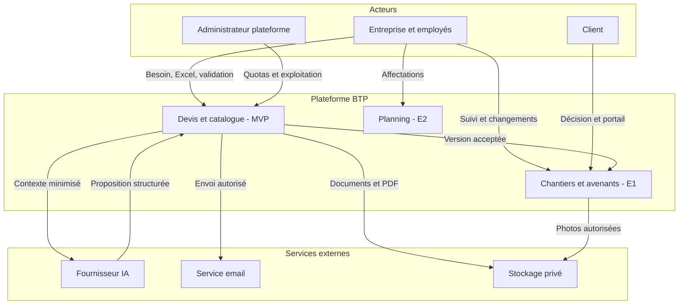
```mermaid
flowchart TB
 subgraph Acteurs[Acteurs]
  direction TB
  Ent[Entreprise et employés]
  Cli[Client]
  Adm[Administrateur plateforme]
 end
 subgraph SaaS[Plateforme BTP]
  direction TB
  Dev[Devis et catalogue - MVP]
  Cha[Chantiers et avenants - E1]
  Pla[Planning - E2]
 end
 subgraph Services[Services externes]
  direction TB
  IA[Fournisseur IA]
  Mail[Service email]
  Obj[Stockage privé]
 end
 Ent -->|Besoin, Excel, validation| Dev
 Ent -->|Suivi et changements| Cha
 Ent -->|Affectations| Pla
 Cli -->|Décision et portail| Cha
 Adm -->|Quotas et exploitation| Dev
 Dev -->|Contexte minimisé| IA
 IA -->|Proposition structurée| Dev
 Dev -->|Envoi autorisé| Mail
 Dev -->|Documents et PDF| Obj
 Cha -->|Photos autorisées| Obj
 Dev -->|Version acceptée| Cha
```

## B-cas-utilisation — Cas d’utilisation UML

**Objectif.** Attribuer les parcours aux six rôles sans confondre permission et visibilité.

**Hypothèses.** AE peut cumuler DV et CH ; les permissions de validation/envoi sont déléguables.

**Explication.** Les rôles déterminent les parcours. La délégation de validation est explicite ; le client ne consulte que le contenu autorisé.

**Règles.** RM02, RM09, RM10, RM18, RM21–RM25 ; matrice permissions.

**Cas d’erreur couverts.** Permission absente, rôle d’une autre entreprise, publication non autorisée.

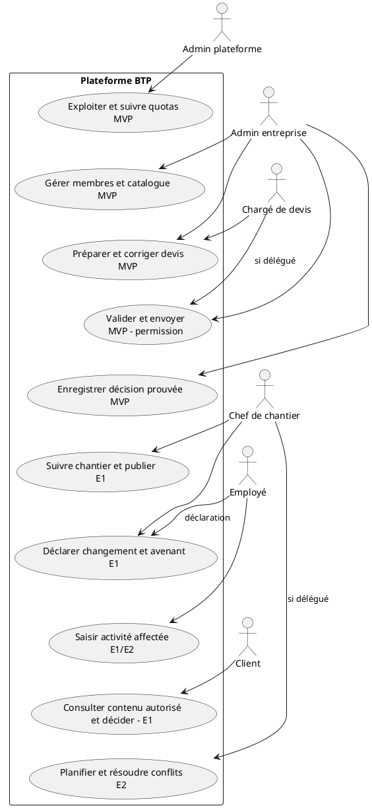
```plantuml
@startuml
!pragma layout smetana
top to bottom direction
skinparam shadowing false
actor "Admin plateforme" as AP
actor "Admin entreprise" as AE
actor "Chargé de devis" as DV
actor "Chef de chantier" as CH
actor "Employé" as EM
actor "Client" as CL
rectangle "Plateforme BTP" {
 usecase "Exploiter et suivre quotas\nMVP" as U1
 usecase "Gérer membres et catalogue\nMVP" as U2
 usecase "Préparer et corriger devis\nMVP" as U3
 usecase "Valider et envoyer\nMVP - permission" as U4
 usecase "Enregistrer décision prouvée\nMVP" as U5
 usecase "Suivre chantier et publier\nE1" as U6
 usecase "Déclarer changement et avenant\nE1" as U7
 usecase "Saisir activité affectée\nE1/E2" as U8
 usecase "Consulter contenu autorisé\net décider - E1" as U9
 usecase "Planifier et résoudre conflits\nE2" as U10
}
AP --> U1
AE --> U2
AE --> U3
DV --> U3
AE --> U4
DV --> U4 : si délégué
AE --> U5
CH --> U6
CH --> U7
EM --> U8
EM --> U7 : déclaration
CL --> U9
CH --> U10 : si délégué
AP -[hidden]down-> AE
AE -[hidden]down-> DV
DV -[hidden]down-> CH
CH -[hidden]down-> EM
EM -[hidden]down-> CL
U1 -[hidden]down-> U2
U2 -[hidden]down-> U3
U3 -[hidden]down-> U4
U4 -[hidden]down-> U5
U5 -[hidden]down-> U6
U6 -[hidden]down-> U7
U7 -[hidden]down-> U8
U8 -[hidden]down-> U9
U9 -[hidden]down-> U10
@enduml
```

## B-vue-simplifiee — Cas d’utilisation — vue Mermaid simplifiée

**Objectif.** Offrir une lecture rapide des regroupements de rôles ; cette vue n’est pas un véritable UML de cas d’utilisation.

**Hypothèses.** Le diagramme UML B-cas-utilisation et la matrice des droits restent les références.

**Explication.** Les rôles déterminent les parcours. La délégation de validation est explicite ; le client ne consulte que le contenu autorisé.

**Règles.** RM02, RM09, RM10, RM24, RM25.

**Cas d’erreur couverts.** Permission absente, rôle d’une autre entreprise, publication non autorisée.

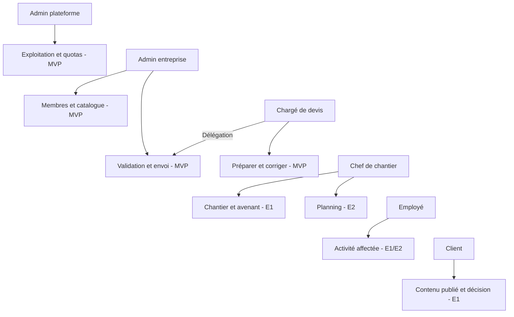
```mermaid
flowchart TB
 AP[Admin plateforme] --> Ops[Exploitation et quotas - MVP]
 AE[Admin entreprise] --> Ges[Membres et catalogue - MVP]
 AE --> Val[Validation et envoi - MVP]
 DV[Chargé de devis] --> Dev[Préparer et corriger - MVP]
 DV -->|Délégation| Val
 CH[Chef de chantier] --> Site[Chantier et avenant - E1]
 CH --> Plan[Planning - E2]
 EM[Employé] --> Act[Activité affectée - E1/E2]
 CL[Client] --> Por[Contenu publié et décision - E1]
 AP ~~~ AE
 AE ~~~ DV
 DV ~~~ CH
 CH ~~~ EM
 EM ~~~ CL
```

## C-parcours-devis — Création du devis

**Objectif.** Relier import, demandes de précision, revue et envoi à leurs voies de correction.

**Hypothèses.** Le PDF et le résultat IA peuvent échouer sans perdre le brouillon.

**Explication.** Le brouillon peut progresser malgré un échec technique. Les questions créent une nouvelle révision et la revue fige la version avant préparation du PDF et envoi.

**Règles.** RM03–RM05, RM09–RM14.

**Cas d’erreur couverts.** Document inexploitable, génération obsolète, estimation non confirmée, revue refusée, PDF/envoi en échec.

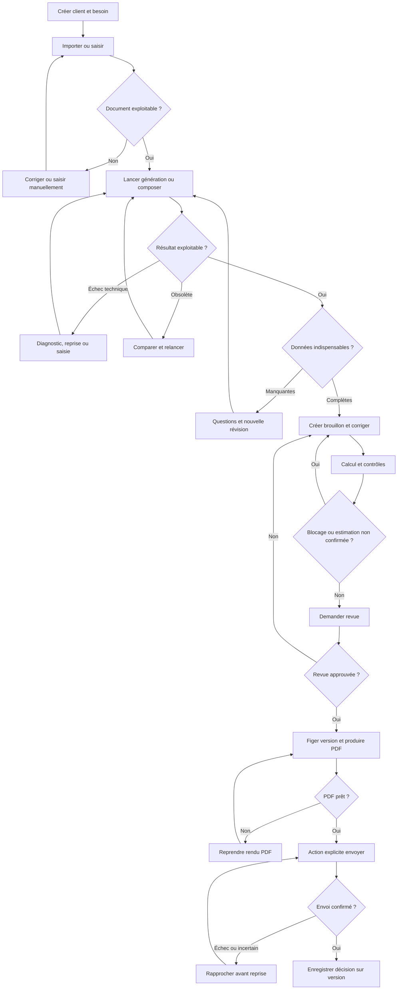
```mermaid
flowchart TB
 A[Créer client et besoin] --> B[Importer ou saisir]
 B --> C{Document exploitable ?}
 C -->|Non| D[Corriger ou saisir manuellement]
 D --> B
 C -->|Oui| E[Lancer génération ou composer]
 E --> F{Résultat exploitable ?}
 F -->|Échec technique| G[Diagnostic, reprise ou saisie]
 G --> E
 F -->|Obsolète| H[Comparer et relancer]
 H --> E
 F -->|Oui| I{Données indispensables ?}
 I -->|Manquantes| J[Questions et nouvelle révision]
 J --> E
 I -->|Complètes| K[Créer brouillon et corriger]
 K --> L[Calcul et contrôles]
 L --> M{Blocage ou estimation non confirmée ?}
 M -->|Oui| K
 M -->|Non| N[Demander revue]
 N --> O{Revue approuvée ?}
 O -->|Non| K
 O -->|Oui| P[Figer version et produire PDF]
 P --> Q{PDF prêt ?}
 Q -->|Non| R[Reprendre rendu PDF]
 R --> P
 Q -->|Oui| S[Action explicite envoyer]
 S --> T{Envoi confirmé ?}
 T -->|Échec ou incertain| U[Rapprocher avant reprise]
 U --> S
 T -->|Oui| V[Enregistrer décision sur version]
```

## D-chaine-ia — Chaîne de traitement IA

**Objectif.** Séparer texte source, connaissances métier, récupération de références et calcul fiable.

**Hypothèses.** Recherche privée limitée au tenant ; recettes du métier pilote approuvées.

**Explication.** Le texte est extrait comme données. L’analyse et les références produisent une proposition contrôlée ; seul le moteur décimal calcule les prix.

**Règles.** RM04–RM08, RM15–RM17, RM26.

**Cas d’erreur couverts.** Injection, référence non autorisée, prix absent, unité incorrecte, information critique manquante.

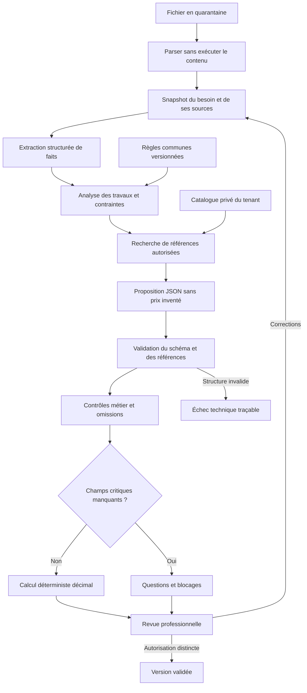
```mermaid
flowchart TB
 F[Fichier en quarantaine] --> P[Parser sans exécuter le contenu]
 P --> S[Snapshot du besoin et de ses sources]
 S --> X[Extraction structurée de faits]
 X --> B[Analyse des travaux et contraintes]
 B --> R[Recherche de références autorisées]
 Cat[Catalogue privé du tenant] --> R
 Com[Règles communes versionnées] --> B
 R --> J[Proposition JSON sans prix inventé]
 J --> V[Validation du schéma et des références]
 V --> C[Contrôles métier et omissions]
 C --> Q{Champs critiques manquants ?}
 Q -->|Oui| Dem[Questions et blocages]
 Q -->|Non| Calc[Calcul déterministe décimal]
 Calc --> H[Revue professionnelle]
 Dem --> H
 V -->|Structure invalide| E[Échec technique traçable]
 H -->|Corrections| S
 H -->|Autorisation distincte| Fin[Version validée]
```

## E-import-excel — Import catalogue Excel

**Objectif.** Valider un import avant publication d’une nouvelle version du catalogue.

**Hypothèses.** XLSX sans macros ; EUR ; une feuille sélectionnée ; noms seuls insuffisants pour déduire les unités.

**Explication.** L’utilisateur choisit le mapping, examine les erreurs et le diff de prix, puis confirme une publication atomique et historisée.

**Règles.** RM06, RM08, RM12, RM13, RM16.

**Cas d’erreur couverts.** Unité/devise absente, doublon contradictoire, formule non exploitable, catalogue modifié depuis preview.

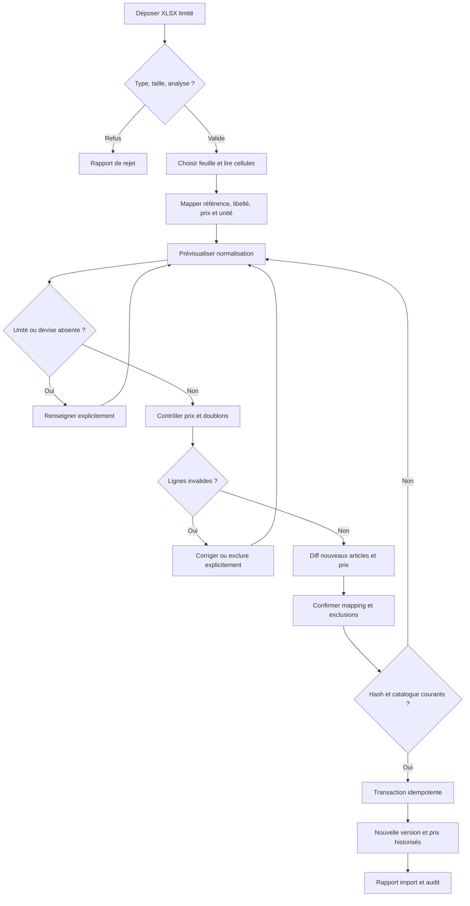
```mermaid
flowchart TB
 A[Déposer XLSX limité] --> B{Type, taille, analyse ?}
 B -->|Refus| R[Rapport de rejet]
 B -->|Valide| C[Choisir feuille et lire cellules]
 C --> D[Mapper référence, libellé, prix et unité]
 D --> E[Prévisualiser normalisation]
 E --> F{Unité ou devise absente ?}
 F -->|Oui| G[Renseigner explicitement]
 G --> E
 F -->|Non| H[Contrôler prix et doublons]
 H --> I{Lignes invalides ?}
 I -->|Oui| J[Corriger ou exclure explicitement]
 J --> E
 I -->|Non| K[Diff nouveaux articles et prix]
 K --> L[Confirmer mapping et exclusions]
 L --> M{Hash et catalogue courants ?}
 M -->|Non| E
 M -->|Oui| N[Transaction idempotente]
 N --> O[Nouvelle version et prix historisés]
 O --> P[Rapport import et audit]
```

## F-classes-devis — Classes métier — devis

**Objectif.** Différencier agrégat devis, version, ligne, ouvrage et matériau.

**Hypothèses.** Un devis peut exister sans version ; une version validable possède au moins une ligne.

**Explication.** La version porte ses lignes et leurs valeurs propres. L’ouvrage décrit la recette ; les composants de ligne donnent le détail du coût sans vente supplémentaire. Le chantier conserve son contrat de référence.

**Règles.** RM03, RM05–RM09, RM11, RM26.

**Cas d’erreur couverts.** Double comptage, recette incohérente, prix modifié après validation, changement non documenté.

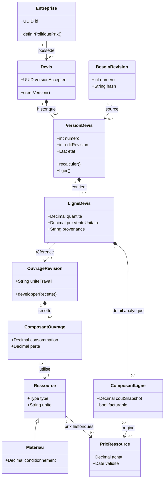
```mermaid
classDiagram
 direction TB
 class Entreprise {
  +UUID id
  +definirPolitiquePrix()
 }
 class BesoinRevision {
  +int numero
  +String hash
 }
 class Devis {
  +UUID versionAcceptee
  +creerVersion()
 }
 class VersionDevis {
  +int numero
  +int editRevision
  +Etat etat
  +recalculer()
  +figer()
 }
 class LigneDevis {
  +Decimal quantite
  +Decimal prixVenteUnitaire
  +String provenance
 }
 class OuvrageRevision {
  +String uniteTravail
  +developperRecette()
 }
 class ComposantOuvrage {
  +Decimal consommation
  +Decimal perte
 }
 class Ressource {
  +Type type
  +String unite
 }
 class Materiau {
  +Decimal conditionnement
 }
 class PrixRessource {
  +Decimal achat
  +Date validite
 }
 class ComposantLigne {
  +Decimal coutSnapshot
  +bool facturable
 }
 Entreprise "1" --> "0..*" Devis : possède
 Devis "1" *-- "0..*" VersionDevis : historique
 BesoinRevision "1" --> "0..*" VersionDevis : source
 VersionDevis "1" *-- "0..*" LigneDevis : contient
 LigneDevis "0..*" --> "0..1" OuvrageRevision : référence
 OuvrageRevision "1" *-- "1..*" ComposantOuvrage : recette
 ComposantOuvrage "0..*" --> "1" Ressource : utilise
 Ressource <|-- Materiau
 Ressource "1" --> "0..*" PrixRessource : prix historiques
 LigneDevis "1" *-- "0..*" ComposantLigne : détail analytique
 ComposantLigne "0..*" --> "0..1" PrixRessource : origine
```

## F-classes-chantier — Classes métier — chantier

**Objectif.** Relier contrat de référence, progression, changements et ressources.

**Hypothèses.** La baseline comprend le devis accepté et les avenants déjà acceptés.

**Explication.** La version porte ses lignes et leurs valeurs propres. L’ouvrage décrit la recette ; les composants de ligne donnent le détail du coût sans vente supplémentaire. Le chantier conserve son contrat de référence.

**Règles.** RM21–RM25.

**Cas d’erreur couverts.** Double comptage, recette incohérente, prix modifié après validation, changement non documenté.

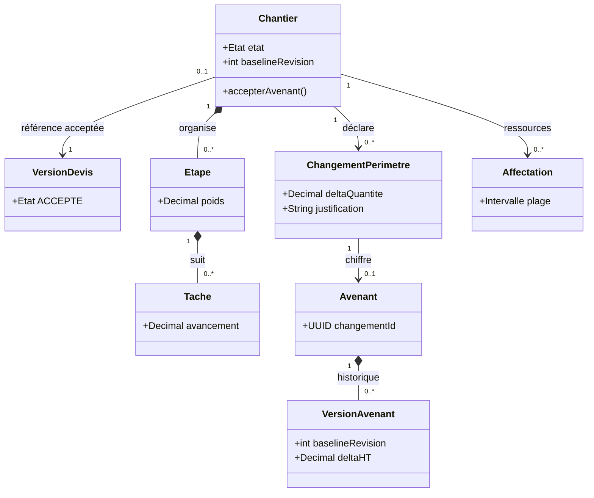
```mermaid
classDiagram
 direction TB
 class Chantier {
  +Etat etat
  +int baselineRevision
  +accepterAvenant()
 }
 class VersionDevis {
  +Etat ACCEPTE
 }
 class Etape {
  +Decimal poids
 }
 class Tache {
  +Decimal avancement
 }
 class ChangementPerimetre {
  +Decimal deltaQuantite
  +String justification
 }
 class Avenant {
  +UUID changementId
 }
 class VersionAvenant {
  +int baselineRevision
  +Decimal deltaHT
 }
 class Affectation {
  +Intervalle plage
 }
 Chantier "0..1" --> "1" VersionDevis : référence acceptée
 Chantier "1" *-- "0..*" Etape : organise
 Etape "1" *-- "0..*" Tache : suit
 Chantier "1" --> "0..*" ChangementPerimetre : déclare
 ChangementPerimetre "1" --> "0..1" Avenant : chiffre
 Avenant "1" *-- "0..*" VersionAvenant : historique
 Chantier "1" --> "0..*" Affectation : ressources
```

## G-mcd-identites — MCD — identités et clients

**Objectif.** Décrire les associations métier, avant les clés SQL ; notation ER conceptuelle.

**Hypothèses.** Compte global, contacts client distincts ; rôle lié à une appartenance.

**Explication.** Le MCD décrit les associations métier ; les ERD montrent les tables et FK. Les détails techniques sont répartis par module et les objets privés reprennent systématiquement le tenant.

**Règles.** RM01, RM02, RM18.

**Cas d’erreur couverts.** Référence croisée tenant, cardinalité invalide, offre acceptée multiple, relation entre modules incohérente.

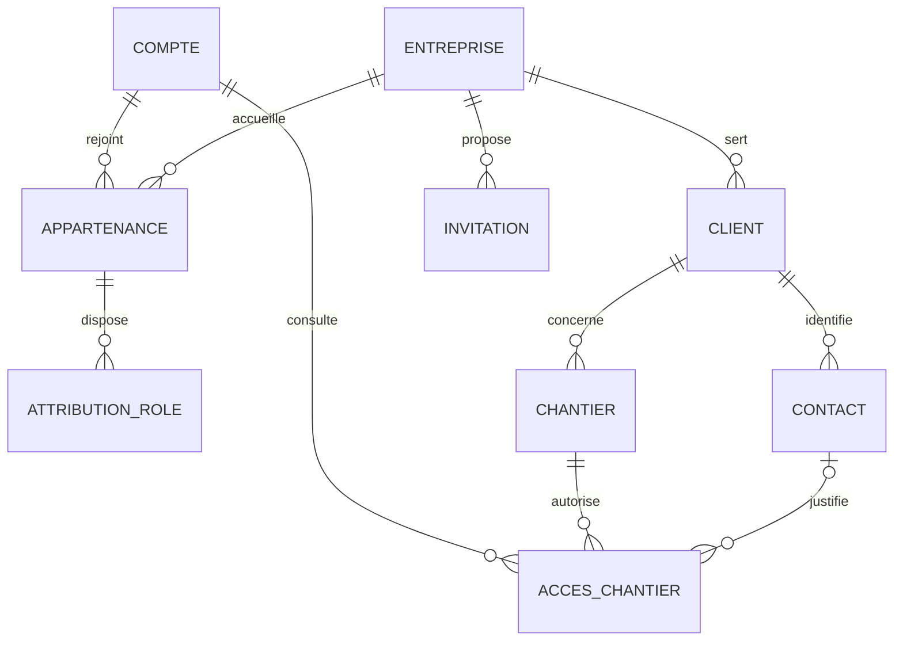
```mermaid
erDiagram
 direction TB
 COMPTE ||--o{ APPARTENANCE : rejoint
 ENTREPRISE ||--o{ APPARTENANCE : accueille
 APPARTENANCE ||--o{ ATTRIBUTION_ROLE : dispose
 ENTREPRISE ||--o{ CLIENT : sert
 CLIENT ||--o{ CONTACT : identifie
 ENTREPRISE ||--o{ INVITATION : propose
 CLIENT ||--o{ CHANTIER : concerne
 COMPTE ||--o{ ACCES_CHANTIER : consulte
 CHANTIER ||--o{ ACCES_CHANTIER : autorise
 CONTACT o|--o{ ACCES_CHANTIER : justifie
```

## G-mcd-chiffrage — MCD — chiffrage

**Objectif.** Modéliser les concepts de prix, besoin et version sans détails physiques.

**Hypothèses.** Chaque entreprise possède son catalogue ; les ouvrages sont versionnés.

**Explication.** Le MCD décrit les associations métier ; les ERD montrent les tables et FK. Les détails techniques sont répartis par module et les objets privés reprennent systématiquement le tenant.

**Règles.** RM03–RM09, RM11.

**Cas d’erreur couverts.** Référence croisée tenant, cardinalité invalide, offre acceptée multiple, relation entre modules incohérente.

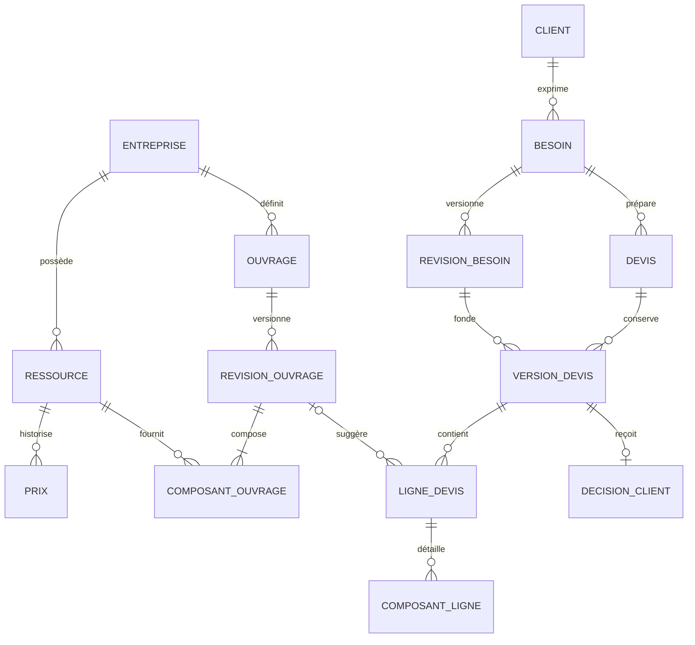
```mermaid
erDiagram
 direction TB
 ENTREPRISE ||--o{ RESSOURCE : possède
 RESSOURCE ||--o{ PRIX : historise
 ENTREPRISE ||--o{ OUVRAGE : définit
 OUVRAGE ||--o{ REVISION_OUVRAGE : versionne
 REVISION_OUVRAGE ||--|{ COMPOSANT_OUVRAGE : compose
 RESSOURCE ||--o{ COMPOSANT_OUVRAGE : fournit
 CLIENT ||--o{ BESOIN : exprime
 BESOIN ||--o{ REVISION_BESOIN : versionne
 BESOIN ||--o{ DEVIS : prépare
 DEVIS ||--o{ VERSION_DEVIS : conserve
 REVISION_BESOIN ||--o{ VERSION_DEVIS : fonde
 VERSION_DEVIS ||--o{ LIGNE_DEVIS : contient
 REVISION_OUVRAGE o|--o{ LIGNE_DEVIS : suggère
 LIGNE_DEVIS ||--o{ COMPOSANT_LIGNE : détaille
 VERSION_DEVIS ||--o| DECISION_CLIENT : reçoit
```

## G-mcd-chantier — MCD — chantier et avenants

**Objectif.** Définir la chaîne contrat accepté → chantier → changement → avenant.

**Hypothèses.** Un changement peut rester une demande sans avenant ; une version ne reçoit qu’une décision.

**Explication.** Le MCD décrit les associations métier ; les ERD montrent les tables et FK. Les détails techniques sont répartis par module et les objets privés reprennent systématiquement le tenant.

**Règles.** RM21–RM25.

**Cas d’erreur couverts.** Référence croisée tenant, cardinalité invalide, offre acceptée multiple, relation entre modules incohérente.

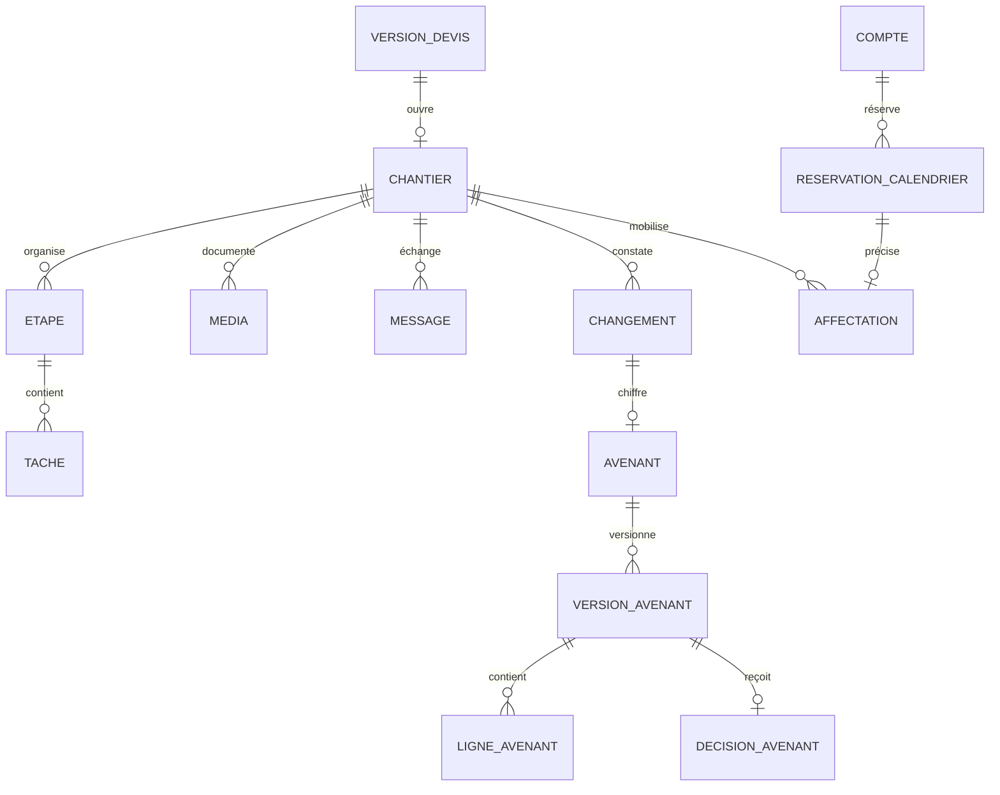
```mermaid
erDiagram
 direction TB
 VERSION_DEVIS ||--o| CHANTIER : ouvre
 CHANTIER ||--o{ ETAPE : organise
 ETAPE ||--o{ TACHE : contient
 CHANTIER ||--o{ MEDIA : documente
 CHANTIER ||--o{ MESSAGE : échange
 CHANTIER ||--o{ CHANGEMENT : constate
 CHANGEMENT ||--o| AVENANT : chiffre
 AVENANT ||--o{ VERSION_AVENANT : versionne
 VERSION_AVENANT ||--o{ LIGNE_AVENANT : contient
 VERSION_AVENANT ||--o| DECISION_AVENANT : reçoit
 COMPTE ||--o{ RESERVATION_CALENDRIER : réserve
 RESERVATION_CALENDRIER ||--o| AFFECTATION : précise
 CHANTIER ||--o{ AFFECTATION : mobilise
```

## H-etats-devis — États commerciaux du devis, portés par sa version

**Objectif.** Expliciter les transitions autorisées indépendamment des jobs IA.

**Hypothèses.** Version figée dès VALIDE ; correction par copie ; décision uniquement sur offre active.

**Explication.** Le cycle commercial appartient à chaque version. Un résultat IA n’avance aucun état commercial ; après VALIDE, une correction crée une nouvelle version.

**Règles.** RM09–RM13 ; transitions et permissions détaillées dans les règles.

**Cas d’erreur couverts.** Validation bloquée, envoi non confirmé, décision sur offre remplacée/expirée, correction sur contenu figé.

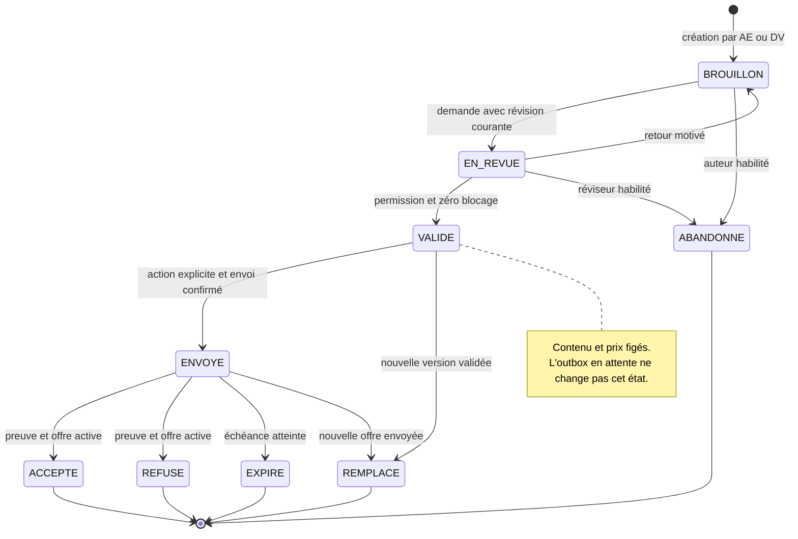
```mermaid
stateDiagram-v2
 direction TB
 [*] --> BROUILLON : création par AE ou DV
 BROUILLON --> EN_REVUE : demande avec révision courante
 EN_REVUE --> BROUILLON : retour motivé
 EN_REVUE --> VALIDE : permission et zéro blocage
 BROUILLON --> ABANDONNE : auteur habilité
 EN_REVUE --> ABANDONNE : réviseur habilité
 VALIDE --> ENVOYE : action explicite et envoi confirmé
 VALIDE --> REMPLACE : nouvelle version validée
 ENVOYE --> ACCEPTE : preuve et offre active
 ENVOYE --> REFUSE : preuve et offre active
 ENVOYE --> EXPIRE : échéance atteinte
 ENVOYE --> REMPLACE : nouvelle offre envoyée
 ACCEPTE --> [*]
 REFUSE --> [*]
 EXPIRE --> [*]
 REMPLACE --> [*]
 ABANDONNE --> [*]
 note right of VALIDE
  Contenu et prix figés.
  L'outbox en attente ne change pas cet état.
 end note
```

## H-etats-generation — États techniques de la génération

**Objectif.** Montrer reprises, résultat obsolète et interruption indépendamment du devis.

**Hypothèses.** Lease avec token ; 3 tentatives maximum ; budget réservé ; REUSSI peut contenir des questions.

**Explication.** Le worker peut reprendre une tentative transitoire ; l’état REUSSI indique une proposition structurée, pas une validation commerciale.

**Règles.** RM12–RM16, RM26.

**Cas d’erreur couverts.** Lease perdue, source modifiée, quota, timeout, tentatives épuisées, accès révoqué.

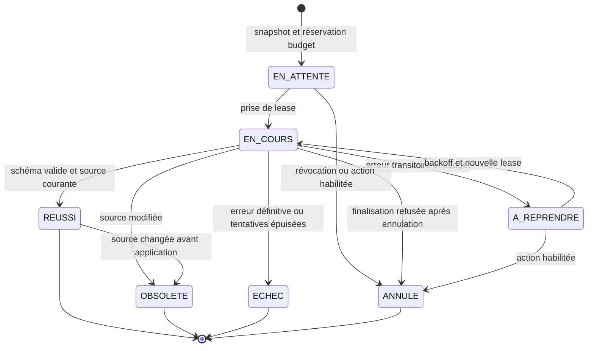
```mermaid
stateDiagram-v2
 direction TB
 [*] --> EN_ATTENTE : snapshot et réservation budget
 EN_ATTENTE --> EN_COURS : prise de lease
 EN_COURS --> A_REPRENDRE : erreur transitoire et budget
 A_REPRENDRE --> EN_COURS : backoff et nouvelle lease
 EN_COURS --> REUSSI : schéma valide et source courante
 EN_COURS --> OBSOLETE : source modifiée
 EN_COURS --> ECHEC : erreur définitive ou tentatives épuisées
 EN_ATTENTE --> ANNULE : révocation ou action habilitée
 EN_COURS --> ANNULE : finalisation refusée après annulation
 A_REPRENDRE --> ANNULE : action habilitée
 REUSSI --> OBSOLETE : source changée avant application
 REUSSI --> [*]
 OBSOLETE --> [*]
 ECHEC --> [*]
 ANNULE --> [*]
```

## I-generation-api — Séquence — lancement et application

**Objectif.** Conserver un résultat candidat et créer une version uniquement après contrôle de fraîcheur.

**Hypothèses.** Les traitements worker sont décrits séparément ; polling authentifié.

**Explication.** L’API fige l’entrée et crée le job. Le polling lit un résultat candidat ; une commande séparée applique ce résultat sous contrôle de version.

**Règles.** RM03, RM12, RM13, RM15.

**Cas d’erreur couverts.** Double clic, révision différente, devis déjà accepté, résultat obsolète.

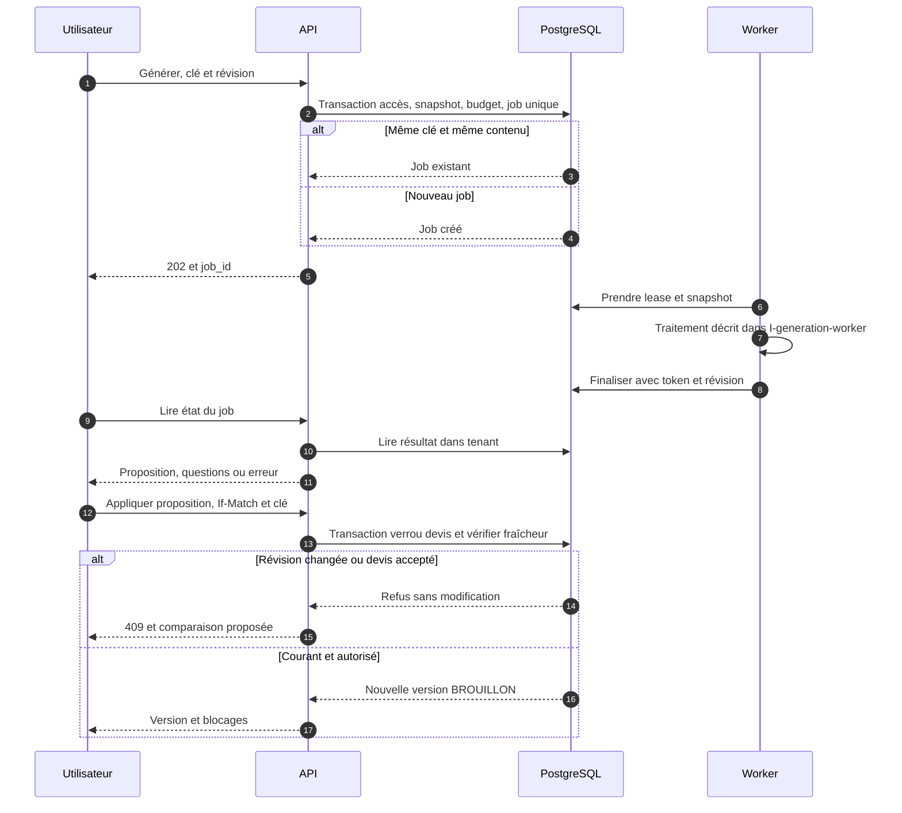
```mermaid
sequenceDiagram
 autonumber
 participant U as Utilisateur
 participant API as API
 participant DB as PostgreSQL
 participant W as Worker
 U->>API: Générer, clé et révision
 API->>DB: Transaction accès, snapshot, budget, job unique
 alt Même clé et même contenu
 DB-->>API: Job existant
 else Nouveau job
 DB-->>API: Job créé
 end
 API-->>U: 202 et job_id
 W->>DB: Prendre lease et snapshot
 W->>W: Traitement décrit dans I-generation-worker
 W->>DB: Finaliser avec token et révision
 U->>API: Lire état du job
 API->>DB: Lire résultat dans tenant
 API-->>U: Proposition, questions ou erreur
 U->>API: Appliquer proposition, If-Match et clé
 API->>DB: Transaction verrou devis et vérifier fraîcheur
 alt Révision changée ou devis accepté
 DB-->>API: Refus sans modification
 API-->>U: 409 et comparaison proposée
 else Courant et autorisé
 DB-->>API: Nouvelle version BROUILLON
 API-->>U: Version et blocages
 end
```

## I-generation-worker — Séquence — fournisseur et reprises

**Objectif.** Décrire les échecs externes et la finalisation protégée après panne.

**Hypothèses.** Chaque tentative est comptabilisée ; le coût d’un timeout peut rester inconnu.

**Explication.** Le worker trace chaque tentative puis publie seulement s’il possède encore la lease et si les données sources sont courantes.

**Règles.** RM04, RM05, RM14–RM16, RM26.

**Cas d’erreur couverts.** Appel ambigu/facturé, structure invalide, reprise limitée, token périmé.

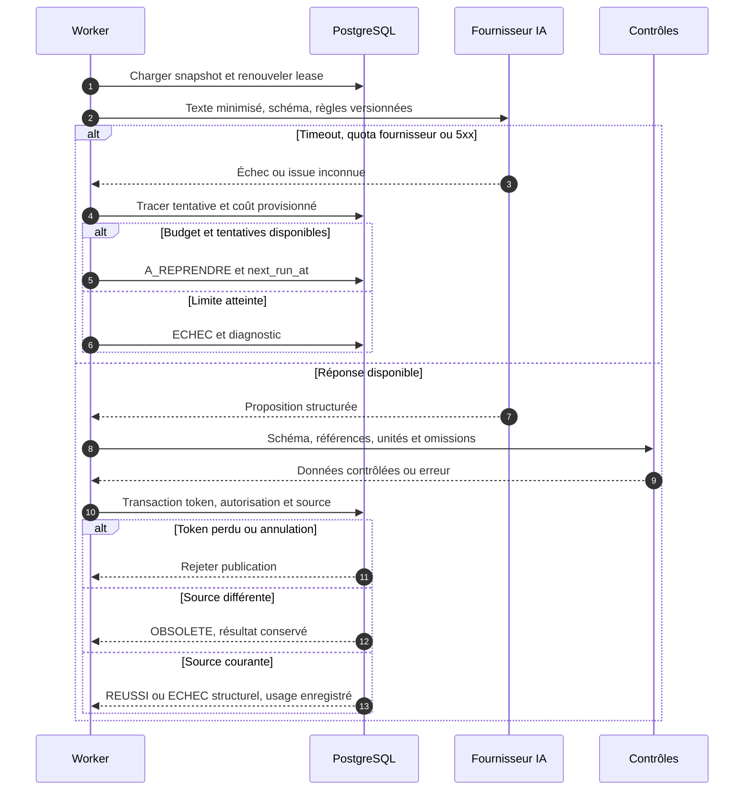
```mermaid
sequenceDiagram
 autonumber
 participant W as Worker
 participant DB as PostgreSQL
 participant IA as Fournisseur IA
 participant C as Contrôles
 W->>DB: Charger snapshot et renouveler lease
 W->>IA: Texte minimisé, schéma, règles versionnées
 alt Timeout, quota fournisseur ou 5xx
 IA-->>W: Échec ou issue inconnue
 W->>DB: Tracer tentative et coût provisionné
 alt Budget et tentatives disponibles
 W->>DB: A_REPRENDRE et next_run_at
 else Limite atteinte
 W->>DB: ECHEC et diagnostic
 end
 else Réponse disponible
 IA-->>W: Proposition structurée
 W->>C: Schéma, références, unités et omissions
 C-->>W: Données contrôlées ou erreur
 W->>DB: Transaction token, autorisation et source
 alt Token perdu ou annulation
 DB-->>W: Rejeter publication
 else Source différente
 DB-->>W: OBSOLETE, résultat conservé
 else Source courante
 DB-->>W: REUSSI ou ECHEC structurel, usage enregistré
 end
 end
```

## I-validation-envoi — Séquence — validation, PDF et envoi

**Objectif.** Séparer validation interne, création du PDF et effet externe.

**Hypothèses.** Worker regroupe rendu et livraison ; prestataire idempotent souhaité.

**Explication.** Validation, rendu PDF et envoi sont trois opérations durables. L’état ENVOYE apparaît après confirmation externe ; une issue incertaine oblige un rapprochement.

**Règles.** RM09–RM14, RM19.

**Cas d’erreur couverts.** PDF de mauvaise version, destinataire erroné, timeout ambigu, livraison potentiellement doublée.

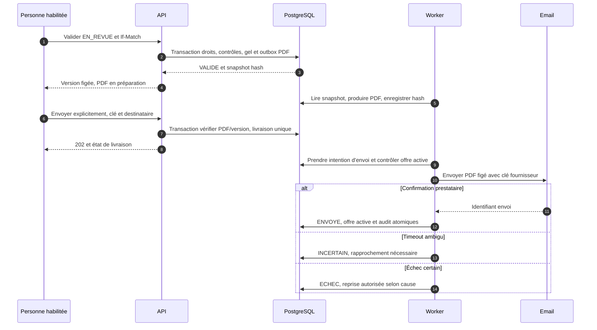
```mermaid
sequenceDiagram
 autonumber
 participant U as Personne habilitée
 participant API as API
 participant DB as PostgreSQL
 participant W as Worker
 participant M as Email
 U->>API: Valider EN_REVUE et If-Match
 API->>DB: Transaction droits, contrôles, gel et outbox PDF
 DB-->>API: VALIDE et snapshot hash
 API-->>U: Version figée, PDF en préparation
 W->>DB: Lire snapshot, produire PDF, enregistrer hash
 U->>API: Envoyer explicitement, clé et destinataire
 API->>DB: Transaction vérifier PDF/version, livraison unique
 API-->>U: 202 et état de livraison
 W->>DB: Prendre intention d'envoi et contrôler offre active
 W->>M: Envoyer PDF figé avec clé fournisseur
 alt Confirmation prestataire
 M-->>W: Identifiant envoi
 W->>DB: ENVOYE, offre active et audit atomiques
 else Timeout ambigu
 W->>DB: INCERTAIN, rapprochement nécessaire
 else Échec certain
 W->>DB: ECHEC, reprise autorisée selon cause
 end
```

## J-composants — Composants et dépendances

**Objectif.** Définir les responsabilités d’un monolithe et de son worker sans microservices prématurés.

**Hypothèses.** Moteur de prix pur, mêmes services métier utilisés par API et worker.

**Explication.** Les commandes traversent les modules du monolithe ; API et worker partagent le domaine. Le chiffrage reste indépendant du fournisseur IA.

**Règles.** RM01, RM05, RM10, RM14, RM19.

**Cas d’erreur couverts.** Effet externe perdu, accès direct à une table d’un autre module, calcul dépendant d’une réponse LLM.

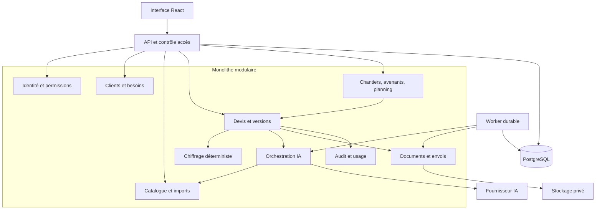
```mermaid
flowchart TB
 Web[Interface React] --> API[API et contrôle accès]
 subgraph Monolithe[Monolithe modulaire]
  direction TB
  Acc[Identité et permissions]
  Bes[Clients et besoins]
  Cat[Catalogue et imports]
  Dev[Devis et versions]
  Prix[Chiffrage déterministe]
  Orch[Orchestration IA]
  Doc[Documents et envois]
  Obs[Audit et usage]
  Ext[Chantiers, avenants, planning]
 end
 API --> Acc
 API --> Bes
 API --> Cat
 API --> Dev
 API --> Ext
 Dev --> Prix
 Dev --> Orch
 Dev --> Doc
 Orch --> Cat
 Ext --> Dev
 Dev --> Obs
 Worker[Worker durable] --> Orch
 Worker --> Doc
 API --> DB[(PostgreSQL)]
 Worker --> DB
 Doc --> Objet[Stockage privé]
 Orch --> IA[Fournisseur IA]
```

## K-frontieres — Flux de données et frontières de confiance

**Objectif.** Identifier les données non fiables et les sorties de données hors du SaaS.

**Hypothèses.** Fournisseur IA contractuellement choisi ; zéro entraînement partagé implicite.

**Explication.** Les documents entrants sont non fiables ; les données privées et connaissances communes se rejoignent uniquement dans un contexte minimisé et filtré.

**Règles.** RM01, RM02, RM16, RM17, RM20, RM26.

**Cas d’erreur couverts.** Injection de prompt, exfiltration vers IA, fuite portail, corpus privé partagé implicitement.

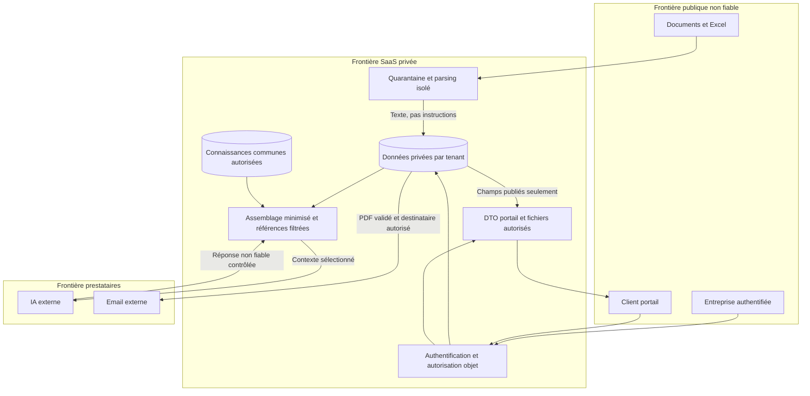
```mermaid
flowchart TB
 subgraph Public[Frontière publique non fiable]
  direction TB
  F[Documents et Excel]
  U[Entreprise authentifiée]
  C[Client portail]
 end
 subgraph Priv[Frontière SaaS privée]
  direction TB
  Gate[Authentification et autorisation objet]
  Q[Quarantaine et parsing isolé]
  T[(Données privées par tenant)]
  K[(Connaissances communes autorisées)]
  R[Assemblage minimisé et références filtrées]
  P[DTO portail et fichiers autorisés]
 end
 subgraph Tiers[Frontière prestataires]
  direction TB
  IA[IA externe]
  E[Email externe]
 end
 F --> Q
 U --> Gate
 Gate --> T
 Q -->|Texte, pas instructions| T
 T --> R
 K --> R
 R -->|Contexte sélectionné| IA
 IA -->|Réponse non fiable contrôlée| R
 C --> Gate
 Gate --> P
 T -->|Champs publiés seulement| P
 P --> C
 T -->|PDF validé et destinataire autorisé| E
```

## L-deploiement-uml — Déploiement UML de référence

**Objectif.** Représenter les nœuds, environnements et services privés réellement nécessaires.

**Hypothèses.** Conteneurs possibles ; bases et buckets séparés ; production avec TLS, secrets et sauvegardes.

**Explication.** Chaque environnement possède ses données, objets et secrets. La production expose l’entrée TLS et protège base/stockage ; les sauvegardes et la supervision sont des composants d’exploitation.

**Règles.** RM14–RM16, RM19, RM20.

**Cas d’erreur couverts.** Secret exposé, données réelles en dev, perte d’objet, restore incohérent, panne de fournisseur.

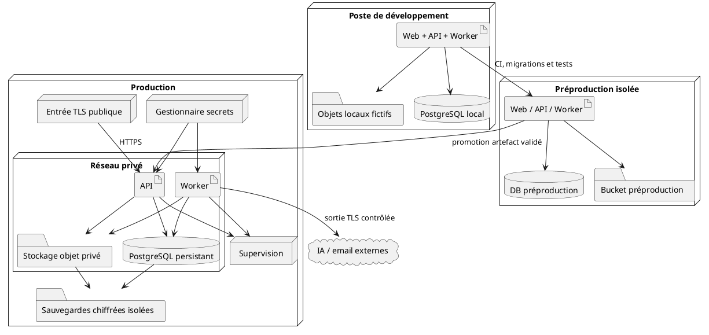
```plantuml
@startuml
!pragma layout smetana
top to bottom direction
skinparam shadowing false
node "Poste de développement" {
 artifact "Web + API + Worker" as Dev
 database "PostgreSQL local" as DDB
 folder "Objets locaux fictifs" as DObj
 Dev --> DDB
 Dev --> DObj
}
node "Préproduction isolée" {
 artifact "Web / API / Worker" as Pre
 database "DB préproduction" as PDB
 folder "Bucket préproduction" as PObj
 Pre --> PDB
 Pre --> PObj
}
node "Production" {
 node "Entrée TLS publique" as TLS
 node "Réseau privé" {
  artifact "API" as API
  artifact "Worker" as Worker
  database "PostgreSQL persistant" as DB
  folder "Stockage objet privé" as Obj
 }
 node "Gestionnaire secrets" as Secrets
 node "Supervision" as Obs
 folder "Sauvegardes chiffrées isolées" as Backup
 TLS --> API : HTTPS
 API --> DB
 Worker --> DB
 API --> Obj
 Worker --> Obj
 Secrets --> API
 Secrets --> Worker
 API --> Obs
 Worker --> Obs
 DB --> Backup
 Obj --> Backup
}
cloud "IA / email externes" as External
Worker --> External : sortie TLS contrôlée
Dev --> Pre : CI, migrations et tests
Pre --> API : promotion artefact validé
@enduml
```

## L-dev — Déploiement dev — Mermaid simplifié

**Objectif.** Visualiser réseau et persistance ; représentation simplifiée, pas UML de déploiement.

**Hypothèses.** Données fictives, services locaux, clés distinctes

**Explication.** Chaque environnement possède ses données, objets et secrets. La production expose l’entrée TLS et protège base/stockage ; les sauvegardes et la supervision sont des composants d’exploitation.

**Règles.** RM14–RM16, RM19, RM20.

**Cas d’erreur couverts.** Secret exposé, données réelles en dev, perte d’objet, restore incohérent, panne de fournisseur.

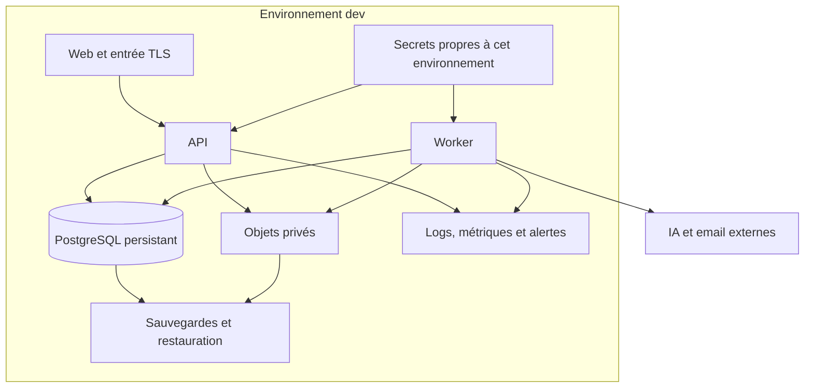
```mermaid
flowchart TB
 subgraph Env[Environnement dev]
  direction TB
  Web[Web et entrée TLS]
  API[API]
  W[Worker]
  DB[(PostgreSQL persistant)]
  Obj[Objets privés]
  Sec[Secrets propres à cet environnement]
  Mon[Logs, métriques et alertes]
  Bak[Sauvegardes et restauration]
 end
 Web --> API
 API --> DB
 W --> DB
 API --> Obj
 W --> Obj
 Sec --> API
 Sec --> W
 API --> Mon
 W --> Mon
 DB --> Bak
 Obj --> Bak
 W --> Ext[IA et email externes]
```

## L-preprod — Déploiement preprod — Mermaid simplifié

**Objectif.** Visualiser réseau et persistance ; représentation simplifiée, pas UML de déploiement.

**Hypothèses.** Jeu anonymisé ou synthétique, base et bucket isolés

**Explication.** Chaque environnement possède ses données, objets et secrets. La production expose l’entrée TLS et protège base/stockage ; les sauvegardes et la supervision sont des composants d’exploitation.

**Règles.** RM14–RM16, RM19, RM20.

**Cas d’erreur couverts.** Secret exposé, données réelles en dev, perte d’objet, restore incohérent, panne de fournisseur.

```mermaid
flowchart TB
 subgraph Env[Environnement preprod]
  direction TB
  Web[Web et entrée TLS]
  API[API]
  W[Worker]
  DB[(PostgreSQL persistant)]
  Obj[Objets privés]
  Sec[Secrets propres à cet environnement]
  Mon[Logs, métriques et alertes]
  Bak[Sauvegardes et restauration]
 end
 Web --> API
 API --> DB
 W --> DB
 API --> Obj
 W --> Obj
 Sec --> API
 Sec --> W
 API --> Mon
 W --> Mon
 DB --> Bak
 Obj --> Bak
 W --> Ext[IA et email externes]
```

## L-prod — Déploiement prod — Mermaid simplifié

**Objectif.** Visualiser réseau et persistance ; représentation simplifiée, pas UML de déploiement.

**Hypothèses.** Accès TLS public ; base et objets privés ; secrets séparés

**Explication.** Chaque environnement possède ses données, objets et secrets. La production expose l’entrée TLS et protège base/stockage ; les sauvegardes et la supervision sont des composants d’exploitation.

**Règles.** RM14–RM16, RM19, RM20.

**Cas d’erreur couverts.** Secret exposé, données réelles en dev, perte d’objet, restore incohérent, panne de fournisseur.

```mermaid
flowchart TB
 subgraph Env[Environnement prod]
  direction TB
  Web[Web et entrée TLS]
  API[API]
  W[Worker]
  DB[(PostgreSQL persistant)]
  Obj[Objets privés]
  Sec[Secrets propres à cet environnement]
  Mon[Logs, métriques et alertes]
  Bak[Sauvegardes et restauration]
 end
 Web --> API
 API --> DB
 W --> DB
 API --> Obj
 W --> Obj
 Sec --> API
 Sec --> W
 API --> Mon
 W --> Mon
 DB --> Bak
 Obj --> Bak
 W --> Ext[IA et email externes]
```

## M-parcours-chantier — Parcours du chantier

**Objectif.** Organiser la progression depuis le devis accepté jusqu’à la réception.

**Hypothèses.** Réception tracée avec réserves éventuelles ; poids de tâches explicitement définis.

**Explication.** La préparation précède l’exécution ; un changement passe par l’avenant. La réception et les réserves sont des étapes distinctes de l’avancement déclaré.

**Règles.** RM21–RM24.

**Cas d’erreur couverts.** Chantier créé depuis devis non accepté, changement refusé, réception sans preuve, réserves non levées.

```mermaid
flowchart TB
 A[Devis accepté] --> B[Créer chantier idempotent]
 B --> C[Préparer étapes, poids et accès]
 C --> D[Affecter équipe et dates]
 D --> E[Démarrer travaux]
 E --> F[Suivre tâches, photos et messages]
 F --> G{Changement de périmètre ?}
 G -->|Oui| H[Déclarer et chiffrer avenant]
 H --> I{Accepté ?}
 I -->|Oui| J[Actualiser baseline et planning]
 I -->|Non| K[Conserver périmètre accepté]
 J --> F
 K --> F
 G -->|Non| L{Travaux terminés ?}
 L -->|Non| F
 L -->|Oui| M[Préparer réception et preuves]
 M --> N{Réserves ?}
 N -->|Oui| O[Lever réserves et tracer]
 O --> M
 N -->|Non| P[Réceptionner puis clôturer]
```

## N-activite-avenant — Activité — création d’avenant

**Objectif.** Faire d’une suggestion un changement contrôlé puis un document soumis au client.

**Hypothèses.** Changement manuel ou détecté ; un avenant peut supprimer des postes avec motif.

**Explication.** La suggestion devient un changement confirmé puis un delta comparé au contrat courant. Seule l’acceptation sur la bonne baseline augmente le budget.

**Règles.** RM10, RM22, RM23.

**Cas d’erreur couverts.** Poste déjà inclus, delta sans unité, frais dupliqués, baseline périmée.

```mermaid
flowchart TB
 A[Déclaration ou suggestion IA] --> B[Chef confirme périmètre et source]
 B --> C[Comparer à baseline courante]
 C --> D{Déjà inclus ou déjà chiffré ?}
 D -->|Oui| E[Rejeter doublon ou corriger]
 D -->|Non| F[Quantifier delta et paramètres]
 F --> G{Données suffisantes ?}
 G -->|Non| H[Questions et précisions]
 H --> F
 G -->|Oui| I[Calcul delta sans frais dupliqués]
 I --> J[Créer version avenant BROUILLON]
 J --> K[Revue et validation humaine]
 K --> L[PDF figé et envoi explicite]
 L --> M{Décision sur baseline courante ?}
 M -->|Baseline changée| R[Rebaser nouvelle version et revalider]
 R --> C
 M -->|Accepté| N[Transaction baseline et budget]
 M -->|Refusé ou expiré| O[Aucun effet contractuel]
```

## N-sequence-avenant — Séquence — acceptation d’avenant

**Objectif.** Empêcher qu’une acceptation concurrente double le périmètre ou le budget.

**Hypothèses.** Verrouillage site puis avenant ; envoi identique au mécanisme de devis.

**Explication.** La décision verrouille le chantier puis l’avenant. Les événements et la baseline sont mis à jour dans la même transaction.

**Règles.** RM12, RM22, RM23.

**Cas d’erreur couverts.** Acceptation rejouée, changement déjà couvert, décisions concurrentes sur baseline ancienne.

```mermaid
sequenceDiagram
 autonumber
 participant H as Chef habilité
 participant API as API
 participant DB as PostgreSQL
 participant C as Client ou preuve
 H->>API: Confirmer changement, source et delta
 API->>DB: Changement unique, baseline et brouillon
 H->>API: Revoir, valider et envoyer explicitement
 API->>DB: Version figée et outbox comme devis
 C->>API: Décision, version et baseline attendue
 API->>DB: Transaction verrou site puis avenant
 alt Baseline différente ou changement déjà couvert
 DB-->>API: Conflit sans modification
 API-->>C: 409, nouvelle offre nécessaire
 else Refus
 DB-->>API: REFUSE, audit et baseline inchangée
 else Acceptation valide
 DB-->>API: ACCEPTE, baseline +1, delta budget, événement unique
 API-->>C: Confirmation version acceptée
 end
```

## O-etats-chantier — États du chantier

**Objectif.** Distinguer préparation, exécution, suspension et réception.

**Hypothèses.** Chef habilité pour transitions ; annulation motivée après contrôle des engagements.

**Explication.** Le chantier peut être suspendu puis repris. La réception suit la résolution des réserves ; l’annulation exige une décision motivée.

**Règles.** RM21, RM22, RM24.

**Cas d’erreur couverts.** Reprise non autorisée, réserves non levées, engagements non examinés avant annulation.

```mermaid
stateDiagram-v2
 direction TB
 [*] --> PREPARATION : devis accepté
 PREPARATION --> EN_COURS : équipe et périmètre prêts
 EN_COURS --> SUSPENDU : motif et dates
 SUSPENDU --> EN_COURS : reprise autorisée
 EN_COURS --> A_RECEVOIR : travaux déclarés terminés
 A_RECEVOIR --> RESERVES : réception avec réserves
 RESERVES --> A_RECEVOIR : réserves levées
 A_RECEVOIR --> RECEPTIONNE : preuve de réception
 RECEPTIONNE --> CLOTURE : contrôle final
 PREPARATION --> ANNULE : décision motivée
 EN_COURS --> ANNULE : engagements examinés
 SUSPENDU --> ANNULE : engagements examinés
 CLOTURE --> [*]
 ANNULE --> [*]
```

## O-etats-avenant — États commerciaux de l’avenant

**Objectif.** Conserver des états distincts du chantier et des jobs IA.

**Hypothèses.** Cycle porté par version_avenant ; valide sur baseline courante seulement.

**Explication.** Une version d’avenant suit un cycle commercial propre. Elle peut être envoyée et refusée sans changer l’état ni le budget du chantier.

**Règles.** RM09–RM12, RM22, RM23.

**Cas d’erreur couverts.** Acceptation avec baseline dépassée, PDF non prêt, tentative d’éditer une version figée.

```mermaid
stateDiagram-v2
 direction TB
 [*] --> BROUILLON : changement confirmé
 BROUILLON --> EN_REVUE : demande de revue
 EN_REVUE --> BROUILLON : correction motivée
 EN_REVUE --> VALIDE : zéro blocage et permission
 VALIDE --> ENVOYE : PDF et envoi confirmé
 VALIDE --> REMPLACE : nouvelle version validée
 ENVOYE --> ACCEPTE : preuve et baseline courante
 ENVOYE --> REFUSE : décision prouvée
 ENVOYE --> EXPIRE : échéance
 ENVOYE --> REMPLACE : nouvelle version envoyée
 BROUILLON --> ABANDONNE : auteur habilité
 EN_REVUE --> ABANDONNE : réviseur habilité
 ACCEPTE --> [*]
 REFUSE --> [*]
 EXPIRE --> [*]
 REMPLACE --> [*]
 ABANDONNE --> [*]
 note right of ENVOYE
  Baseline périmée : acceptation bloquée.
  Nouvelle version et nouvelle validation.
 end note
```

## P-planning — Planning et indisponibilités

**Objectif.** Prévenir les conflits, y compris pour une personne dans plusieurs entreprises.

**Hypothèses.** Calendrier global privé par compte ; droits tenant pour gérer l’affectation ; horaires en UTC avec fuseau local.

**Explication.** Disponibilités et absences sont vérifiées puis réservées atomiquement. Le calendrier global bloque les conflits sans divulguer les détails des autres entreprises.

**Règles.** RM02, RM18, RM25.

**Cas d’erreur couverts.** Double réservation, chevauchement de congé, fuseau mal normalisé, salarié révoqué.

```mermaid
flowchart TB
 A[Choisir personne, site et intervalle] --> B[Contrôler droits et appartenance active]
 B --> C[Normaliser UTC et intervalle demi-ouvert]
 C --> D[Contrôler disponibilités et congés]
 D --> E{Conflit privé global ?}
 E -->|Oui| F[Afficher indisponible sans détails tiers]
 F --> G[Modifier dates ou personne]
 G --> A
 E -->|Non| H[Transaction réservation et affectation]
 H --> I{Conflit concurrent en base ?}
 I -->|Oui| F
 I -->|Non| J[Confirmer et notifier]
 K[Demande de congé] --> L[Contrôler réservations existantes]
 L --> M{Réaffectation nécessaire ?}
 M -->|Oui| N[Chef résout avant approbation]
 N --> L
 M -->|Non| O[Réserver absence atomiquement]
 O --> D
```

## Q-amelioration — Amélioration contrôlée de l’IA

**Objectif.** Corriger règles et connaissances sans entraînement automatique ni partage de tarifs.

**Hypothèses.** Autorisation spécifique et examen de provenance avant utilisation collective.

**Explication.** Un retour reste privé jusqu’à autorisation. Les règles candidates passent confidentialité, benchmark et approbation avant publication avec possibilité de rollback.

**Règles.** RM17, RM19, RM26.

**Cas d’erreur couverts.** Réidentification, droits de source insuffisants, omission critique ou régression après publication.

```mermaid
flowchart TB
 F[Retour utilisateur privé] --> A[Analyser erreur et contexte]
 A --> T{Portée choisie ?}
 T -->|Entreprise| P[Règle privée versionnée]
 T -->|Collective proposée| C{Autorisation et droits de source ?}
 C -->|Non| Stop[Rester privé ou rejeter]
 C -->|Oui| D[Dépersonnaliser et examiner confidentialité]
 D --> E{Risque résiduel acceptable ?}
 E -->|Non| Stop
 E -->|Oui| R[Règle commune candidate sans prix privés]
 P --> Eval[Évaluer sur cas de référence]
 R --> Eval
 Eval --> V{Omissions et régressions ?}
 V -->|Oui| A
 V -->|Non| H[Approbation humaine documentée]
 H --> Pub[Publication versionnée et rollout limité]
 Pub --> Mon[Mesurer incidents et erreurs]
 Mon -->|Régression| Roll[Rollback version précédente]
 Mon -->|Nouveau retour| F
```

## G-erd-identites — ERD physique — identites

**Objectif.** Traduire le MCD en tables, clés et cardinalités ; tables externes montrées seulement pour les liens.

**Hypothèses.** PK/FK composites sur données privées ; attributs complets et liens non affichés dans le dictionnaire et SQL. Les tables externes sont réduites à leurs clés ; génération omet les liens compte et brouillon pour conserver au plus cinq éléments par rangée.

**Explication.** Le MCD décrit les associations métier ; les ERD montrent les tables et FK. Les détails techniques sont répartis par module et les objets privés reprennent systématiquement le tenant.

**Règles.** RM01–RM03, RM08, RM11–RM14, RM21–RM25 selon module.

**Cas d’erreur couverts.** Référence croisée tenant, cardinalité invalide, offre acceptée multiple, relation entre modules incohérente.

```mermaid
erDiagram
 direction TB
 tenants {
  uuid id PK
  text state
 }
 accounts {
  uuid id PK
  text state
 }
 sessions {
  uuid id PK
  uuid account_id FK
 }
 memberships {
  uuid tenant_id PK,FK
  uuid id PK
  uuid account_id FK
  text state
 }
 membership_roles {
  uuid tenant_id PK,FK
  uuid id PK
  uuid membership_id FK
 }
 invitations {
  uuid tenant_id PK,FK
  uuid id PK
 }
 clients {
  uuid tenant_id PK,FK
  uuid id PK
 }
 client_contacts {
  uuid tenant_id PK,FK
  uuid id PK
  uuid client_id FK
 }
 accounts ||--o{ sessions : account_id
 accounts ||--o| memberships : account_id
 memberships ||--o{ membership_roles : membership_id
 clients ||--o{ client_contacts : client_id
```

## G-erd-catalogue — ERD physique — catalogue

**Objectif.** Traduire le MCD en tables, clés et cardinalités ; tables externes montrées seulement pour les liens.

**Hypothèses.** PK/FK composites sur données privées ; attributs complets et liens non affichés dans le dictionnaire et SQL. Les tables externes sont réduites à leurs clés ; génération omet les liens compte et brouillon pour conserver au plus cinq éléments par rangée.

**Explication.** Le MCD décrit les associations métier ; les ERD montrent les tables et FK. Les détails techniques sont répartis par module et les objets privés reprennent systématiquement le tenant.

**Règles.** RM01–RM03, RM08, RM11–RM14, RM21–RM25 selon module.

**Cas d’erreur couverts.** Référence croisée tenant, cardinalité invalide, offre acceptée multiple, relation entre modules incohérente.

```mermaid
erDiagram
 direction TB
 files {
  uuid tenant_id PK,FK
  uuid id PK
  text state
  uuid uploaded_by FK
 }
 catalog_imports {
  uuid tenant_id PK,FK
  uuid id PK
  uuid file_id FK
  text state
 }
 catalog_revisions {
  uuid tenant_id PK,FK
  uuid id PK
  integer number
  uuid import_id FK
 }
 resources {
  uuid tenant_id PK,FK
  uuid id PK
  text reference
  uuid unit_id FK
 }
 resource_prices {
  uuid tenant_id PK,FK
  uuid id PK
  uuid resource_id FK
  uuid catalog_revision_id FK
 }
 works {
  uuid tenant_id PK,FK
  uuid id PK
  text reference
 }
 work_revisions {
  uuid tenant_id PK,FK
  uuid id PK
  uuid work_id FK
  integer number
  uuid unit_id FK
 }
 work_components {
  uuid tenant_id PK,FK
  uuid id PK
  uuid work_revision_id FK
  uuid resource_id FK
 }
 units {
  uuid id PK
 }
 accounts {
  uuid id PK
 }
 accounts ||--o{ files : uploaded_by
 files ||--o{ catalog_imports : file_id
 catalog_imports o|--o{ catalog_revisions : import_id
 units ||--o{ resources : unit_id
 resources ||--o{ resource_prices : resource_id
 catalog_revisions ||--o{ resource_prices : catalog_revision_id
 works ||--o{ work_revisions : work_id
 units ||--o{ work_revisions : unit_id
 work_revisions ||--o{ work_components : work_revision_id
 resources ||--o{ work_components : resource_id
```

## G-erd-devis — ERD physique — devis

**Objectif.** Traduire le MCD en tables, clés et cardinalités ; tables externes montrées seulement pour les liens.

**Hypothèses.** PK/FK composites sur données privées ; attributs complets et liens non affichés dans le dictionnaire et SQL. Les tables externes sont réduites à leurs clés ; génération omet les liens compte et brouillon pour conserver au plus cinq éléments par rangée.

**Explication.** Le MCD décrit les associations métier ; les ERD montrent les tables et FK. Les détails techniques sont répartis par module et les objets privés reprennent systématiquement le tenant.

**Règles.** RM01–RM03, RM08, RM11–RM14, RM21–RM25 selon module.

**Cas d’erreur couverts.** Référence croisée tenant, cardinalité invalide, offre acceptée multiple, relation entre modules incohérente.

```mermaid
erDiagram
 direction TB
 requirements {
  uuid tenant_id PK,FK
  uuid id PK
  uuid client_id FK
 }
 requirement_revisions {
  uuid tenant_id PK,FK
  uuid id PK
  uuid requirement_id FK
  integer number
  uuid created_by FK
 }
 requirement_files {
  uuid tenant_id PK,FK
  uuid id PK
  uuid requirement_revision_id FK
  uuid file_id FK
 }
 quotes {
  uuid tenant_id PK,FK
  uuid id PK
  uuid requirement_id FK
  text reference
  uuid draft_version_id FK
  uuid active_offer_version_id FK
  uuid accepted_version_id FK
 }
 quote_versions {
  uuid tenant_id PK,FK
  uuid id PK
  uuid quote_id FK
  uuid requirement_revision_id FK
  integer number
  integer edit_revision
  text state
  uuid validated_by FK
 }
 quote_lines {
  uuid tenant_id PK,FK
  uuid id PK
  uuid quote_version_id FK
  uuid work_revision_id FK
  uuid unit_id FK
 }
 line_components {
  uuid tenant_id PK,FK
  uuid id PK
  uuid quote_line_id FK
  uuid resource_price_id FK
  uuid unit_id FK
 }
 quote_decisions {
  uuid tenant_id PK,FK
  uuid id PK
  uuid quote_version_id FK
  uuid recorded_by FK
  uuid proof_file_id FK
 }
 clients {
  uuid tenant_id PK,FK
  uuid id PK
 }
 accounts {
  uuid id PK
 }
 files {
  uuid tenant_id PK,FK
  uuid id PK
 }
 work_revisions {
  uuid tenant_id PK,FK
  uuid id PK
 }
 units {
  uuid id PK
 }
 resource_prices {
  uuid tenant_id PK,FK
  uuid id PK
 }
 clients ||--o{ requirements : client_id
 requirements ||--o{ requirement_revisions : requirement_id
 accounts ||--o{ requirement_revisions : created_by
 requirement_revisions ||--o{ requirement_files : requirement_revision_id
 files ||--o{ requirement_files : file_id
 requirements ||--o{ quotes : requirement_id
 quote_versions o|--o{ quotes : draft_version_id
 quote_versions o|--o{ quotes : active_offer_version_id
 quote_versions o|--o{ quotes : accepted_version_id
 quotes ||--o{ quote_versions : quote_id
 requirement_revisions ||--o{ quote_versions : requirement_revision_id
 accounts o|--o{ quote_versions : validated_by
 quote_versions ||--o{ quote_lines : quote_version_id
 work_revisions o|--o{ quote_lines : work_revision_id
 units ||--o{ quote_lines : unit_id
 quote_lines ||--o{ line_components : quote_line_id
 resource_prices o|--o{ line_components : resource_price_id
 units ||--o{ line_components : unit_id
 quote_versions ||--o| quote_decisions : quote_version_id
 accounts ||--o{ quote_decisions : recorded_by
 files o|--o{ quote_decisions : proof_file_id
```

## G-erd-generation — ERD physique — generation

**Objectif.** Traduire le MCD en tables, clés et cardinalités ; tables externes montrées seulement pour les liens.

**Hypothèses.** PK/FK composites sur données privées ; attributs complets et liens non affichés dans le dictionnaire et SQL. Les tables externes sont réduites à leurs clés ; génération omet les liens compte et brouillon pour conserver au plus cinq éléments par rangée.

**Explication.** Le MCD décrit les associations métier ; les ERD montrent les tables et FK. Les détails techniques sont répartis par module et les objets privés reprennent systématiquement le tenant.

**Règles.** RM01–RM03, RM08, RM11–RM14, RM21–RM25 selon module.

**Cas d’erreur couverts.** Référence croisée tenant, cardinalité invalide, offre acceptée multiple, relation entre modules incohérente.

```mermaid
erDiagram
 direction TB
 generation_jobs {
  uuid tenant_id PK,FK
  uuid id PK
  uuid quote_id FK
  uuid requirement_revision_id FK
  uuid base_version_id FK
  uuid catalog_revision_id FK
  uuid knowledge_release_id FK
  text state
  uuid requested_by FK
 }
 ai_usage {
  uuid tenant_id PK,FK
  uuid id PK
  uuid job_id FK
 }
 quotes {
  uuid tenant_id PK,FK
  uuid id PK
 }
 requirement_revisions {
  uuid tenant_id PK,FK
  uuid id PK
 }
 catalog_revisions {
  uuid tenant_id PK,FK
  uuid id PK
 }
 knowledge_releases {
  uuid id PK
 }
 quotes ||--o{ generation_jobs : quote_id
 requirement_revisions ||--o{ generation_jobs : requirement_revision_id
 catalog_revisions ||--o{ generation_jobs : catalog_revision_id
 knowledge_releases ||--o{ generation_jobs : knowledge_release_id
 generation_jobs ||--o{ ai_usage : job_id
```

## G-erd-traitements — ERD physique — traitements

**Objectif.** Traduire le MCD en tables, clés et cardinalités ; tables externes montrées seulement pour les liens.

**Hypothèses.** PK/FK composites sur données privées ; attributs complets et liens non affichés dans le dictionnaire et SQL. Les tables externes sont réduites à leurs clés ; génération omet les liens compte et brouillon pour conserver au plus cinq éléments par rangée.

**Explication.** Le MCD décrit les associations métier ; les ERD montrent les tables et FK. Les détails techniques sont répartis par module et les objets privés reprennent systématiquement le tenant.

**Règles.** RM01–RM03, RM08, RM11–RM14, RM21–RM25 selon module.

**Cas d’erreur couverts.** Référence croisée tenant, cardinalité invalide, offre acceptée multiple, relation entre modules incohérente.

```mermaid
erDiagram
 direction TB
 idempotency_keys {
  uuid tenant_id PK,FK
  uuid id PK
  uuid account_id FK
 }
 ai_budget_periods {
  uuid tenant_id PK,FK
  uuid id PK
  text period
 }
 outbox {
  uuid tenant_id PK,FK
  uuid id PK
  text state
 }
 audit_events {
  uuid tenant_id PK,FK
  uuid id PK
  uuid actor_id FK
 }
 accounts {
  uuid id PK
 }
 accounts ||--o{ idempotency_keys : account_id
 accounts o|--o{ audit_events : actor_id
```

## G-erd-connaissances — ERD physique — connaissances

**Objectif.** Traduire le MCD en tables, clés et cardinalités ; tables externes montrées seulement pour les liens.

**Hypothèses.** PK/FK composites sur données privées ; attributs complets et liens non affichés dans le dictionnaire et SQL. Les tables externes sont réduites à leurs clés ; génération omet les liens compte et brouillon pour conserver au plus cinq éléments par rangée.

**Explication.** Le MCD décrit les associations métier ; les ERD montrent les tables et FK. Les détails techniques sont répartis par module et les objets privés reprennent systématiquement le tenant.

**Règles.** RM01–RM03, RM08, RM11–RM14, RM21–RM25 selon module.

**Cas d’erreur couverts.** Référence croisée tenant, cardinalité invalide, offre acceptée multiple, relation entre modules incohérente.

```mermaid
erDiagram
 direction TB
 knowledge_releases {
  uuid id PK
  text state
 }
 feedback {
  uuid tenant_id PK,FK
  uuid id PK
  uuid job_id FK
  uuid release_id FK
 }
 generation_jobs {
  uuid tenant_id PK,FK
  uuid id PK
 }
 generation_jobs o|--o{ feedback : job_id
 knowledge_releases o|--o{ feedback : release_id
```

## G-erd-chantier — ERD physique — chantier

**Objectif.** Traduire le MCD en tables, clés et cardinalités ; tables externes montrées seulement pour les liens.

**Hypothèses.** PK/FK composites sur données privées ; attributs complets et liens non affichés dans le dictionnaire et SQL. Les tables externes sont réduites à leurs clés ; génération omet les liens compte et brouillon pour conserver au plus cinq éléments par rangée.

**Explication.** Le MCD décrit les associations métier ; les ERD montrent les tables et FK. Les détails techniques sont répartis par module et les objets privés reprennent systématiquement le tenant.

**Règles.** RM01–RM03, RM08, RM11–RM14, RM21–RM25 selon module.

**Cas d’erreur couverts.** Référence croisée tenant, cardinalité invalide, offre acceptée multiple, relation entre modules incohérente.

```mermaid
erDiagram
 direction TB
 sites {
  uuid tenant_id PK,FK
  uuid id PK
  uuid quote_id FK
  uuid reference_quote_version_id FK
  uuid client_id FK
  text state
  integer baseline_revision
 }
 site_access {
  uuid tenant_id PK,FK
  uuid id PK
  uuid site_id FK
  uuid account_id FK
  uuid contact_id FK
  text state
 }
 site_stages {
  uuid tenant_id PK,FK
  uuid id PK
  uuid site_id FK
 }
 site_tasks {
  uuid tenant_id PK,FK
  uuid id PK
  uuid stage_id FK
  uuid assigned_membership_id FK
 }
 quotes {
  uuid tenant_id PK,FK
  uuid id PK
 }
 quote_versions {
  uuid tenant_id PK,FK
  uuid id PK
 }
 clients {
  uuid tenant_id PK,FK
  uuid id PK
 }
 accounts {
  uuid id PK
 }
 client_contacts {
  uuid tenant_id PK,FK
  uuid id PK
 }
 memberships {
  uuid tenant_id PK,FK
  uuid id PK
 }
 quotes ||--o| sites : quote_id
 quote_versions ||--o{ sites : reference_quote_version_id
 clients ||--o{ sites : client_id
 sites ||--o{ site_access : site_id
 accounts ||--o{ site_access : account_id
 client_contacts o|--o{ site_access : contact_id
 sites ||--o{ site_stages : site_id
 site_stages ||--o{ site_tasks : stage_id
 memberships o|--o{ site_tasks : assigned_membership_id
```

## G-erd-suivi — ERD physique — suivi

**Objectif.** Traduire le MCD en tables, clés et cardinalités ; tables externes montrées seulement pour les liens.

**Hypothèses.** PK/FK composites sur données privées ; attributs complets et liens non affichés dans le dictionnaire et SQL. Les tables externes sont réduites à leurs clés ; génération omet les liens compte et brouillon pour conserver au plus cinq éléments par rangée.

**Explication.** Le MCD décrit les associations métier ; les ERD montrent les tables et FK. Les détails techniques sont répartis par module et les objets privés reprennent systématiquement le tenant.

**Règles.** RM01–RM03, RM08, RM11–RM14, RM21–RM25 selon module.

**Cas d’erreur couverts.** Référence croisée tenant, cardinalité invalide, offre acceptée multiple, relation entre modules incohérente.

```mermaid
erDiagram
 direction TB
 site_media {
  uuid tenant_id PK,FK
  uuid id PK
  uuid site_id FK
  uuid file_id FK
  uuid created_by FK
 }
 site_messages {
  uuid tenant_id PK,FK
  uuid id PK
  uuid site_id FK
  uuid author_id FK
 }
 scope_changes {
  uuid tenant_id PK,FK
  uuid id PK
  uuid site_id FK
  text reference
  text state
  uuid unit_id FK
 }
 sites {
  uuid tenant_id PK,FK
  uuid id PK
 }
 files {
  uuid tenant_id PK,FK
  uuid id PK
 }
 accounts {
  uuid id PK
 }
 units {
  uuid id PK
 }
 sites ||--o{ site_media : site_id
 files ||--o{ site_media : file_id
 accounts ||--o{ site_media : created_by
 sites ||--o{ site_messages : site_id
 accounts ||--o{ site_messages : author_id
 sites ||--o{ scope_changes : site_id
 units ||--o{ scope_changes : unit_id
```

## G-erd-avenants — ERD physique — avenants

**Objectif.** Traduire le MCD en tables, clés et cardinalités ; tables externes montrées seulement pour les liens.

**Hypothèses.** PK/FK composites sur données privées ; attributs complets et liens non affichés dans le dictionnaire et SQL. Les tables externes sont réduites à leurs clés ; génération omet les liens compte et brouillon pour conserver au plus cinq éléments par rangée.

**Explication.** Le MCD décrit les associations métier ; les ERD montrent les tables et FK. Les détails techniques sont répartis par module et les objets privés reprennent systématiquement le tenant.

**Règles.** RM01–RM03, RM08, RM11–RM14, RM21–RM25 selon module.

**Cas d’erreur couverts.** Référence croisée tenant, cardinalité invalide, offre acceptée multiple, relation entre modules incohérente.

```mermaid
erDiagram
 direction TB
 amendments {
  uuid tenant_id PK,FK
  uuid id PK
  uuid site_id FK
  uuid scope_change_id FK
  uuid reference_quote_version_id FK
  text reference
 }
 amendment_versions {
  uuid tenant_id PK,FK
  uuid id PK
  uuid amendment_id FK
  integer number
  integer edit_revision
  integer baseline_revision
  text state
 }
 amendment_lines {
  uuid tenant_id PK,FK
  uuid id PK
  uuid amendment_version_id FK
  uuid unit_id FK
 }
 amendment_decisions {
  uuid tenant_id PK,FK
  uuid id PK
  uuid amendment_version_id FK
  uuid recorded_by FK
 }
 pdf_documents {
  uuid tenant_id PK,FK
  uuid id PK
  uuid quote_version_id FK
  uuid amendment_version_id FK
  uuid file_id FK
 }
 deliveries {
  uuid tenant_id PK,FK
  uuid id PK
  uuid quote_version_id FK
  uuid amendment_version_id FK
  uuid pdf_document_id FK
  text state
  uuid authorized_by FK
 }
 sites {
  uuid tenant_id PK,FK
  uuid id PK
 }
 scope_changes {
  uuid tenant_id PK,FK
  uuid id PK
 }
 quote_versions {
  uuid tenant_id PK,FK
  uuid id PK
 }
 units {
  uuid id PK
 }
 accounts {
  uuid id PK
 }
 files {
  uuid tenant_id PK,FK
  uuid id PK
 }
 sites ||--o{ amendments : site_id
 scope_changes ||--o| amendments : scope_change_id
 quote_versions ||--o{ amendments : reference_quote_version_id
 amendments ||--o{ amendment_versions : amendment_id
 amendment_versions ||--o{ amendment_lines : amendment_version_id
 units ||--o{ amendment_lines : unit_id
 amendment_versions ||--o| amendment_decisions : amendment_version_id
 accounts ||--o{ amendment_decisions : recorded_by
 quote_versions o|--o{ pdf_documents : quote_version_id
 amendment_versions o|--o{ pdf_documents : amendment_version_id
 files ||--o{ pdf_documents : file_id
 quote_versions o|--o{ deliveries : quote_version_id
 amendment_versions o|--o{ deliveries : amendment_version_id
 pdf_documents ||--o{ deliveries : pdf_document_id
 accounts ||--o{ deliveries : authorized_by
```

## G-erd-planning — ERD physique — planning

**Objectif.** Traduire le MCD en tables, clés et cardinalités ; tables externes montrées seulement pour les liens.

**Hypothèses.** PK/FK composites sur données privées ; attributs complets et liens non affichés dans le dictionnaire et SQL. Les tables externes sont réduites à leurs clés ; génération omet les liens compte et brouillon pour conserver au plus cinq éléments par rangée.

**Explication.** Le MCD décrit les associations métier ; les ERD montrent les tables et FK. Les détails techniques sont répartis par module et les objets privés reprennent systématiquement le tenant.

**Règles.** RM01–RM03, RM08, RM11–RM14, RM21–RM25 selon module.

**Cas d’erreur couverts.** Référence croisée tenant, cardinalité invalide, offre acceptée multiple, relation entre modules incohérente.

```mermaid
erDiagram
 direction TB
 calendar_reservations {
  uuid id PK
  uuid tenant_id FK
  uuid account_id FK
  tstzrange period
 }
 assignments {
  uuid tenant_id PK,FK
  uuid id PK
  uuid site_id FK
  uuid membership_id FK
  uuid calendar_reservation_id FK
 }
 leave_requests {
  uuid tenant_id PK,FK
  uuid id PK
  uuid membership_id FK
  tstzrange period
  text state
  uuid calendar_reservation_id FK
  uuid approved_by FK
 }
 time_entries {
  uuid tenant_id PK,FK
  uuid id PK
  uuid site_id FK
  uuid membership_id FK
  text state
 }
 tenants {
  uuid id PK
 }
 accounts {
  uuid id PK
 }
 sites {
  uuid tenant_id PK,FK
  uuid id PK
 }
 memberships {
  uuid tenant_id PK,FK
  uuid id PK
 }
 tenants ||--o{ calendar_reservations : tenant_id
 accounts ||--o{ calendar_reservations : account_id
 sites ||--o{ assignments : site_id
 memberships ||--o{ assignments : membership_id
 calendar_reservations ||--o| assignments : calendar_reservation_id
 memberships ||--o{ leave_requests : membership_id
 calendar_reservations o|--o{ leave_requests : calendar_reservation_id
 accounts o|--o{ leave_requests : approved_by
 sites ||--o{ time_entries : site_id
 memberships ||--o{ time_entries : membership_id
```
